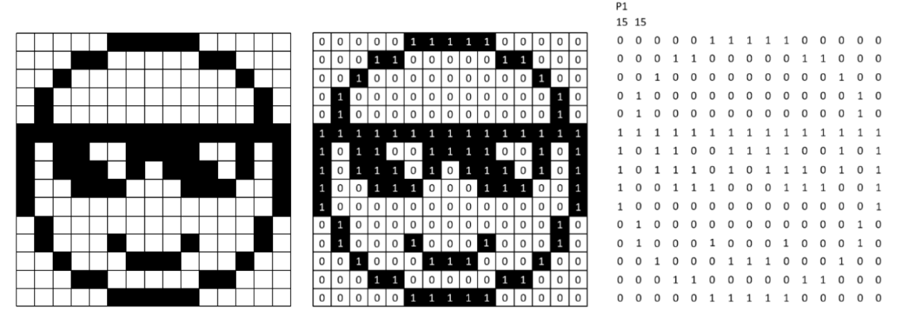
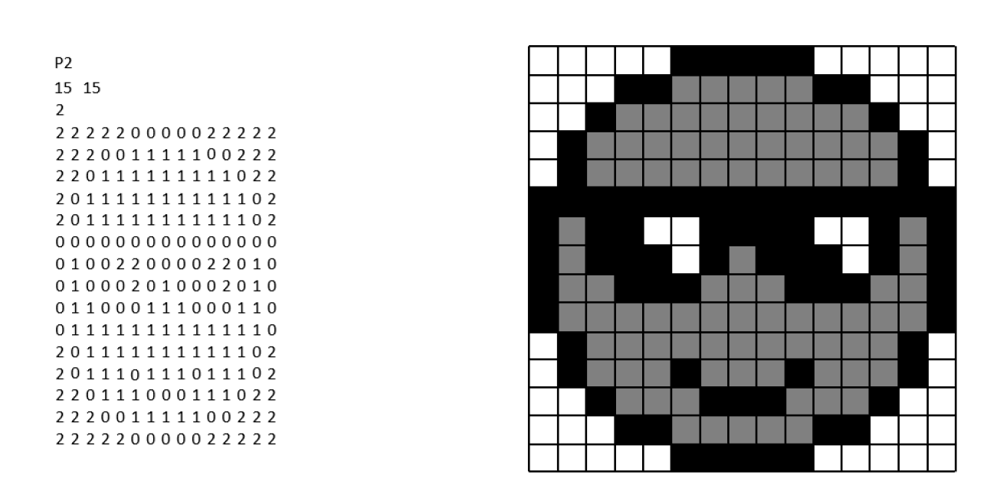
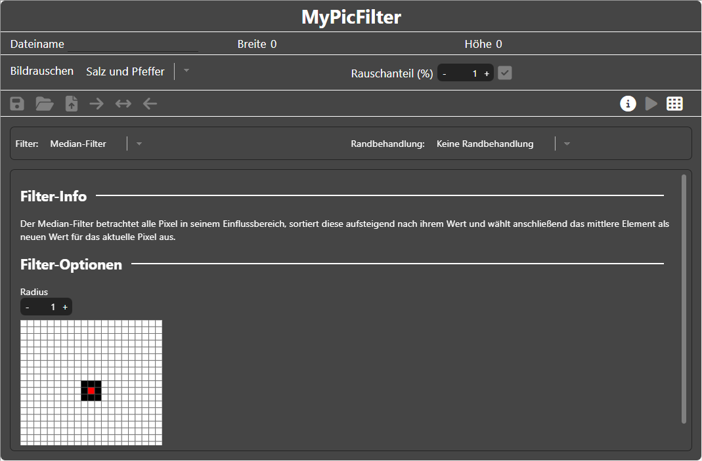
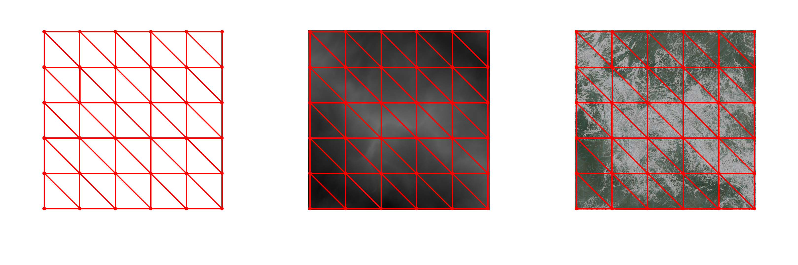
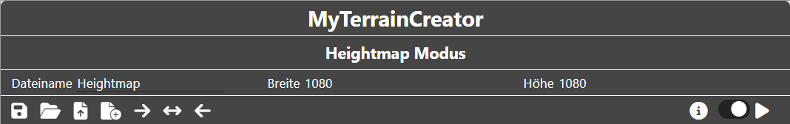

<!--
author:     Leon Endris

email:      leendris@uni-koblenz.de

version:    1.0.0

language:   de

narrator:   Deutsch Female

comment:    In dieser extra für Projekttage
            erstellten Lektion des CV-Online-
            Kurses soll ein Überblick über
            dessen Inhalte und Themen gegeben
            werden.

link:       ../CSS/main.css 

script:     ../JavaScript/LiaScriptCustom.js

logo:       ../Images/Project/Project_Logo.png

-->

# Projekttag
Willkommen zum CV-Online-Kurs Projekttag. Diese Lektion soll dir einen Überblick über die verschiedenen Themen und Inhalte bieten, die der CV-Online-Kurs abdeckt. Es handelt sich dabei um eine große Menge an Inhalten, die normalerweise in einzelnen Lektionen abgehandelt werden. Es ist also nicht entscheidend, dass du alle diese Informationen behältst. Vielmehr ist das Ziel, dass du ein grundlegendes Verständnis für verschiedene Themen erwirbst, die im Bereich der Computervisualistik abgedeckt werden.

# Pixel-/Rastergrafik
Dieser Abschnitt beschäftigt sich mit Pixel- beziehungsweise Rastergrafiken. Du sollst einen Überblick über dessen Aufbau erhalten und am Ende auch selbst versuchen eigene Rastergrafiken zu erzeugen.

## Was ist eine Pixel-/Rastergrafik?
Gängige Bildformate wie **JPG** oder **PNG** verwenden ein Raster, um sogenannte **Picture Elements**, kurz **"Pixel"**, anzuordnen. Jeder Pixel enthält eine codierte Farbwertinformation. Die wichtigsten Eigenschaften eines solchen codierten Bildes sind **Höhe**, **Breite** und **Farbtiefe**. Die **Farbtiefe** gibt an, wie viele Abstufungen von Helligkeitswerten möglich sind. Dadurch gibt sie auch an, wie viele **Bits** benötigt werden, um den Farbwert zu codieren. Ein **Bit** ist die kleinste Informationseinheit in der Informatik und nimmt entweder den Wert *"1"* oder *"0"* an. Binärbilder erlauben beispielsweise nur schwarze oder weiße Pixel. Deshalb ist ein **Bit** ausreichend um den Wert eines jeden darin vorkommenden Pixels zu speichern. Bei Grauwertbildern können verschiedene Grautöne zwischen Schwarz und Weiß dargestellt werden. Normalerweise werden 8 **Bit** (= 1 **Byte**) dafür verwendet. Während mit 1 **Bit** nur 21, also 2 Werte gespeichert werden können, kann man mit 8 **Bit** 28 ganze 256 Abstufungen erziehlen. Schließlich können Farbbilder durch das anteilige Mischen der Farben Rot, Grün und Blau erzeugt werden, hierbei kann jeder einzelne Farbkanal mit 1 **Byte** codiert werden.

Ein Problem bei Pixel-/Rastergrafiken besteht darin, dass eine verlustfreie Skalierung nicht möglich ist. Wenn wir in ein solches Bild hineinzoomen, werden die einzelnen Pixel immer deutlicher sichtbar.

---------------------------------------------------------------------------------------------------------------------------------------------------------------------------------

> In diesen Abbildungen wird immer weiter in ein Bild hineingezoomt. Die einzelnen Pixel werden immer deutlicher sichtbar
>
>    

## Wie werden einfache Bildformate codiert?
Portable Bitmap (PBM)
=================================================================================================================================================================================

Gehen wir zunächst von einem simplen Schwarz-Weiß-Bild aus. Wir codieren nun den Wert eines jeden Pixels als Zahl. *Schwarz* wird als *"1"* und *Weiß* wird als *"0"* codiert. Das ist schon fast die Codierung die wir für das lesen einer **Portable Bitmap (PBM)** verwenden. In der ersten Zeile muss nun zusätzlich das Format angeben werden. **PBMs** werden dabei durch das einfügen von *"P1"* in der ersten Zeile gekennzeichnet. Anschließend geben wir die Dimension unseres Bildes in der zweiten Zeile an. Also die Breite und danach die Höhe. Die restlichen Zeilen codieren dann das eigentliche Bild.

> Codierung eines Smileys im PBM Format:
> 
> 

---------------------------------------------------------------------------------------------------------------------------------------------------------------------------------
Portable Graymap (PGM)
=================================================================================================================================================================================

Möchten wir nun Grauwertbilder codieren, also Bilder, die auch Werte zwischen Schwarz und Weiß annehmen können, nutzen wir das **Portable Graymap (PGM)** Format. Die erste Zeile wird von *"P1"* in *"P2"* umgewandelt, um zu kennzeichnen, dass es sich nun um ein **PGM** handelt. In Zeile zwei werden weiterhin die Breite und Höhe unseres Bildes angezeigt. In einer dritten Zeile wird nun zusätzlich die **Farbtiefe** angegeben. Die **Farbtiefe** gibt an, wie viele Abstufungen von Grautönen wir zulassen, beziehungsweise was der Maximalwert sein soll, bei dem ein Pixel ganz weiß ist. Hierbei ist es nun wichtig zu beachten, dass *"0" Schwarz* codiert und die Zahl, die wir als Maximalwert festgelegt haben *Weiß*. In unserem Beispiel geben wir eine **Farbtiefe** von *"2"* an. Das bedeutet, dass *"0" schwarz*, *"1" grau* und *"2" weiß* codiert.

> Codierung eines Smileys im PGM Format:
> 
> 

---------------------------------------------------------------------------------------------------------------------------------------------------------------------------------

> Dieses Video fasst den Inhalt des vorangegangenen Textes zusammen:
> 
> !?[pixelGraphicVideoProjectDay](https://youtu.be/tZCfRwykDEs)

### Übersicht der Formate PBM und PGM
An dieser Stelle werden die wichtigsten Details nochmals aufgelistet.

---------------------------------------------------------------------------------------------------------------------------------------------------------------------------------
Portable Bitmap (PBM) - Übersicht
---------------------------------------------------------------------------------------------------------------------------------------------------------------------------------

Das **Portable Bitmap (PBM)** Format ist gut für die Erstellung von Schwarz-Weiß-Bildern geeignet. Der Aufbau ist wie folgt:

* Die erste Zeile gibt das Format an. Damit erkannt wird, dass es sich um ein **PBM** handelt, tragen wir dort *"P1"* ein.
* Die zweite Zeil gibt die Dimension unseres Bildes an. Möchten wir also ein Bild mit Breite 15 und Höhe 15 erstellen, dann schreiben wir *"15 15"* in diese Zeile.
* Ab der dritten Reihe werden nun die einzelnen Pixel codiert. Beim **PBM** ist es nur möglich *schwarze* oder *weiße* Pixel zu codieren. *Weiße* Pixel werden mit einer *"0"* codiert und *schwarze* Pixel mit einer *"1"*.

> Aufbau des **Portable Bitmap (PBM)** Formats:
> 
> 

---------------------------------------------------------------------------------------------------------------------------------------------------------------------------------
Portable Graymap (PGM) - Übersicht
---------------------------------------------------------------------------------------------------------------------------------------------------------------------------------

Das **Portable Graymap (PGM)** Format ist für die Erstellung von Grauwertbildern geeignet. Der Aufbau ist wie folgt:

* Die erste Zeile gibt das Format an. Damit erkannt wird, dass es sich um ein **PGM** handelt, tragen wir dort *"P2"* ein.
* Die zweite Zeile gibt die Dimension unseres Bildes an. Möchten wir also ein Bild mit Breite 15 und Höhe 15 erstellen, dann schreiben wir *"15 15"* in diese Zeile.
* Anders als bei **PBMs** wird in der dritten Zeile zusätzlich die Information benötigt, wie viele Abstufungen von Grautönen wir zulassen, beziehungsweise was der Maximalwert sein soll, bei dem ein Pixel ganz weiß ist. Meist werden *"255"* Grautöne zugelassen. 
* Ab der vierten Zeile werden nun die einzelnen Pixel codiert. Beim **PGM** ist es nun möglich auch Grauwerte zwischen *schwarz "0"* und *weiß (der vorher definierte Maximalwert)* zu codieren, indem wir die Zahlen zwischen *"0"* und unserem definierten *Maximalwert* wählen.

> Aufbau des **Portable Bitmap (PBM)** Formats:
> 
> 

## Erstelle ein eigenes Bild
Erstelle nun eigene Bilder mit dem Tool "MyPicCoder". Die Dokumentation und Anleitung für das Tool befindet sich auf der nächsten Seite, falls etwas unklar ist. Nutze den Editor, um dein Bild in einem der drei Vorgestellten Formate zu erstellen. Sei kreativ und spiel ein wenig mit dem Tool rum. Mögliche Motive wären:

* Der eigene Name
* Ein Baum
* Ein einfaches Emoji

Du kannst auch über  ein Beispielbild auswählen und dieses bearbeiten und anpassen.

??[MyPicCoder](https://shortytwo42.github.io/InteractiveCodingTools/InteractiveCodingTools/HTML/MyPicCoder.html)

### MyPicCoder Anleitung

    

        Das Tool **"MyPicCoder"** ist in zwei Abschnitte aufgeteilt. Links der Editor und rechts die Vorschau
        
    

    

        Im Header befinden sich alle wichtigen Funktionen
        
    

    

        Links im Header kann zunächst der Dateiname frei gewählt werden. 
        

        Die Icons bedeuten folgendes von links nach rechts:
        <ul>
            <li> Die Diskette, speichert das aktuelle Bild mit dem aktuell ausgewählten Dateinamen.</li>
            <li> Der Ordner kann verwendet werden, um eigene Bilder hochzuladen und diese zu bearbeiten. Hierbei werden nur Dateien der Art **"PBM"**, **"PGM"**, **"PPM"** und "svg" angenommen.</li>
            <li> Die Datei mit Pfeil, öffnet das Beispielbilder Menü (zu diesem kommen wir später).</li>
            <li> Der Pfeil, der nach rechts zeigt, versteckt die Vorschau und gibt dem Editor, den gesamten Platz.</li>
            <li> Der Pfeil, der in beide Richtungen zeigt, sorgt dafür, dass Editor und Vorschau, zu gleichen Anteilen gezeigt werden</li>
            <li> Der Pfeil, der nach links zeigt, versteckt den Editor und gibt der Vorschau, den gesamten Platz.</li>
        </ul>
    

    

        Rechts im Header sehen wir folgende Icons.
        

        Die Icons bedeuten folgendes von links nach rechts:
        <ul>
            <li> Der Slider ist zu Beginn angeschaltet. Das bedeutet, dass die Live-Vorschau aktiviert ist. Änderungen im Editor werden also in Echtzeit auch in der Vorschau gezeigt. Die Live-Vorschau kann jederzeit an und ausgeschaltet werden.</li>
            <li> Ist die Live-Vorschau ausgeschaltet, kann das Code Symbol geklickt werden, um die Vorschau manuell zu aktualisieren.</li>
        </ul>
    

    

        Nun zum Beispielbilder Menü. In diesem kann zunächst ausgewählt werden, von welchem Bildtyp das Beispiel sein soll. Dabei wird zwischen **"PBM"**, **"PGM"**, **"PPM"** und "svg" unterschieden. Für jeden Bildtyp gibt es drei Beispiele, die ausgewählt werden können. Durch Klicken auf das "Datei mit Pfeil"-Icon in der unteren rechten Ecke des Menüs, wird das ausgewählte Beispiel hochgeladen und kann bearbeitet werden.
        
    

# Vektorgrafik
Dieser Abschnitt beschäftigt sich mit Vektorgrafiken. Du sollst einen Überblick über deren Aufbau erhalten und am Ende auch selbst versuchen eine eigene Vektorgrafik zu erzeugen.

## Was ist eine Vektorgrafik 
Vektorgrafiken bestehen aus simplen geometrischen Formen, wie unter anderem Linien, Kurven oder Rechtecken. Diese Elemente befinden sich dabei auf einer zweidimensionalen Ebene. In diesem Kurs gehen wir näher auf **Scalable Vector Graphics (SVGs)** ein. Ein Format, mit dem es möglich ist, Vektorgrafiken zu speichern. Würden wir beispielsweise einen Kreis speichern wollen, so müssten wir ein vorher definiertes Koordinatensystem, die Koordinate des Kreismittelpunkts und den Radius des Kreises speichern. Soll die Vektorgrafik angezeigt werden, so wird diese Rasterisiert. Ein Vorgang, in dem die Vektorgrafik in eine Rastergrafik umgewandelt wird. Der Vorteil dabei ist, dass die Grundinformation in geometrischen Formen gespeichert ist, und somit eine verlustfreie Skalierung ermöglicht. Nachteil ist es, dass die Rasterisierung und Darstellung immer mit einem Rechenaufwand verbunden ist, der von Computer zu Computer unterschiedlich viel Zeit in Anspruch nehmen kann. So nehemen SVGs zwar meist weniger Speicherplatz als Pixel-/Rastergrafiken ein, tauschen diesen Vorteil aber durch eine unbekannte Rechendauer ein.

---------------------------------------------------------------------------------------------------------------------------------------------------------------------------------
Rasterisierung
=================================================================================================================================================================================
Bei der Rasterisierung eines SVGs wandelt der Computer die in einer Vektorgrafik gespeicherten geometrischen Informationen in eine Rastergrafik um. Ein einfaches Beispiel hierfür ist die Darstellung eines Dreiecks. Ein Koordinatensystem und die zugehörigen Koordinaten der Dreieckseckpunkte, sowie die Farbe des Dreiecks wurden in einem SVG gespeichert. Nun soll dieses Dreieck in einem Raster der Größe 10 x 10 Pixeln dargestellt werden. 

Die Vorgehensweise dabei ist wie folgt: Die Pixel, in denen die Eckpunkten des Dreiecks liegen, werden in der Farbe des Dreiecks eingefärbt. Ebenso können diejenigen Pixel eingefärbt werden, die entlang einer Linie zwischen den Eckpunkten verlaufen. Zusätzlich erhalten die Pixel, die von den bereits eingefärbten Pixeln umgeben sind, die Farbe des Dreiecks. Dieser Prozess kann für beliebige Rastergrößen wiederholt werden und ermöglicht dadurch eine verlustfreie Skalierung von SVGs.

---------------------------------------------------------------------------------------------------------------------------------------------------------------------------------

> Dieses Video fasst den Inhalt des vorangegangenen Textes zusammen:
> 
> !?[rasterizationVideoProjectDay](https://youtu.be/l5Plb8Xjo2A)

### Wie ist ein SVG aufgebaut
**Scalable Vector Graphics** (SVGs) sind ein Bildformat, mit dem wir 2D Vektorgrafiken codieren können. Bildinformationen werden nicht in einem Raster gespeichert, sondern in simplen geometrischen Formen. Mit Tools wie "Inkscape" oder auch "Adobe Illustrator" können SVGs in einem Editor erstellt werden. Es gibt aber auch die Möglichkeit SVGs direkt mit Code zu erstellen. 

---------------------------------------------------------------------------------------------------------------------------------------------------------------------------------
SVGs
=================================================================================================================================================================================
Um ein SVG zu erstellen müssen wir zunächst einen **SVG-tag** öffnen: **\<svg>...</svg>**. In diesem Tag definieren wir zusätzlich die Dimensionen unseres Koordinatensystems. Die ersten beiden Zahlen sind dabei die Koordinaten für die obere linke Ecke des Koordinatensystems und die letzten beiden Zahlen für die untere rechte Ecke. Möchten wir also ein Koordinatensystem erstellen, dessen obere linke Ecke bei (0, 0) liegt und dessen untere rechte Ecke bei (20, 20) liegt schreiben wir: **\<svg viewBox="0 0 20 20">...</svg>**

---------------------------------------------------------------------------------------------------------------------------------------------------------------------------------
Rechtecke - \<rect ...></rect>
---------------------------------------------------------------------------------------------------------------------------------------------------------------------------------
Wir können Rechtecke in unser SVG einfügen, indem wir innerhalb des **SVG-tags** einen **rect-tag** einfügen. Rechtecken müssen wir folgende Attribute mitgeben:

- **x & y:** diese beiden Attribute definieren die Koordinate der oberen linken Ecke des Rechtecks.
- **width:** definiert die Breite des Rechtecks.
- **height:** definiert die Höhe des Rechtecks.
- **rx & ry:** (optional) **rx** beschreibt den Kantenradius in x und **ry** den Kantenradius in y Richtung. 

---------------------------------------------------------------------------------------------------------------------------------------------------------------------------------
Kreise - \<circle ...></circle>
---------------------------------------------------------------------------------------------------------------------------------------------------------------------------------
Mithilfe des **circle-tags** können wir Kreise erstellen. Einem Kreis geben wir folgende Attribute mit:

- **cx & cy:** diese beiden Attribute definieren die Koordinate des Kreismittelpunkts (c steht hierbei für center).
- **r:** definiert den Radius des Kreises.

---------------------------------------------------------------------------------------------------------------------------------------------------------------------------------
Ellipsen - \<ellipse ...></ellipse>
---------------------------------------------------------------------------------------------------------------------------------------------------------------------------------
Ellipsen werden ähnlich wie Kreise erstellt. Wir nutzen den **ellipse-tag** und übergeben folgende Attribute:

- **cx & cy:** diese beiden Attribute definieren die Koordinate des Ellipsenmittelpunkts (c steht hierbei für center).
- **rx & ry:** definieren jeweils den Ellipsen-Radius in x und in y Richtung.

---------------------------------------------------------------------------------------------------------------------------------------------------------------------------------
Linien - \<line ...></line>
---------------------------------------------------------------------------------------------------------------------------------------------------------------------------------
Mit dem **line-tag** können wir einfache Linien erstellen. Dafür müssen wir folgende Attribute definieren:

- **x1 & y1:** diese beiden Attribute definieren die Koordinate des Startpunktes der Linie.
- **x1 & y1:** diese beiden Attribute definieren die Koordinate des Endpunktes der Linie.
- **stroke:** dieses Attribut definiert die Farbe der Linie. Viele Farben können durch ihre englischen Namen ("black", "red", "green", ...) ausgewählt werden. Es ist aber auch möglich einen **RGB-Wert** zu übergeben. Beispielsweise wäre weiß "rgb(255, 255, 255)".
- **stroke-width:** (optional) mit diesem Attribut definieren wir die dicke unserer Linie. Der Standardwert beträgt 1.

Die beiden Attribute **stroke** und **stroke-width** können auch bei den anderen Geometrien angewandt werden, um deren Umrisse anzupassen.

---------------------------------------------------------------------------------------------------------------------------------------------------------------------------------
Polylinien - \<polyline ...></polyline>
---------------------------------------------------------------------------------------------------------------------------------------------------------------------------------
Polylinien sind mehrere einzelne Linien, die direkt miteinander verbunden sind. Weil die Anzahl der Koordinaten hierbei sehr lang werden kann, werden die Koordinaten auch anders übergeben. Wir übergeben dem **polyline-tag** folgende Attribute:

- **points:** dieses Attribut ersetzt die einzelnen **x1**, **y1**, ... Attribute, die wir bei Linien benutzt haben. Aufeinanderfolgende Zahlen sind nun immer ein Pärchen von x und y Werten.
- **stroke:** dieses Attribute definiert auch hier die Farbe der Linie. Eine genauere Beschreibung gibt es unter der Beschreibung von Linien.
- **stroke-width:** (optional) dieses Attribute definiert auch hier die Breite der Linie. Eine genauere Beschreibung gibt es unter der Beschreibung von Linien.
- **fill:** mit diesem Attribut können wir die Farbe des von der Polylinie umschlossenen Bereiches definieren. Wie auch bei Stroke können wir die Farbe durch die englischen Begriffe festlegen, oder den **RGB-Wert** direkt übergeben.

Das **fill** Attribut kann auch bei den anderen Geometrien verwendet werden, um deren Flächen zu färben. Wenn wir keine Färbung wollen, können wir auch folgendes eintragen: **fill="none"**.

---------------------------------------------------------------------------------------------------------------------------------------------------------------------------------
Polygone - \<polygon ...></polygon>
---------------------------------------------------------------------------------------------------------------------------------------------------------------------------------
Polygone sind Polylines sehr ähnlich. Der Hauptunterschied ist, dass automatisch die erste und letzte Koordinate miteinander verbunden werden. Ansonsten werden dieselben Attribute übergeben wie auch bei Polylinien.

---------------------------------------------------------------------------------------------------------------------------------------------------------------------------------

> Dieses Video fasst den Inhalt des vorangegangenen Textes zusammen:
> 
> !?[svgVideoProjectDay](https://youtu.be/MiGyh90eEK8)

## Erstelle ein eigenes SVG
Erstelle nun ein eigenes SVG mit dem Tool "MyPicCoder". Die Dokumentation und Anleitung für das Tool befindet sich auf der nächsten Seite, falls etwas unklar ist. Nutze den Editor um ein SVG zu erstellen. Sei kreativ und spiel ein wenig mit dem Tool rum. Mögliche Motive wären:

* Ein einfaches Emoji
* Ein Briefumschlag Icon
* Ein eigenes Logo

Du kannst auch über  ein Beispiel SVG auswählen und dieses bearbeiten und anpassen.

??[MyPicCoder](https://shortytwo42.github.io/InteractiveCodingTools/InteractiveCodingTools/HTML/MyPicCoder.html)

### MyPicCoder Anleitung

    

        Das Tool **"MyPicCoder"** ist in zwei Abschnitte aufgeteilt. Links der Editor und rechts die Vorschau
        
    

    

        Im Header befinden sich alle wichtigen Funktionen
        
    

    

        Links im Header kann zunächst der Dateiname frei gewählt werden. 
        

        Die Icons bedeuten folgendes von links nach rechts:
        <ul>
            <li> Die Diskette, speichert das aktuelle Bild mit dem aktuell ausgewählten Dateinamen.</li>
            <li> Der Ordner kann verwendet werden, um eigene Bilder hochzuladen und diese zu bearbeiten. Hierbei werden nur Dateien der Art **"PBM"**, **"PGM"**, **"PPM"** und "svg" angenommen.</li>
            <li> Die Datei mit Pfeil, öffnet das Beispielbilder Menü (zu diesem kommen wir später).</li>
            <li> Der Pfeil, der nach rechts zeigt, versteckt die Vorschau und gibt dem Editor, den gesamten Platz.</li>
            <li> Der Pfeil, der in beide Richtungen zeigt, sorgt dafür, dass Editor und Vorschau, zu gleichen Anteilen gezeigt werden</li>
            <li> Der Pfeil, der nach links zeigt, versteckt den Editor und gibt der Vorschau, den gesamten Platz.</li>
        </ul>
    

    

        Rechts im Header sehen wir folgende Icons.
        

        Die Icons bedeuten folgendes von links nach rechts:
        <ul>
            <li> Der Slider ist zu Beginn angeschaltet. Das bedeutet, dass die Live-Vorschau aktiviert ist. Änderungen im Editor werden also in Echtzeit auch in der Vorschau gezeigt. Die Live-Vorschau kann jederzeit an und ausgeschaltet werden.</li>
            <li> Ist die Live-Vorschau ausgeschaltet, kann das Code Symbol geklickt werden, um die Vorschau manuell zu aktualisieren.</li>
        </ul>
    

    

        Nun zum Beispielbilder Menü. In diesem kann zunächst ausgewählt werden, von welchem Bildtyp das Beispiel sein soll. Dabei wird zwischen **"PBM"**, **"PGM"**, **"PPM"** und "svg" unterschieden. Für jeden Bildtyp gibt es drei Beispiele, die ausgewählt werden können. Durch Klicken auf das "Datei mit Pfeil"-Icon in der unteren rechten Ecke des Menüs, wird das ausgewählte Beispiel hochgeladen und kann bearbeitet werden.
        
    

# Filter
Dieser Abschnitt beschäftigt sich mit Filtern. Du sollst einen Überblick über deren Funktionsweise und Einsatzbereiche erhalten und am Ende verstehen, wie der Median- und Mittelwert-Filter funktionieren.

## Was sind Filter
Häufig werden Filter genutzt, um ungewollten Effekten bei aufgenommenen Bildern entgegenzuwirken oder bestimmte Informationen aus Bildern besonders hervorzuheben (beispielsweise Kanten). Einer dieser ungewollten Effekte ist Bildrauschen. Auf dieses Phänomen gehen wir im folgenden Abschnitt genauer ein.

### Bildrauschen
Sensoren sind nie perfekt. So auch die Sensoren in den Kameras, mit denen wir Bilder aufnehmen. Dadurch kann es zu Ungenauigkeiten kommen, wenn das einfallende Licht in einen Pixelwert umgewandelt werden soll. Diese Ungenauigkeiten führen zu einem sogenannten **verrauschten Bild** und können von Kamera zu Kamera unterschiedlich stark ausfallen. Diese Art des Rauschens nennen wir auch **Gauß-Rauschen**. Eine andere Art von Rauschen ist das sogenannte **Salz-und-Pfeffer-Rauschen**. Dabei sind vereinzelte Pixel entweder annähernd schwarz oder weiß. Dieser Effekt kann auftreten, wenn die einzelnen Sensoren nicht mehr richtig funktionieren und entweder den Wert des Pixels immer als komplett beleuchtet (weiß) oder als unbeleuchtet (schwarz) auswerten.

> Hier ein Vergleich zwischen einem unverrauschten Bild, einem **Gauß-** und einem **Salz-und-Pfeffer-**verrauschten Bild:
>
> 

---------------------------------------------------------------------------------------------------------------------------------------------------------------------------------

> Dieses Video fasst den Inhalt des vorangegangenen Textes zusammen:
> 
> !?[imageNoiseProjectDay](https://youtu.be/NG3Ly77WHs8)

### Filter
Kompliziert ausgedrückt transformiert ein Filter den Wert jedes Pixels in einem Eingabebild in einen neuen Pixelwert für ein Ausgabebild, nachdem eine mathematische Funktion, Formel oder Algorithmus darauf angewandt wurde. In einfacheren Worten gehen wir also wie folgt vor: Wir gehen über jeden einzelnen Pixel in unserem Eingabebild und wenden darauf eine vorher definierte Operation an. Das kann beispielsweise sein, dass wir den aktuellen Wert lediglich um 10 erhöhen, damit das Bild insgesamt aufgehellt wird. Sehr häufig betrachten wir aber nicht nur den aktuellen Pixel, sondern betrachten auch gleich seine Nachbarschaft. Das können wir uns vorstellen, wie eine Maske oder ein Fenster, dass wir über unser Bild legen. In der Mitte des Fensters befindet sich unser Eingabepixel. Die Koordinaten dieses Pixels sind meist auch die Koordinaten des Ausgabepixels. Die Pixel, die sich sonst noch in dem Fenster befinden, sind diejenigen Nachbarpixel, die für unser Eingabepixel von Interesse sind und die wir bei der Ermittlung des Wertes für unser Ausgabepixel mit einbeziehen. 

> Hier zu sehen sind unser Input- und unser Output-Bild nebeneinander. Das Fenster müsste so platziert sein, damit wir den Wert des im Output-Bild rot markierten Pixels ermitteln könnten.
>
> 

Bei vielen Filtern können wir die Größe des Fensters selbst auswählen, indem wir einen Radius angeben. Dabei müssen wir immer beachten, dass auch der Rechenaufwand steigt, je größer wir das Fenster wählen. Die zwei Filter, die in diesem Abschnitt vorgestellt werden, nutzen ein solches Fenster:

Median-Filter
---------------------------------------------------------------------------------------------------------------------------------------------------------------------------------
Bei diesem Filter sortieren wir zunächst alle betrachteten Pixelwerte der Größe nach. Anschließend wählen wir den Median dieser Werte aus, also den Wert, der genau in der Mitte liegt. Auf diese Weise können wir stark ausreißende Werte oder extreme Werte aus unserem Eingabebild entfernen.

> Wir stellen uns die Pixelwerte in unserem Filter in einer Reihe vor. Diese Reihe sortieren wir aufsteigend und wählen dann den Wert aus, der genau in der Mitte der Reihe liegt.
>
> 

Mittelwert-Filter
---------------------------------------------------------------------------------------------------------------------------------------------------------------------------------
Bei diesem Filter werden alle benachbarten Pixelwerte und der aktuelle Wert aufsummiert und durch die Anzahl an Pixeln geteilt, die in Betracht gezogen wurden. Ein Vorteil dabei ist, dass benachbarte Pixel dadurch auch ähnliche Werte annehmen und Sensorungenauigkeiten dadurch ausgeglichen werden können. Ein Nachteil ist, dass Bilder danach "verschwommen" aussehen können. Und vor allem Kanten werden dadurch "verschmiert".

> Alle Werte innerhalb des Fensters werden summiert und anschließend durch die Anzahl an Pixeln innerhalb des Fensters geteilt.
>
> 

---------------------------------------------------------------------------------------------------------------------------------------------------------------------------------

> Dieses Video fasst den Inhalt des vorangegangenen Textes zusammen:
> 
> !?[filterVideoProjectDay](https://youtu.be/6rpdrnaJEyU)

## Pixelwert selbst berechnen
In diesem Abschnitt, sollst du nun selbst versuchen den neuen Pixelwert eines Eingabepixels zu berechnen, damit du besser verstehst, wie die einzelnen Filter funktionieren. Du musst lediglich den Wert für den Median- und Mittelwert-Filter berechnen, weil der Gauß-Filter nicht näher beschrieben wurde.

??[CalcFilter](https://shortytwo42.github.io/InteractiveCodingTools/InteractiveCodingTools/HTML/CalcFilter.html)

## Probiere selbst die vorgestellten Filter aus
Nutze nun selbst das Filter Tool "MyPicFilter", um die vorgestellten Filter in Aktion zu sehen. Versuche anschließend die Quizfragen aus dem Abschlussquiz zu beantworten. Auch hier sind falsche Antworten nicht schlimm. Nutze die Erklärungen für die korrekten Antworten, um auch aus deinen Fehlern lernen zu können. Du kannst eigene Bilder hochladen und diese Filtern. Achte dabei jedoch darauf, keine zu hohen Auflösungen zu nutzen, weil die Berechnung dadurch länger dauert. Du kannst aber auch über  ein Beispielbild auswählen. Probiere beispielsweise folgende Dinge aus:

* Lade ein Bild hoch. Nutze nun die verschiedenen Filter und schau dir die Ergebnisse an.
* Nutze ein und den selben Filter aber veränder die Filtergröße/den Radius.
* Lade ein Bild hoch und wende Salz-und-Pfeffer-Rauschen darauf an. Nutze nun die verschiedenen Filter.
* Lade ein Bild hoch und wende Gauß-Rauschen darauf an. Nutze nun die verschiedenen Filter.

??[MyPicCoder](https://shortytwo42.github.io/InteractiveCodingTools/InteractiveCodingTools/HTML/MyPicFilter.html)

### MyPicFilter Anleitung

    

        Das Tool **"MyPicFilter"** ist in zwei Abschnitte aufgeteilt. Links wird das Eingabebild angezeigt und rechts das Ausgabeild, nachdem der vorher definierte Filter angewandt wurde.
        
    

    

        Der Header zeigt zunächst den Namen, die Breite und die Höhe des aktuellen Bildes. Darunter ist es zudem möglich verschiedene Arten des Rauschens auf das Eingabebild drauf zu rechnen (Salz und Pfeffer Rauschen oder Gauß-Rauschen). Zudem kann der Rauschanteil (Salz und Pfeffer Rauschen) beziehungsweise die Rauschstärke (Gauß-Rauschen) eingestellt werden. 
        
        <ul>
            <li> Durch Klicken auf das Häkchen Icon wird das Rauschen auf das Eingabebild angewandt.</li>
       </ul>
    

    

        Links im Header sehen wir folgende Icons.
        

        Die Icons bedeuten folgendes von links nach rechts:
        <ul>
            <li> Durch Klicken auf das Speicher Icon, wird zunächst das Speichermenü aufgerufen (zu diesem kommen wir später).</li>
            <li> Der Ordner kann verwendet werden, um eigene Dateien hochzuladen. Angenommen werden Dateien vom Typen **"PGM"**, **"PPM"**, **"JPG"** und **"PNG"**.</li>
            <li> Die Datei mit Pfeil, öffnet das Beispielbilder Menü (zu diesem kommen wir später).</li>
            <li> Der Pfeil, der nach rechts zeigt, versteckt das Ausgabebild und gibt dem Eingabebild, den gesamten Platz.</li>
            <li> Der Pfeil, der in beide Richtungen zeigt, sorgt dafür, dass sowohl Eingabebild als auch Ausgabebild, zu gleichen Anteilen gezeigt werden.</li>
            <li> Der Pfeil, der nach links zeigt, versteckt das Ausgabebild und gibt dem Eingabebild, den gesamten Platz.</li>
        </ul> 
    

    

        Rechts im Header sehen wir folgende Icons.
        

        Die Icons bedeuten folgendes von links nach rechts:
        <ul>
            <li> Durch Klicken auf das Play Icon wird der aktuell ausgewählte Filter auf das Eingabebild angewandt und dadurch das Ausgabebild erzeugt.</li>
            <li> Durch Klicken auf das Filter Icon wird das Filtermenü geöffnet (zu diesem kommen wir später).</li>
        </ul>
    

    

        Im Speichermenü kann entschieden werden, ob das Eingabebild und/oder das Ausgabebild gespeichert werden sollen und auch in welchem Format diese gespeichert werden sollen. Mögliche Formate sind **"PGM"**, **"PPM"**, **"JPG"** und **"PNG"**.
        
    

    

        Nun zum Beispielbilder Menü. In diesem kann zunächst ausgewählt werden, ob ein Grauwertbild oder ein Farbbild hochgeladen werden soll. Anschließend kann eines von drei Motiven ausgewählt werden.
        
    

    

        Im Filtermenü kann zwischen drei verschiedenen Filtern ausgewählt werden: "Medianfilter", "Mittelwertfilter" und "Gauß-Filter". Zudem ist es möglich keinen Filter auszuwählen. Die Funktionsweise jedes Filters wird im Punkt **"Filter-Info"** kurz beschrieben. Auch ist es unter den **"Filter-Optionen"** möglich den Einflussbereich des Filters anzupassen. Dabei sollten zwei Dinge bedacht werden. Die Berechnung des neuen Bilds dauert länger, je größer der Einflussbereich gewählt ist. Auch dauert die Bearbeitung von Farbbildern länger, da in diesen drei Kanäle anstelle von nur einem Kanal neu berechnet werden müssen. Die Durchführung kann möglicherweise einige Sekunden dauern und ist auch von der Hardware abhängig. Auch ist es möglich die Randbehandlung des Filters anzupassen. An den Rändern der Bilder kommt es dazu, dass der Filter über die Grenzen hinweg ragt. Es ist möglich, die Ränder nicht zu behandeln und somit schwarz zu lassen, das äußerste Pixel zu wiederholen, oder auch die Randpixel zu spiegeln.
        
        
        
        
    

## Abschlussquiz: Filter

1. Welcher Filter eignen sich besser um Salz-und-Pfeffer-Rauschen zu verringern?
---------------------------------------------------------------------------------------------------------------------------------------------------------------------------------
<!-- data-randomize -->
- [[X]] Median-Filter
- [[ ]] Mittelwert-Filter
- [[ ]] Keiner der beiden Filter
*********************************************************************************************************************************************************************************
Der Median Filter eignet sich für diesen Fall am besten. Die Pixel werden zunächst der nach der Größe ihrer Werte sortiert und dadurch wandern annähernd schwarze und annähernd weiße Pixel an die äußeren Ränder. Extreme Werte, können dadurch also eliminiert werden. Beim Mittelwert-Filter werden diese extremen Pixelwerte mit in die Berechnung des neuen Pixelwertes einfließen.
*********************************************************************************************************************************************************************************

2. Welche Filter eignen sich um Gauß-Rauschen zu verringern?
---------------------------------------------------------------------------------------------------------------------------------------------------------------------------------
<!-- data-randomize -->
- [[ ]] Median-Filter
- [[X]] Mittelwert-Filter
- [[ ]] Keiner der beiden Filter
*********************************************************************************************************************************************************************************
Der Mittelwert-Filter eignen sich um Gauß-Rauschen im Bild zu verringern. Das Bild "geglättet", indem die Werte der benachbarten Pixel mit einbezogen werden. Dadurch sollen starke unterschiede zwischen Nachbarpixeln behoben werden. 
*********************************************************************************************************************************************************************************

3. Welche Aussagen treffen zu?
---------------------------------------------------------------------------------------------------------------------------------------------------------------------------------
<!-- data-randomize -->
- [[X]] Je Größer der Radius, desto länger dauert die Berechnung des Ausgabebilds.
- [[ ]] Filter laufen schneller über Farbbilder als über Grauwertbilder.
- [[X]] Kanten bleiben bei der Anwendung des Medianfilters weitestgehend erhalten.
*********************************************************************************************************************************************************************************
Je Größer der Radius eines Filters, desto mehr Pixel werden für jeden Berechnungsschritt mit in betracht gezogen. Dadurch ist der Rechenaufwand höher und die Berechnung dauert meist länger. 

Bei Farbbildern müssen drei Kanäle gefiltert werden, was dazu führt, dass auch hier die Berechnung länger dauert, als bei einfachen Grauwertbildern, bei denen nur ein Kanal gefiltert werden muss.

Kanten bleiben bei der Anwendung des Medianilters weitestgehend erhalten und können lediglich verschoben werden. Da die Werte aber nicht gemittelt werden, werden die Kanten an sich aber nicht geglättet.
*********************************************************************************************************************************************************************************

4. Wie wirkt sich die Größe der Filtermaske bei einem Mittelwert-Filter auf das Ausgabebild aus?
---------------------------------------------------------------------------------------------------------------------------------------------------------------------------------
<!-- data-randomize -->
- [( )] Eine große Filtermaske verstärkt die Kanten im Ausgabebild
- [( )] Die Größe der Filtermaske hat keinen Einfluss auf das Ausgabebild
- [(X)] Je größer die Filtermaske, desto "verschmierter" das Ausgabebild
*********************************************************************************************************************************************************************************
Eine größere Filtermaske beim Mittelwert-Filter führt zu einem "verschmierteren" oder auch unschärferen Bild. Außerdem gehen dadurch auch die Kanten eher verloren
*********************************************************************************************************************************************************************************

# Terrain
Dieser Abschnitt beschäftigt sich mit Terrains. Dir soll ein Überblick über virtuelle Terrains gegeben werden und du sollst die Funktionsweise von Height- und Texturemaps vermittelt bekommen.

## Terrains
Das Wort "Terrain" stammt aus dem Französischen und bedeutet so viel wie "Gebiet" oder "Gelände". Ein Terrain ist ein Abschnitt der natürlichen Erdoberfläche mit all ihren Besonderheiten und Eigenschaften. Hierzu gehören Anhöhen und Vertiefungen sowie die generelle Form des Bodens. Abhängig von seiner Lage auf der Welt können Terrains sehr unterschiedlich sein. Es gibt flache und gleichmäßige Gelände, aber auch solche, die durch Berge und starke Höhenunterschiede geprägt sind.

> Foto des "Glacier des Bossons" in Frankreich
>
> 

---------------------------------------------------------------------------------------------------------------------------------------------------------------------------------
Virtuelle Terrains
=================================================================================================================================================================================  
Auch in der Computergrafik benötigen wir häufig virtuelle Terrains. Die Anforderungen an diese Terrains können sich je nach Anwendung unterscheiden. In Videospielen beispielsweise ist es wichtig, dass der Spielercharakter mindestens einer bestimmten Route folgen kann. In Filmen hingegen können computergenerierte Terrains als Hintergrundkulissen dienen, wenn es zu riskant, teuer oder gar unmöglich ist, an realen Drehorten zu filmen. Beispiele dafür wären der Mount Everest oder andere Planeten in Sci-Fiction Welten.

Stellen wir uns virtuelle Terrains zunächst wie gleichmäßig verteilte Punkte in einem Koordinatensystem vor. Diese Punkte, auch Vektoren genannt, werden miteinander durch Linien verbunden, um Dreiecke zu bilden. Diese Struktur aus Dreiecken wird in der Computergrafik auch als "Mesh" bezeichnet. Die Dichte oder auch Auflösung dieses Netzes aus Dreiecken kann erhöht oder verringert werden, indem wir Punkte hinzufügen oder entfernen. Bisher haben wir nur in zwei Dimensionen gearbeitet, was noch kein vollständiges Terrain ergibt. Um ein realistisches Terrain zu erstellen, fügen wir nun zusätzlich zu Länge und Breite auch die Höhenwerte hinzu. Jeder einzelne Vektor erhält eine Höhenangabe, wodurch ein virtuelles Terrain entsteht. 

> Links sehen wir die einzelnen Vektoren, in der Mitte das daraus resultierende Mesh und rechts das Mesh mit einer höheren Anzahl an Vektoren
>
> 

---------------------------------------------------------------------------------------------------------------------------------------------------------------------------------
Height- und Texturemaps
=================================================================================================================================================================================  
Wie gleichmäßige Gitter erstellt werden, wissen wir ja jetzt. Diese sind für viele Terraintypen geeignet und sehen bis auf deren Auflösung eigentlich immer gleich aus. Was sich ändert sind lediglich die Höhenwerte. Eine einfache Methode Höhenwerte zu speichern ist in Form von Bildern. Diese nennen wir auch Texturen. Wir können uns die Höhenwerte als Grauwertbild vorstellen. Je geringer der Pixelwert, desto kleiner ist auch der Höhenwert. Solche Grauwerttexturen, die Höhenwerte speichern, nennen wir auch Heightmaps (zu Deutsch: Höhenkarten). Um den Vectoren ihre entsprechenden Höhenwerte zuzuweisen können wir uns vorstellen, dass die Heightmap unter unser Mesh gelegt wird. Die Vektoren lesen nun den Pixelwert aus, der sich unter ihnen befindet und nehmen dadurch ihre entsprechende Höhe an. 

Doch nicht nur Höhenwerte können in Texturen gespeichert werden. In sogenannten Texturemaps werden auch die Farbwerte für unser Terrain gespeichert. Wir können uns auch hier vorstellen, dass die Texturemap unter unser Terrain gelegt wird und das Mesh daraus seine Farbinformationen bezieht. 

> Links sehen wir das Mesh, in der Mitte das Mesh über einer Heightmap und rechts das Mesh über einer Texturemap liegend.
>
> 

---------------------------------------------------------------------------------------------------------------------------------------------------------------------------------

> Dieses Video fasst den Inhalt des vorangegangenen Textes zusammen:
> 
> !?[TerrainVideo](https://youtu.be/d5l9ln9e1Mg)

## Erstelle ein eigenes Terrain
Nutze nun das Terrain Tool "MyTerrainCreator", um ein eigenes Terrain durch das zeichnen und bearbeiten einer Height- sowie dessen Texturemap zu erstellen. Beobachte dabei, wie sich deine Änderungen an den beiden Texturen auf das virtuelle Terrain auswirken. Versuche anschließend die Quizfragen aus dem Abschlussquiz zu beantworten. Auch hier sind falsche Antworten nicht schlimm. Nutze die Erklärungen für die korrekten Antworten, um auch aus deinen Fehlern lernen zu können. Du kannst über  eine Beispiele auswählen. Wechsel durch klicken auf  zwischen dem Heightmap Modus und dem Texturemap Modus, um auch deren spezifische Beispiele hochzuladen. Probiere beispielsweise folgende Dinge aus:

* Zeichne zunächst mit den Standardwerten eine Height- und eine Texturemap. Erkunde das Tool ein wenig und mach dich mit den Funktionen vertraut
* Lass das Terrain weiterhin in derselben Auflösung, also Quadratisch. Änder nun aber die Dimensionen deiner Texturen so, dass Höhe und Breite unterschiedlich sind. Was fällt dir auf, wenn du nun auf den Texturen zeichnest?

??[MyPicFilter](https://shortytwo42.github.io/InteractiveCodingTools/InteractiveCodingTools/HTML/MyTerrainCreator.html)

### MyTerrainCreator Anleitung

    

        Das Tool **"MyTerrainCreator"** ist in zwei Abschnitte aufgeteilt. Links kann sowohl die **"Heightmap"** als auch die **"Texturemap"** des Terrains bearbeitet werden, indem auf diese gemalt wird. Rechts ist das Terrain zu sehen, das durch die Bearbeitung der beiden Texturen Form und Farbe annimmt. Im Zeichenbereich ist es möglich mittels des Scrollrads der Maus zu zoomen. Durch Rechtsklick und bewegen der Maus kann über das Bild geschwenkt werden. Durch Linksklick und bewegen der Maus kann gemalt werden. Auch in der Vorschau kann man mit dem Mausrad zoomen und mit Linksklick und bewegen der Maus kann die Kameraposition verändert werden.
        
    

     

        Der Header zeigt zunächst an, in welchem Modus wir uns Befinden. Die beiden Modi, die es gibt, sind der **"Heightmap Modus"** und der **"Texturemap Modus"**. Darunter steht, der Dateiname der aktuellen Textur und die Dimensionen von dieser. 
        
    

    

        Links im Header sehen wir folgende Icons.
        

        Die Icons bedeuten folgendes von links nach rechts:
        <ul>
            <li> Durch Klicken auf das Speicher Icon wird zunächst das Speichermenü geöffnet (zu diesem kommen wir später).</li>
            <li> Durch Klicken auf das Ordner Icon können eigene **"Height-"** oder **"Texturemaps"** hochgeladen werden. Erlaubt sind für **"Heightmaps"** Dateien der Art **"PGM"**, **"JPG"** und **"PNG"** und für **"Texturemaps"** **"PPM"**, **"JPG"** oder **"PNG"**.</li>
            <li> Das "Datei mit Pfeil"-Icon erlaubt es Beispiele hochzuladen und öffnet zunächst das Beispielbilder Menü (zu diesem kommen wir später).</li>
            <li> Das "Datei mit Plus"-Icon erlaubt es, neue **"Heightmaps"** und **"Texturemaps"** zu erstellen. Hierfür wird das "neue Heightmap/Texturemap"-Menü geöffnet (zu diesem kommen wir später).</li>
            <li> Der Pfeil, der nach rechts zeigt, versteckt die Vorschau und gibt dem Zeichenbereich, den gesamten Platz.</li>
            <li> Der Pfeil, der in beide Richtungen zeigt, sorgt dafür, dass sowohl Zeichenbereich als auch Vorschau, zu gleichen Anteilen gezeigt werden</li>
            <li> Der Pfeil, der nach links zeigt, versteckt den Zeichenbereich und gibt der Vorschau, den gesamten Platz.</li>
        </ul> 
    

    

        Rechts im Header sehen wir folgende Icons.
        

        Die Icons bedeuten folgendes von links nach rechts:
        <ul>
            <li> Der Slider ist zu Beginn angeschaltet. Das bedeutet, dass die Live-Vorschau aktiviert ist. Das heißt, dass alle Änderungen an den Texturen direkt in der Terrain-Vorschau angezeigt werden.</li>
            <li> Ist die Live-Vorschau ausgeschaltet, kann man die Änderungen durch Klicken auf das Play Icon manuell aktualisieren.</li>
        </ul>
    

    

        Im Speichermenü kann entschieden werden, ob die **"Heightmap"**, die **"Texturemap"** und/oder die **"Geometrie"** gespeichert werden sollen und auch in welchem Format diese jeweils gespeichert werden sollen. Mögliche Formate für **"Height-"** und **"Texturemap"** sind **"PGM"**, **"PPM"**, **"JPG"** und **"PNG"**. Die Geometrie wird als "stl" Datei gespeichert.
        
    

    

        Im Beispielbilder Menü können Beispiele ausgewählt und hochgeladen werden. Je nachdem welcher Modus momentan ausgewählt ist, werden auch **"Heightmap"** oder **"Texturemap"** Beispiele vorgeschlagen. 
        
    

    

        Im "neue Heightmap/Texturemap"-Menü können neue **"Heightmaps"** und **"Texturemaps"** erstellen werden. Dabei können die Dimensionen und der Dateiname frei gewählt werden. Wird „neue Heightmap erstellen“ bzw. „neue Texturemap erstellen“ angehakt, so werden die ausgewählten Optionen durch Klicken auf das Häkchen unten rechts erstellt.
        
    

    

        Links im Zeichenbereich gibt es eine Sidebar, durch die verschiedene Aktionen durchgeführt werden können. 
        

        <ul>
            <li> Das Menü Icon öffnet das Hauptmenü mit verschiedenen Optionen (zu diesem kommen wir später).</li>
            <li> Der Pfeil nach links mit dem Uhrzeiger ist der Undo Button. Mit diesem können die letzten Pinselstriche gelöscht werden.</li>
            <li> Der Pfeil nach rechts mit dem Uhrzeiger ist der Redo Button. Mit diesem können versehentlich, mit dem Undo Button, gelöschte Pinselstriche wiederhergestellt werden.</li>
            <li> Das Radiergummi Icon wechselt zwischen Zeichnen und Radieren. Ist der Radiergummi aktiv, ist das Symbol blau.</li>
            <li> Das Bild Icon wird genutzt, um zwischen **"Heightmap Modus"** und **"Texturemap Modus"** zu wechseln. Es ist blau, wenn wir uns im **"Texturemap Modus"** befinden.</li>
        </ul>
    

    

        Durch Klicken auf den Menü Button wird das Hauptmenü geöffnet. Dort können wir verschiedene Anpassungen unternehmen. Es gibt die Pinseloptionen. Im **"Heightmap Modus"** kann dort der Grauwert des Pinsels angepasst werden, im **"Texturemap Modus"** die Farbe des Pinsels. Zudem kann die Deckkraft, Pinselgröße und ob es ein weicher Pinsel sein soll (Intensität nimmt zu den Rändern ab) angepasst werden. Die Terrain Optionen lassen die Auflösung des Terrains manuell anpassen. Sowie die Skalierung des gesamten Terrains (Default ist es eine Einheitsebene von -1 bis 1). Auch die Höhenmap Skalierung kann angepasst werden. Also wie stark der Höhenwert der **"Heightmap"** gewichtet werden soll. Auch ist es möglich in den Wireframe Modus zu wechseln. Zuletzt gibt es die Lichtoptionen. Dabei kann die Lichtfarbe angepasst werden, ob das Licht um das Terrain rotieren soll und wenn ja, wie schnell es um das Terrain rotieren soll.
        
    

## Abschlussquiz: Terrains

1. Mit Heightmaps können wir Höhlen und Brücken darstellen
---------------------------------------------------------------------------------------------------------------------------------------------------------------------------------
<!-- data-randomize -->
- [( )] Ja
- [(X)] Nein
*********************************************************************************************************************************************************************************
Nein. Wir müssen uns Heightmaps wie eine Vogelperspektive auf die Welt vorstellen. Wenn wir über eine Brücke fliegen, sehen wir nur deren Oberfläche und nicht was darunter liegt. Es kann immer nur ein Höhenwert pro Punkt in der Welt gespeichert werden. Es ist also leider nicht möglich, mit einer Heightmap auch Brücken oder Höhlen darzustellen.
*********************************************************************************************************************************************************************************

2. Height- und Texturemaps müssen genau die selben Seitenverhältnisse wie deren Meshes vorweisen.
---------------------------------------------------------------------------------------------------------------------------------------------------------------------------------
<!-- data-randomize -->
- [( )] Ja
- [(X)] Nein
*********************************************************************************************************************************************************************************
Nein. Haben diese dieselben Seitenverhältnisse wie das zugrundeliegende Terrain ist es zwar leichter vorzustellen, wie deren Werte das Terrain beeinflussen, aber es ist nicht nötig das selbe Seitenverhältnis zu wählen. Die Texturen werden entsprechend gestreckt oder gestaucht, damit sie zu dem Mesh passen.
*********************************************************************************************************************************************************************************

3. Welche Aussagen sind wahr?
---------------------------------------------------------------------------------------------------------------------------------------------------------------------------------
<!-- data-randomize -->
- [[ ]] Helle Pixel in der Heightmap geben besonders tiefe Stellen im Terrain an.
- [[X]] Virtuelle Terrains können in Filmen genutzt werden.
- [[ ]] Je niedriger die Auflösung der Heightmap, desto höher der Detailgrad.
- [[X]] Je höher die Auflösung einer Heightmap, desto mehr Speicherplatz nimmt sie ein.
*********************************************************************************************************************************************************************************
Je heller ein Pixel, desto höher auch der Höhenwert an dieser Stelle im Terrain.

Virtuelle Terrains werden häufig für Filme genutzt um als Hintergründe für Szenen zu dienen. Oft ist es nicht möglich oder zu gefährlich vor Ort zu drehen (Mars, Mount Everest, ...).

Je niedriger die Auflösung einer Heightmap ausfällt, desto geringer ist auch der Detailgrad des Terrains. So kann es vorkommen, dass die Pixel der Heightmap auf dem Terrain zu erkennen sind.

Wird keine komprimierung des Bildes vorgenommen, ist eine höher aufgelöste Heightmap auch immer mit mehr Speicherplatzt verbunden, da jeder Pixelwert einzeln gespeichert werden muss.
*********************************************************************************************************************************************************************************
