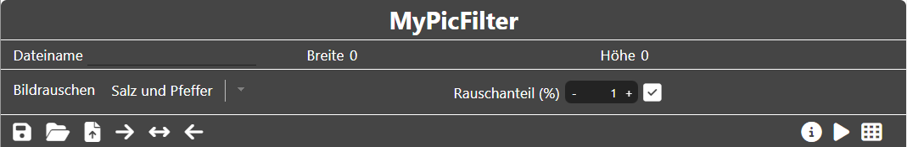
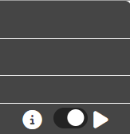

<!--
author:     Leon Endris

email:      leendris@uni-koblenz.de

version:    1.0.0

language:   de

narrator:   Deutsch Female

comment:    Dies ist die Sandbox für den
            CV Online Kurs. Alle Tools, die für
            den Kurs entwickelt wurden werden 
            hier aufgelistet und beschrieben

link:       ../CSS/Main.css

script:     ../JavaScript/LiaScriptCustom.js

-->

# Sandbox
Hier sind alle Tools zu finden, die für den CV Online Kurs entwickelt wurden
(Auf Github hochgeladen)
 
## MyPicCoder
Der **"MyPicCoder"** wurde als Alternative zum Tool **"CodeMyPic"** entwickelt. Es können folgende Grafikdateien erstellt werden:

* Portable Bitmap (*.pbm)
* Portable Graymap (*.pgm)
* Portable Pixmap (*.ppm)
* Scalable Vector Graphics (*.svg)

??[MyPicCoder](https://shortytwo42.github.io/InteractiveCodingTools/InteractiveCodingTools/HTML/MyPicCoder.html)

### MyPicCoder Anleitung

    

        Das Tool **"MyPicCoder"** ist in zwei Abschnitte aufgeteilt. Links der Editor und rechts die Vorschau
        
    

    

        Im Header befinden sich alle wichtigen Funktionen
        
    

    

        Links im Header kann zunächst der Dateiname frei gewählt werden. 
        

        Die Icons bedeuten folgendes von links nach rechts:
        <ul>
            <li> Die Diskette, speichert das aktuelle Bild mit dem aktuell ausgewählten Dateinamen.</li>
            <li> Der Ordner kann verwendet werden, um eigene Bilder hochzuladen und diese zu bearbeiten. Hierbei werden nur Dateien der Art "pbm", "pgm", "ppm" und "svg" angenommen.</li>
            <li> Die Datei mit Pfeil, öffnet das Beispielbilder Menü (zu diesem kommen wir später).</li>
            <li> Der Pfeil, der nach rechts zeigt, versteckt die Vorschau und gibt dem Editor, den gesamten Platz.</li>
            <li> Der Pfeil, der in beide Richtungen zeigt, sorgt dafür, dass Editor und Vorschau, zu gleichen Anteilen gezeigt werden</li>
            <li> Der Pfeil, der nach links zeigt, versteckt den Editor und gibt der Vorschau, den gesamten Platz.</li>
        </ul>
    

    

        Rechts im Header sehen wir folgende Icons.
        

        Die Icons bedeuten folgendes von links nach rechts:
        <ul>
            <li> Der Slider ist zu Beginn angeschaltet. Das bedeutet, dass die Live-Vorschau aktiviert ist. Änderungen im Editor werden also in Echtzeit auch in der Vorschau gezeigt. Die Live-Vorschau kann jederzeit an und ausgeschaltet werden.</li>
            <li> Ist die Live-Vorschau ausgeschaltet, kann das Code Symbol geklickt werden, um die Vorschau manuell zu aktualisieren.</li>
        </ul>
    

    

        Nun zum Beispielbilder Menü. In diesem kann zunächst ausgewählt werden, von welchem Bildtyp das Beispiel sein soll. Dabei wird zwischen "pbm", "pgm", "ppm" und "svg" unterschieden. Für jeden Bildtyp gibt es drei Beispiele, die ausgewählt werden können. Durch Klicken auf das "Datei mit Pfeil"-Icon in der unteren rechten Ecke des Menüs, wird das ausgewählte Beispiel hochgeladen und kann bearbeitet werden.
        
    

## PutPixel
Das **"PutPixel"** Tool wurde entwickelt, um den Teilnehmenden des Kurses die Möglichkeit zu geben mithilfe der Funktion **"putPixel()"** **"For-Schleifen"** sowie **"If-Abfragen"** besser zu verstehen:

??[PutPixel](https://shortytwo42.github.io/InteractiveCodingTools/InteractiveCodingTools/HTML/PutPixel.html)

### PutPixel Anleitung

    

        Das Tool **"PutPixel"** ist in zwei Abschnitte aufgeteilt. Links der Code Editor und rechts die Vorschau
        
    

    

        Im Header kann zunächst die Dimension, also Breite und Höhe, des Bildes ausgewählt werden
        
    

    

        Links im Header sehen wir folgende Icons.
        

        Die Icons bedeuten folgendes von links nach rechts:
        <ul>
            <li> Klickt man auf diesen "Reload" Button, wird ein simpler Beispielcode geladen, um einen Ansatzpunkt zur Verfügung zu stellen, der weiter verändert werden kann.</li>
            <li> Der Pfeil, der nach rechts zeigt, versteckt die Vorschau und gibt dem Editor, den gesamten Platz.</li>
            <li> Der Pfeil, der in beide Richtungen zeigt, sorgt dafür, dass Editor und Vorschau, zu gleichen Anteilen gezeigt werden</li>
            <li> Der Pfeil, der nach links zeigt, versteckt den Editor und gibt der Vorschau, den gesamten Platz.</li>
        </ul> 
    

    

        Rechts im Header sehen wir das Code Icon.
        <ul>
            <li> Wird dieses Angeklickt, wird das Programm aus dem Editor zunächst überprüft (ob dieses auch nur zugelassene Funktionen beinhaltet), und anschließend ausgeführt.</li>
       </ul> 
    

## MyPicFilter
**"MyPicFilter"** wurde als Tool entwickelt um die Auswirkungen verschiedener Filter auf Eingabebilder zu verdeutlichen:

??[MyPicFilter](https://shortytwo42.github.io/InteractiveCodingTools/InteractiveCodingTools/HTML/MyPicFilter.html)

### MyPicFilter Anleitung

    

        Das Tool **"MyPicFilter"** ist in zwei Abschnitte aufgeteilt. Links wird das Eingabebild angezeigt und rechts das Ausgabeild, nachdem der vorher definierte Filter angewandt wurde.
        
    

    

        Der Header zeigt zunächst den Namen, die Breite und die Höhe des aktuellen Bildes. Darunter ist es zudem möglich verschiedene Arten des Rauschens auf das Eingabebild drauf zu rechnen (Salz und Pfeffer Rauschen oder Gauß-Rauschen). Zudem kann der Rauschanteil (Salz und Pfeffer Rauschen) beziehungsweise die Rauschstärke (Gauß-Rauschen) eingestellt werden. 
        
        <ul>
            <li> Durch Klicken auf das Häkchen Icon wird das Rauschen auf das Eingabebild angewandt.</li>
       </ul>
    

    

        Links im Header sehen wir folgende Icons.
        

        Die Icons bedeuten folgendes von links nach rechts:
        <ul>
            <li> Durch Klicken auf das Speicher Icon, wird zunächst das Speichermenü aufgerufen (zu diesem kommen wir später).</li>
            <li> Der Ordner kann verwendet werden, um eigene Dateien hochzuladen. Angenommen werden Dateien vom Typen "pgm", "ppm", "jpg" und "png".</li>
            <li> Die Datei mit Pfeil, öffnet das Beispielbilder Menü (zu diesem kommen wir später).</li>
            <li> Der Pfeil, der nach rechts zeigt, versteckt das Ausgabebild und gibt dem Eingabebild, den gesamten Platz.</li>
            <li> Der Pfeil, der in beide Richtungen zeigt, sorgt dafür, dass sowohl Eingabebild als auch Ausgabebild, zu gleichen Anteilen gezeigt werden.</li>
            <li> Der Pfeil, der nach links zeigt, versteckt das Ausgabebild und gibt dem Eingabebild, den gesamten Platz.</li>
        </ul> 
    

    

        Rechts im Header sehen wir folgende Icons.
        

        Die Icons bedeuten folgendes von links nach rechts:
        <ul>
            <li> Durch Klicken auf das Play Icon wird der aktuell ausgewählte Filter auf das Eingabebild angewandt und dadurch das Ausgabebild erzeugt.</li>
            <li> Durch Klicken auf das Filter Icon wird das Filtermenü geöffnet (zu diesem kommen wir später).</li>
        </ul>
    

    

        Im Speichermenü kann entschieden werden, ob das Eingabebild und/oder das Ausgabebild gespeichert werden sollen und auch in welchem Format diese gespeichert werden sollen. Mögliche Formate sind "pgm", "ppm", "jpg" und "png".
        
    

    

        Nun zum Beispielbilder Menü. In diesem kann zunächst ausgewählt werden, ob ein Grauwertbild oder ein Farbbild hochgeladen werden soll. Anschließend kann eines von drei Motiven ausgewählt werden.
        
    

    

        Im Filtermenü kann zwischen drei verschiedenen Filtern ausgewählt werden: "Medianfilter", "Mittelwertfilter" und "Gauß-Filter". Zudem ist es möglich keinen Filter auszuwählen. Die Funktionsweise jedes Filters wird im Punkt **"Filter-Info"** kurz beschrieben. Auch ist es unter den **"Filter-Optionen"** möglich den Einflussbereich des Filters anzupassen. Dabei sollten zwei Dinge bedacht werden. Die Berechnung des neuen Bilds dauert länger, je größer der Einflussbereich gewählt ist. Auch dauert die Bearbeitung von Farbbildern länger, da in diesen drei Kanäle anstelle von nur einem Kanal neu berechnet werden müssen. Die Durchführung kann möglicherweise einige Sekunden dauern und ist auch von der Hardware abhängig. Auch ist es möglich die Randbehandlung des Filters anzupassen. An den Rändern der Bilder kommt es dazu, dass der Filter über die Grenzen hinweg ragt. Es ist möglich, die Ränder nicht zu behandeln und somit schwarz zu lassen, das äußerste Pixel zu wiederholen, oder auch die Randpixel zu spiegeln.
        
        
        
        
    

## MyTerrainCreator
**"MyTerrainCreator"** wurde als Tool entwickelt um interaktiv **"Heightmaps"** sowie **"Texturemaps"** zu erstellen und direkt die Auswirkung auf ein virtuelles Terrain zu erkennen.

??[MyPicFilter](https://shortytwo42.github.io/InteractiveCodingTools/InteractiveCodingTools/HTML/MyTerrainCreator.html)

### MyTerrainCreator Anleitung

    

        Das Tool **"MyTerrainCreator"** ist in zwei Abschnitte aufgeteilt. Links kann sowohl die **"Heightmap"** als auch die **"Texturemap"** des Terrains bearbeitet werden, indem auf diese gemalt wird. Rechts ist das Terrain zu sehen, das durch die Bearbeitung der beiden Texturen Form und Farbe annimmt. Im Zeichenbereich ist es möglich mittels des Scrollrads der Maus zu zoomen. Durch Rechtsklick und bewegen der Maus kann über das Bild geschwenkt werden. Durch Linksklick und bewegen der Maus kann gemalt werden. Auch in der Vorschau kann man mit dem Mausrad zoomen und mit Linksklick und bewegen der Maus kann die Kameraposition verändert werden.
        
    

     

        Der Header zeigt zunächst an, in welchem Modus wir uns Befinden. Die beiden Modi, die es gibt, sind der **"Heightmap Modus"** und der **"Texturemap Modus"**. Darunter steht, der Dateiname der aktuellen Textur und die Dimensionen von dieser. 
        
    

    

        Links im Header sehen wir folgende Icons.
        

        Die Icons bedeuten folgendes von links nach rechts:
        <ul>
            <li> Durch Klicken auf das Speicher Icon wird zunächst das Speichermenü geöffnet (zu diesem kommen wir später).</li>
            <li> Durch Klicken auf das Ordner Icon können eigene **"Height-"** oder **"Texturemaps"** hochgeladen werden. Erlaubt sind für **"Heightmaps"** Dateien der Art "pgm", "jpg" und "png" und für **"Texturemaps"** "ppm", "jpg" oder "png".</li>
            <li> Das "Datei mit Pfeil"-Icon erlaubt es Beispiele hochzuladen und öffnet zunächst das Beispielbilder Menü (zu diesem kommen wir später).</li>
            <li> Das "Datei mit Plus"-Icon erlaubt es, neue **"Heightmaps"** und **"Texturemaps"** zu erstellen. Hierfür wird das "neue Heightmap/Texturemap"-Menü geöffnet (zu diesem kommen wir später).</li>
            <li> Der Pfeil, der nach rechts zeigt, versteckt die Vorschau und gibt dem Zeichenbereich, den gesamten Platz.</li>
            <li> Der Pfeil, der in beide Richtungen zeigt, sorgt dafür, dass sowohl Zeichenbereich als auch Vorschau, zu gleichen Anteilen gezeigt werden</li>
            <li> Der Pfeil, der nach links zeigt, versteckt den Zeichenbereich und gibt der Vorschau, den gesamten Platz.</li>
        </ul> 
    

    

        Rechts im Header sehen wir folgende Icons.
        

        Die Icons bedeuten folgendes von links nach rechts:
        <ul>
            <li> Der Slider ist zu Beginn angeschaltet. Das bedeutet, dass die Live-Vorschau aktiviert ist. Das heißt, dass alle Änderungen an den Texturen direkt in der Terrain-Vorschau angezeigt werden.</li>
            <li> Ist die Live-Vorschau ausgeschaltet, kann man die Änderungen durch Klicken auf das Play Icon manuell aktualisieren.</li>
        </ul>
    

    

        Im Speichermenü kann entschieden werden, ob die **"Heightmap"**, die **"Texturemap"** und/oder die **"Geometrie"** gespeichert werden sollen und auch in welchem Format diese jeweils gespeichert werden sollen. Mögliche Formate für **"Height-"** und **"Texturemap"** sind "pgm", "ppm", "jpg" und "png". Die Geometrie wird als "stl" Datei gespeichert.
        
    

    

        Im Beispielbilder Menü können Beispiele ausgewählt und hochgeladen werden. Je nachdem welcher Modus momentan ausgewählt ist, werden auch **"Heightmap"** oder **"Texturemap"** Beispiele vorgeschlagen. 
        
    

    

        Im "neue Heightmap/Texturemap"-Menü können neue **"Heightmaps"** und **"Texturemaps"** erstellen werden. Dabei können die Dimensionen und der Dateiname frei gewählt werden. Wird „neue Heightmap erstellen“ bzw. „neue Texturemap erstellen“ angehakt, so werden die ausgewählten Optionen durch Klicken auf das Häkchen unten rechts erstellt.
        
    

    

        Links im Zeichenbereich gibt es eine Sidebar, durch die verschiedene Aktionen durchgeführt werden können. 
        

        <ul>
            <li> Das Menü Icon öffnet das Hauptmenü mit verschiedenen Optionen (zu diesem kommen wir später).</li>
            <li> Der Pfeil nach links mit dem Uhrzeiger ist der Undo Button. Mit diesem können die letzten Pinselstriche gelöscht werden.</li>
            <li> Der Pfeil nach rechts mit dem Uhrzeiger ist der Redo Button. Mit diesem können versehentlich, mit dem Undo Button, gelöschte Pinselstriche wiederhergestellt werden.</li>
            <li> Das Radiergummi Icon wechselt zwischen Zeichnen und Radieren. Ist der Radiergummi aktiv, ist das Symbol blau.</li>
            <li> Das Bild Icon wird genutzt, um zwischen **"Heightmap Modus"** und **"Texturemap Modus"** zu wechseln. Es ist blau, wenn wir uns im **"Texturemap Modus"** befinden.</li>
        </ul>
    

    

        Durch Klicken auf den Menü Button wird das Hauptmenü geöffnet. Dort können wir verschiedene Anpassungen unternehmen. Es gibt die Pinseloptionen. Im **"Heightmap Modus"** kann dort der Grauwert des Pinsels angepasst werden, im **"Texturemap Modus"** die Farbe des Pinsels. Zudem kann die Deckkraft, Pinselgröße und ob es ein weicher Pinsel sein soll (Intensität nimmt zu den Rändern ab) angepasst werden. Die Terrain Optionen lassen die Auflösung des Terrains manuell anpassen. Sowie die Skalierung des gesamten Terrains (Default ist es eine Einheitsebene von -1 bis 1). Auch die Höhenmap Skalierung kann angepasst werden. Also wie stark der Höhenwert der **"Heightmap"** gewichtet werden soll. Auch ist es möglich in den Wireframe Modus zu wechseln. Zuletzt gibt es die Lichtoptionen. Dabei kann die Lichtfarbe angepasst werden, ob das Licht um das Terrain rotieren soll und wenn ja, wie schnell es um das Terrain rotieren soll.
        
    

