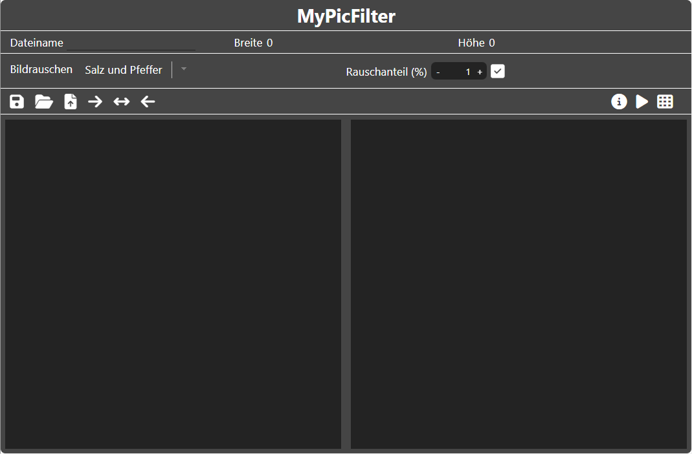

<!--
author:     Leon Endris

email:      leendris@uni-koblenz.de

version:    0.1.0

language:   de

narrator:   Deutsch Female

comment:    Dies ist die Sandbox für den
            CV Online Kurs. Alle Tools, die für
            den Kurs entwickelt wurden werden 
            hier aufgelistet und kurz beschrieben

link:       ../CSS/Main.css

script:     ../JavaScript/LiaScriptCustom.js

-->

# Sandbox
Hier sind alle Tools zu finden, die für den CV Online Kurs entwickelt wurden
(Auf Github hochgeladen)
 
## MyPicCoder
Der **"MyPicCoder"** wurde als Alternative zum Tool **"CodeMyPic"** entwickelt. Es können folgende Grafikdateien erstellt werden:

* Portable Bitmap (*.pbm)
* Portable Graymap (*.pgm)
* Portable Pixmap (*.ppm)
* Scalable Vector Graphics (*.svg)

??[MyPicCoder](https://shortytwo42.github.io/InteractiveCodingTools/InteractiveCodingTools/HTML/MyPicCoder.html)

### MyPicCoder Anleitung

    

        Das Tool **"MyPicCoder"** ist in zwei Abschnitte aufgeteilt. Links der Editor und rechts die Vorschau
        
    

    

        Im Header befinden sich alle wichtigen Funktionen
        
    

    

        Links im Header kann zunächst der Dateiname frei gewählt werden. 
        

        Die Icons bedeuten folgendes von links nach rechts:
        <ul>
            <li> Die Diskette, speichert das aktuelle Bild mit dem aktuell ausgewählten Dateinamen.</li>
            <li> Der Ordner kann verwendet werden, um eigene Bilder hochzuladen und diese zu bearbeiten. Hierbei werden nur Dateien der Art "pbm", "pgm", "ppm" und "svg" angenommen.</li>
            <li> Die Datei mit dem Pfeil, öffnet das Beispielbilder Menü (zu diesem kommen wir später).</li>
            <li> Der Pfeil, der nach rechts zeigt, versteckt die Vorschau und gibt dem Editor, den gesamten Platz.</li>
            <li> Der Pfeil, der in beide Richtungen zeigt, sorgt dafür, dass Editor und Vorschau, zu gleichen Anteilen gezeigt werden</li>
            <li> Der Pfeil, der nach links zeigt, versteckt den Editor und gibt der Vorschau, den gesamten Platz.</li>
        </ul>
    

    

        Rechts im Header sehen wir folgende Icons.
        

        Die Icons bedeuten folgendes von links nach rechts:
        <ul>
            <li> Der Slider ist zu beginn angeschaltet. Das bedeutet, dass die Live-Vorschau aktiviert ist. Änderungen im Editor werden also in Echtzeit auch in der Vorschau gezeigt. Die Live-Vorschau kann jederzeit an und ausgeschaltet werden.</li>
            <li> Ist die Live-Vorschau ausgeschaltet, kann das Code Symbol geklickt werden, um die Vorschau manuell zu aktualisieren.</li>
        </ul>
    

    

        Nun zum Beispielbilder Menü. In diesem kann zunächst ausgewählt werden, von welchem Bildtyp das Beispiel sein soll. Dabei wird zwischen "pbm", "pgm", "ppm" und "svg" unterschieden. Für jeden Bildtyp gibt es drei Beispiele, die ausgewählt werden können. Durch Klicken auf das "Datei mit dem Pfeil"-Icon in der unteren rechten Ecke des Menüs, wird das ausgewählte Beispiel hochgeladen und kann bearbeitet werden.
        
    

## PutPixel
Das **"PutPixel"** Tool wurde entwickelt, um den Teilnehmenden des Kurses die Möglichkeit zu geben mithilfe der Funktion **"putPixel()"** **"For-Schleifen"** sowie **"If-Abfragen"** besser zu verstehen:

??[PutPixel](https://shortytwo42.github.io/InteractiveCodingTools/InteractiveCodingTools/HTML/PutPixel.html)

### PutPixel Anleitung

    

        Das Tool **"PutPixel"** ist in zwei Abschnitte aufgeteilt. Links der Code Editor und rechts die Vorschau
        
    

    

        Im Header kann zunächst die Dimension, also Breite und Höhe, des Bildes ausgewählt werden
        
    

    

        Links im Header sehen wir folgende Icons.
        

        Die Icons bedeuten folgendes von links nach rechts:
        <ul>
            <li> Klickt man auf diesen "Reload" Button, wird ein simpler Beispielcode geladen, um einen Ansatzpunkt zur Verfügung zu stellen, der weiter verändert werden kann.</li>
            <li> Der Pfeil, der nach rechts zeigt, versteckt die Vorschau und gibt dem Editor, den gesamten Platz.</li>
            <li> Der Pfeil, der in beide Richtungen zeigt, sorgt dafür, dass Editor und Vorschau, zu gleichen Anteilen gezeigt werden</li>
            <li> Der Pfeil, der nach links zeigt, versteckt den Editor und gibt der Vorschau, den gesamten Platz.</li>
        </ul> 
    

    

        Rechts im Header sehen wir das Code Icon.
        <ul>
            <li> Wird dieses Angeklickt, wird das Programm aus dem Editor zunächst überprüft (ob dieses auch nur zugelassene Funktionen beinhaltet), und anschließend ausgeführt.</li>
       </ul> 
    

## MyPicFilter
**"MyPicFilter"** wurde als Tool entwickelt um die Auswirkungen verschiedener Filter auf Eingabebilder zu verdeutlichen:

??[MyPicFilter](https://shortytwo42.github.io/InteractiveCodingTools/InteractiveCodingTools/HTML/MyPicFilter.html)

### MyPicFilter Anleitung

    

        Das Tool **"MyPicFilter"** ist in zwei Abschnitte aufgeteilt. Links wird das Eingabebild angezeigt und rechts das Ausgabeild, nachdem der vorher definierte Filter angewandt wurde.
        
    

    

        Der Header zeigt zunächst den Namen, die Breite und die Höhe des aktuellen Bildes. Darunter ist es zudem möglich verschiedene Arten des Rauschens auf das Eingabebild drauf zu rechnen (Salz und Pfeffer Rauschen oder Gauß-Rauschen). Zudem kann der Rauschanteil (Salz und Pfeffer Rauschen) beziehungsweise die Rauschstärke (Gauß-Rauschen) eingestellt werden. 
        
        <ul>
            <li> Durch Klicken auf das Häkchen Icon wird das Rauschen auf das Eingabebild angewandt.</li>
       </ul>
    

    <!--  -->

## MyTerrainCreator
**"MyTerrainCreator"** wurde als Tool entwickelt um interaktiv **"Heightmaps"** sowie **"Texturemaps"** zu erstellen und direkt die Auswirkung auf ein virtuelles Terrain zu erkennen

??[MyPicFilter](https://shortytwo42.github.io/InteractiveCodingTools/InteractiveCodingTools/HTML/MyTerrainCreator.html)

### MyTerrainCreator Anleitung

    

    

