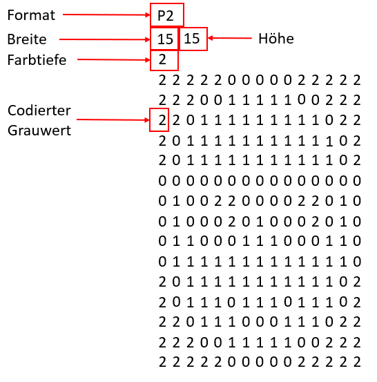
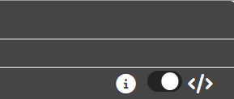

<!--
author:     Leon Endris

email:      leendris@uni-koblenz.de

version:    1.1.0

language:   de

narrator:   Deutsch Female

comment:    Dies ist die erste Lektion des
            CV Online Kurses. Verschiedene Formate 
            und Nutzen von Pixel-/Rastergrafiken 
            werden hier vorgestellt.

link:       ../CSS/main.css 

script:     ../JavaScript/liaScriptCustom.js

logo:       ../Images/Rastergraphics/Rastergraphics_Logo.png

-->

# Lektion 1: Pixel-/Rastergrafik
Willkommen zur ersten Lektion des CV Online Kurses. In dieser Lektion lernst du mehr über den Aufbau von Pixel-/Rastergrafiken. Außerdem sollst du am Ende dieser Lektion in der Lage sein erste eigene Bilddateien selber zu erstellen.

# Was ist eine Pixel-/Rastergrafik?
Gängige Bildformate wie **JPG** oder **PNG** verwenden ein Raster, um sogenannte **Picture Elements**, kurz **"Pixel"**, anzuordnen. Jeder Pixel enthält eine codierte Farbwertinformation. Die wichtigsten Eigenschaften eines solchen codierten Bildes sind **Höhe**, **Breite** und **Farbtiefe**. Die **Farbtiefe** gibt an, wie viele Abstufungen von Helligkeitswerten möglich sind. Dadurch gibt sie auch an, wie viele **Bits** benötigt werden, um den Farbwert zu codieren. Ein **Bit** ist die kleinste Informationseinheit in der Informatik und nimmt entweder den Wert *"1"* oder *"0"* an. Binärbilder erlauben beispielsweise nur schwarze oder weiße Pixel. Deshalb ist ein **Bit** ausreichend um den Wert eines jeden darin vorkommenden Pixels zu speichern. Bei Grauwertbildern können verschiedene Grautöne zwischen Schwarz und Weiß dargestellt werden. Normalerweise werden 8 **Bit** (= 1 **Byte**) dafür verwendet. Während mit 1 **Bit** nur 21, also 2 Werte gespeichert werden können, kann man mit 8 **Bit** 28 ganze 256 Abstufungen erziehlen. Schließlich können Farbbilder durch das anteilige Mischen der Farben Rot, Grün und Blau erzeugt werden, hierbei kann jeder einzelne Farbkanal mit 1 **Byte** codiert werden.

Ein Problem bei Pixel-/Rastergrafiken besteht darin, dass eine verlustfreie Skalierung nicht möglich ist. Wenn wir in ein solches Bild hineinzoomen, werden die einzelnen Pixel immer deutlicher sichtbar.

---------------------------------------------------------------------------------------------------------------------------------------------------------------------------------

> In diesen Abbildungen wird immer weiter in ein Bild hineingezoomt. Die einzelnen Pixel werden immer deutlicher sichtbar
>
>    

# Wie werden einfache Bildformate codiert?
> Der Inhalt des folgenden Textes ist auch am Ende dieser Seite in einem Video zusammengefasst. Nutzte die Resource, die dir besser liegt oder lese den Text und schaue zusätzlich das Video um das Gelernte zu festigen.

---------------------------------------------------------------------------------------------------------------------------------------------------------------------------------
Portable Bitmap (PBM)
=================================================================================================================================================================================

Gehen wir zunächst von einem simplen Schwarz-Weiß-Bild aus. Wir codieren nun den Wert eines jeden Pixels als Zahl. *Schwarz* wird als *"1"* und *Weiß* wird als *"0"* codiert. Das ist schon fast die Codierung die wir für das lesen einer **Portable Bitmap (PBM)** verwenden. In der ersten Zeile muss nun zusätzlich das Format angeben werden. **PBMs** werden dabei durch das einfügen von *"P1"* in der ersten Zeile gekennzeichnet. Anschließend geben wir die Dimension unseres Bildes in der zweiten Zeile an. Also die Breite und danach die Höhe. Die restlichen Zeilen codieren dann das eigentliche Bild.

> Codierung eines Smileys im PBM Format:
> 
> 

---------------------------------------------------------------------------------------------------------------------------------------------------------------------------------
Portable Graymap (PGM)
=================================================================================================================================================================================

Möchten wir nun Grauwertbilder codieren, also Bilder, die auch Werte zwischen Schwarz und Weiß annehmen können, nutzen wir das **Portable Graymap (PGM)** Format. Die erste Zeile wird von *"P1"* in *"P2"* umgewandelt, um zu kennzeichnen, dass es sich nun um ein **PGM** handelt. In Zeile zwei werden weiterhin die Breite und Höhe unseres Bildes angezeigt. In einer dritten Zeile wird nun zusätzlich die **Farbtiefe** angegeben. Die **Farbtiefe** gibt an, wie viele Abstufungen von Grautönen wir zulassen, beziehungsweise was der Maximalwert sein soll, bei dem ein Pixel ganz weiß ist. Hierbei ist es nun wichtig zu beachten, dass *"0" Schwarz* codiert und die Zahl, die wir als Maximalwert festgelegt haben *Weiß*. In unserem Beispiel geben wir eine **Farbtiefe** von *"2"* an. Das bedeutet, dass *"0" schwarz*, *"1" grau* und *"2" weiß* codiert.

> Codierung eines Smileys im PGM Format:
> 
> 

---------------------------------------------------------------------------------------------------------------------------------------------------------------------------------
Portable Pixmap (PPM)
=================================================================================================================================================================================

Farbbilder sind mit den vorherigen Formaten nicht darstellbar. Auf einem gängigen Computer Bildschirm wird die Wahrnehmung verschiedener Farben erzielt, indem die drei Farben Rot, Grün und Blau anteilig gemischt werden. Wir sprechen hierbei vom **RGB-Farbraum**. Schwarz, Grau und Weiß werden dargestellt, indem alle drei Grundfarben zu gleichen Anteilen verwendet werden. Nutzen wir nun 3 Zahlen pro Pixel anstatt wie bisher nur einer, können wir alle drei Grundfarben einzeln ansprechen und bestimmen, zu welchem Anteil sie den Farbeindruck des aktuellen Pixels beeinflussen. In die erste Zeile schreiben wir nun *"P3"* um zu kennzeichnen, dass es sich um eine **Portable Pixmap (PPM)** handelt. Zeile zwei beschreibt, wie auch bei den beiden vorherigen Formaten, die Breite und Höhe des codierten Bildes. In Zeile 3 wird, wie auch bei **PGMs**, die **Farbtiefe** angegeben. Diese bezieht sich nun aber auf alle drei Farbkanäle. In unserem Beispiel geben wir als **Farbtiefe** *"1"* an. Das bedeutet, dass eine Grundfarbe entweder gar keinen Anteil am Farbwert des aktuellen Pixels nimmt, wenn sie auf *"0"* steht. Oder, dass sie den Farbwert des aktuellen Pixels beeinflusst, wenn sie auf *"1"* steht. *Rot* würde hierbei als *"1 0 0"* codiert werden, *Grün* als *"0 1 0"* und *Blau* als *"0 0 1"*. Unser Beispiel zeigt wieder den Smiley, aber dieses mal in Farbe.

> Codierung eines Smileys im **PPM** Format:
> 
> 

---------------------------------------------------------------------------------------------------------------------------------------------------------------------------------

> Dieses Video fasst den Inhalt des vorangegangenen Textes zusammen:
> 
> !?[pixelGraphicVideo](https://youtu.be/-6yhYWyqlCo)

## Übersicht der Formate PBM, PGM und PPM
An dieser Stelle werden die wichtigsten Details nochmals aufgelistet.

---------------------------------------------------------------------------------------------------------------------------------------------------------------------------------
Portable Bitmap (PBM) - Übersicht
---------------------------------------------------------------------------------------------------------------------------------------------------------------------------------

Das **Portable Bitmap (PBM)** Format ist gut für die Erstellung von Schwarz-Weiß-Bildern geeignet. Der Aufbau ist wie folgt:

* Die erste Zeile gibt das Format an. Damit erkannt wird, dass es sich um ein **PBM** handelt, tragen wir dort *"P1"* ein.
* Die zweite Zeil gibt die Dimension unseres Bildes an. Möchten wir also ein Bild mit Breite 15 und Höhe 15 erstellen, dann schreiben wir *"15 15"* in diese Zeile.
* Ab der dritten Reihe werden nun die einzelnen Pixel codiert. Beim **PBM** ist es nur möglich *schwarze* oder *weiße* Pixel zu codieren. *Weiße* Pixel werden mit einer *"0"* codiert und *schwarze* Pixel mit einer *"1"*.

> Aufbau des **Portable Bitmap (PBM)** Formats:
> 
> 

---------------------------------------------------------------------------------------------------------------------------------------------------------------------------------
Portable Graymap (PGM) - Übersicht
---------------------------------------------------------------------------------------------------------------------------------------------------------------------------------

Das **Portable Graymap (PGM)** Format ist für die Erstellung von Grauwertbildern geeignet. Der Aufbau ist wie folgt:

* Die erste Zeile gibt das Format an. Damit erkannt wird, dass es sich um ein **PGM** handelt, tragen wir dort *"P2"* ein.
* Die zweite Zeile gibt die Dimension unseres Bildes an. Möchten wir also ein Bild mit Breite 15 und Höhe 15 erstellen, dann schreiben wir *"15 15"* in diese Zeile.
* Anders als bei **PBMs** wird in der dritten Zeile zusätzlich die Information benötigt, wie viele Abstufungen von Grautönen wir zulassen, beziehungsweise was der Maximalwert sein soll, bei dem ein Pixel ganz weiß ist. Meist werden *"255"* Grautöne zugelassen. 
* Ab der vierten Zeile werden nun die einzelnen Pixel codiert. Beim **PGM** ist es nun möglich auch Grauwerte zwischen *schwarz "0"* und *weiß (der vorher definierte Maximalwert)* zu codieren, indem wir die Zahlen zwischen *"0"* und unserem definierten *Maximalwert* wählen.

> Aufbau des **Portable Bitmap (PBM)** Formats:
> 
> 

---------------------------------------------------------------------------------------------------------------------------------------------------------------------------------
Portable Pixmap (PPM) - Übersicht
---------------------------------------------------------------------------------------------------------------------------------------------------------------------------------

Das **Portable Pixmap (PPM)** Format ist für die Erstellung von Farbbildern geeignet. Der Aufbau ist wie folgt:

* Die erste Zeile gibt das Format an. Damit erkannt wird, dass es sich um ein **PPM** handelt, tragen wir dort *"P3"* ein.
* Die zweite Zeile gibt die Dimension unseres Bildes an. Möchten wir also ein Bild mit Breite 15 und Höhe 15 erstellen, dann schreiben wir *"15 15"* in diese Zeile.
* Wie auch bei **PGMs** wird in der dritten Zeile zusätzlich die Information benötigt, wie viele Abstufungen von Helligkeitswerten wir zulassen, beziehungsweise was der Maximalwert sein soll. Meist werden *"255"* Abstufungen zugelassen.
* Ab der vierten Zeile werden nun die einzelnen Pixel codiert. Beim **PPM** ist es nun möglich auch Farbwerte zu codieren. Dies wird ermöglicht, indem wir nun 3 Zahlen pro Pixel angeben. Eine für den Rot-, eine für den Grün- und eine für den Blaukanal. Wir mischen diese 3 Farbwerte also anteilig, um verschiedene Farbeindrücke zu erzeugen. Möchten wir ein Rotes Pixel erzeugen und die Farbtiefe wurde auf *"255"* gesetzt, so setzten wir die Zahlen *"255 0 0"* ein.

> Aufbau des **Portable Bitmap (PBM)** Formats:
> 
> 

# Erstelle ein eigenes Bild
Erstelle nun eigene Bilder mit dem Tool "MyPicCoder". Die Dokumentation und Anleitung für das Tool befindet sich auf der nächsten Seite, falls etwas unklar ist. Nutze den Editor, um dein Bild in einem der drei Vorgestellten Formate zu erstellen. Sei kreativ und spiel ein wenig mit dem Tool rum. Mögliche Motive wären:

* Der eigene Name
* Ein Baum
* Ein einfaches Emoji

Du kannst auch über  ein Beispielbild auswählen und dieses bearbeiten und anpassen.

??[MyPicCoder](https://shortytwo42.github.io/InteractiveCodingTools/InteractiveCodingTools/HTML/MyPicCoder.html)

## MyPicCoder Anleitung

    

        Das Tool **"MyPicCoder"** ist in zwei Abschnitte aufgeteilt. Links der Editor und rechts die Vorschau
        
    

    

        Im Header befinden sich alle wichtigen Funktionen
        
    

    

        Links im Header kann zunächst der Dateiname frei gewählt werden. 
        

        Die Icons bedeuten folgendes von links nach rechts:
        <ul>
            <li> Die Diskette, speichert das aktuelle Bild mit dem aktuell ausgewählten Dateinamen.</li>
            <li> Der Ordner kann verwendet werden, um eigene Bilder hochzuladen und diese zu bearbeiten. Hierbei werden nur Dateien der Art **"PBM"**, **"PGM"**, **"PPM"** und "svg" angenommen.</li>
            <li> Die Datei mit Pfeil, öffnet das Beispielbilder Menü (zu diesem kommen wir später).</li>
            <li> Der Pfeil, der nach rechts zeigt, versteckt die Vorschau und gibt dem Editor, den gesamten Platz.</li>
            <li> Der Pfeil, der in beide Richtungen zeigt, sorgt dafür, dass Editor und Vorschau, zu gleichen Anteilen gezeigt werden</li>
            <li> Der Pfeil, der nach links zeigt, versteckt den Editor und gibt der Vorschau, den gesamten Platz.</li>
        </ul>
    

    

        Rechts im Header sehen wir folgende Icons.
        

        Die Icons bedeuten folgendes von links nach rechts:
        <ul>
            <li> Der Slider ist zu Beginn angeschaltet. Das bedeutet, dass die Live-Vorschau aktiviert ist. Änderungen im Editor werden also in Echtzeit auch in der Vorschau gezeigt. Die Live-Vorschau kann jederzeit an und ausgeschaltet werden.</li>
            <li> Ist die Live-Vorschau ausgeschaltet, kann das Code Symbol geklickt werden, um die Vorschau manuell zu aktualisieren.</li>
        </ul>
    

    

        Nun zum Beispielbilder Menü. In diesem kann zunächst ausgewählt werden, von welchem Bildtyp das Beispiel sein soll. Dabei wird zwischen **"PBM"**, **"PGM"**, **"PPM"** und "svg" unterschieden. Für jeden Bildtyp gibt es drei Beispiele, die ausgewählt werden können. Durch Klicken auf das "Datei mit Pfeil"-Icon in der unteren rechten Ecke des Menüs, wird das ausgewählte Beispiel hochgeladen und kann bearbeitet werden.
        
    

# Programmierübung am Beispiel von Pixel-/Rastergrafiken
> Der Inhalt des folgenden Textes ist auch am Ende dieser Seite in einem Video zusammengefasst. Nutzte die Resource, die dir besser liegt oder lese den Text und schaue zusätzlich das Video um das Gelernte zu festigen.

---------------------------------------------------------------------------------------------------------------------------------------------------------------------------------
Die PutPixel-Funktion
=================================================================================================================================================================================

Wie könnte wir die erstellung einer Pixel-/Rastergrafik zumindest teilweise automatisieren? Stellen wir uns dafür zunächst das Raster eines Bildes als Koordinatensystem vor, bei dem wir die einzelnen Pixel nur mit natürlichen Zahlen (0, 1, 2, ...) ansprechen können. Das Koordinatensystem bei Bildern startet in der oberen linken Ecke. Zudem startet es nicht von 1, sondern in der Informatik zählen wir von 0 aufsteigend. Möchten wir also das obere linke Pixel eines Bildes ansprechen, so geben wir die Koordinaten *"(0, 0)"* an. Es gibt nun eine Funktion **"putPixel()"**. An diese Funktion übergeben wir die Koordinate, die wir einfärben wollen. Das würde folgendermaßen Aussehen:

> Klicke auf die einzelnen Bilder um sie im Vollbild zu betrachten. Auf jedem der Bilder ist links der Editor zu sehen, in dem wir die Funktion aufrufen. Rechts sehen wir das Bildkoordinatensystem, nachdem die Funktion ausgeführt wurde. Im ersten Bild wird die Funktion nur mit den Koordinaten aufgerufen. Das führt dazu, dass das aufgerufene Pixel schwarz gefärbt wird. Im zweiten Bild wird die Funktion zusätzlich mit einer Zahl zwischen *"0" (schwarz)* und *"255" (weiß)* aufgerufen, um das Pixel in einem gewünschten Grauwert zu färben. Und im dritten Bild wird die Funktion mit drei Zahlen zwischen *"0"* und *"255"* aufgerufen, um die Färbung in verschiedenen Farben zu ermöglichen.
> 
>   

---------------------------------------------------------------------------------------------------------------------------------------------------------------------------------
Die For-Schleife
=================================================================================================================================================================================

Möchten wir nun die erste Reihe unseres Bildes schwarz färben, könnten wir das tun, indem wir die **"putPixel()"** Funktion mehrfach aufrufen für jedes Pixel der ersten Reihe. Das können wir allerdings auch abkürzen, indem wir eine **"Schleife"** benutzen. Wir nutzen genauer gesagt eine sogenannte **"For-Schleife"**. Diese ist wie folgt aufgebaut:

* Zunächst wird eine Laufvariable definiert. Dieser Laufvariable weisen wir einen Startwert zu. In **"JavaScript"**, der Programmiersprache, die wir in diesem Kurs verwenden, würden wir das wie folgt erzielen: **let x = 0;**. Wir wählen **x = 0**, weil wir ja die gesamte erste Reihe schwarz färben möchten und deshalb auch bei *"0"* starten.
* Dann definieren wir eine Abbruchbedingung. Solange diese Bedingung erfüllt ist, wird die Schleife wiederholt. Beispielsweise möchten wir, dass der Code innerhalb der Schleife so lange wiederholt wird, bis unsere Laufvariable nicht mehr kleiner als die Breite unseres Bildes ist. Dies würden wir schreiben als: **x < picture_width;**. Der Wert für **picture_width** wird hierbei als gegeben betrachtet. Ist unser Bild also *"10"* Pixel breit würde **picture_width** auch den Wert *"10"* annehmen.
* Zuletzt müssen wir definieren, wie die Laufvariable nach jeder Durchführung der Schleife angepasst wird. In unserem Beispiel möchten wir die Variable immer um *"1"* erhöhen, um den nächten Pixel zu erreichen. Dies kann in **JavaScript** entweder als **x = x + 1**, **x += 1** oder, wie es am üblichsten ist, als **x++** realisiert werden.

> Ein Beispiel einer kompletten **"For-Schleife"** sieht also wie folgt aus: 
> 
> 

Möchten wir nun nicht nur die erste Reihe verfärben, so können wir die Schleife auch verschachteln. Wir umschließen unsere erste **"For-Schleife"** mit einer weiteren **"For-Schleife"**, die wiederum eine andere Laufvariable verändert. Diese läuft dieses Mal von *"0"* so lange durch, bis die Laufvariable nicht mehr kleiner als die Höhe des Bildes ist. Dabei wird der Wert der Höhe des Bildes in **"picture_height"** gespeichert. Verschachteln wir unsere **"For-Schleifen"** auf diese Weise, so können wir jedes Pixel unseres Bildes ansprechen.

> Mittels eines verschachtelten **"For-Loops"** können wir das gesamte Bild schwarz färben.
> 
> 

---------------------------------------------------------------------------------------------------------------------------------------------------------------------------------
Die If-Abfrage
=================================================================================================================================================================================

Zuletzt können wir noch eine **"Bedingung"** einbauen, mit der wir bestimmen, wann unsere Funktion ausgeführt werden soll. Dies erziehlen wir mithilfe einer **"If-Abfrage"**. Diese ist wie relativ simpel aufgebaut. Wir schreiben **if**, öffnen daraufhin runde Klammern **"()"**, und innerhalb dieser Klammern definieren wir unsere Bedingung. Alles was danach innerhalb der geschweiften Klammern **"{}"** steht, wird nur ausgeführt, wenn die Bedingung erfüllt ist. Mögliche Bedingungen wären:

* **if(x == y)** --> wir nutzen **"=="** um abzufragen, ob zwei Werte gleich sind (nicht mit **"="** verwechseln. Damit wird ein Wert zugewiesen)
* **if(x < y)**
* **if(x + y == 1)**
* ...

> Um in unserem Beispiel also nicht einfach das gesamte Bild schwarz zu färben, können wir zusätzlich eine Bedingung für die **"putPixel()"** Funktion definieren.  Die Funktion soll nur aufgerufen werden, wenn x und y gleich sind.
> 
> 

---------------------------------------------------------------------------------------------------------------------------------------------------------------------------------

> Dieses Video fasst den Inhalt des vorangegangenen Textes zusammen:
> 
> !?[putPixelVideo](https://youtu.be/SJvE3u-DgiQ)

## Programmierbeispiel: PutPixel
Versuche es nun selbst mithilfe des PutPixel Tools. Die Dokumentation und Anleitung für das Tool befindet sich auf der nächsten Seite, falls etwas unklar ist. 
Mögliche Aufgaben wären:

* Färbe nur die 3te Reihe schwarz
* Färbe ein Pixel nur, wenn x + y ein Bestimmtes Ergebnis erfüllen
* Änder die Breite und Höhe des Bildes auf *"256"* und gehe mit einer verschachtelten Schleife über jedes Pixel. Setze nun Beispielsweise den x-Wert als Rot und den y-Wert als Grün ein. (Erinnerung: **"putPixel(x, y, [0, 0, 0])"** würde das Pixel schwarz färben)

??[PutPixel](https://shortytwo42.github.io/InteractiveCodingTools/InteractiveCodingTools/HTML/PutPixel.html)

### PutPixel Anleitung

    

        Das Tool **"PutPixel"** ist in zwei Abschnitte aufgeteilt. Links der Code Editor und rechts die Vorschau
        
    

    

        Im Header kann zunächst die Dimension, also Breite und Höhe, des Bildes ausgewählt werden
        
    

    

        Links im Header sehen wir folgende Icons.
        

        Die Icons bedeuten folgendes von links nach rechts:
        <ul>
            <li> Klickt man auf diesen "Reload" Button, wird ein simpler Beispielcode geladen, um einen Ansatzpunkt zur Verfügung zu stellen, der weiter verändert werden kann.</li>
            <li> Der Pfeil, der nach rechts zeigt, versteckt die Vorschau und gibt dem Editor, den gesamten Platz.</li>
            <li> Der Pfeil, der in beide Richtungen zeigt, sorgt dafür, dass Editor und Vorschau, zu gleichen Anteilen gezeigt werden</li>
            <li> Der Pfeil, der nach links zeigt, versteckt den Editor und gibt der Vorschau, den gesamten Platz.</li>
        </ul> 
    

    

        Rechts im Header sehen wir das Code Icon.
        <ul>
            <li> Wird dieses Angeklickt, wird das Programm aus dem Editor zunächst überprüft (ob dieses auch nur zugelassene Funktionen beinhaltet), und anschließend ausgeführt.</li>
       </ul> 
    

