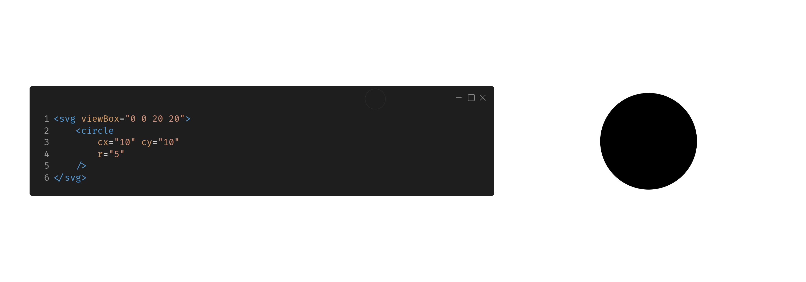
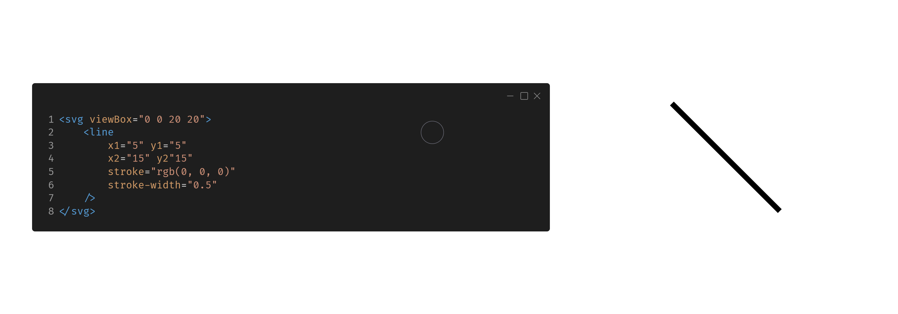
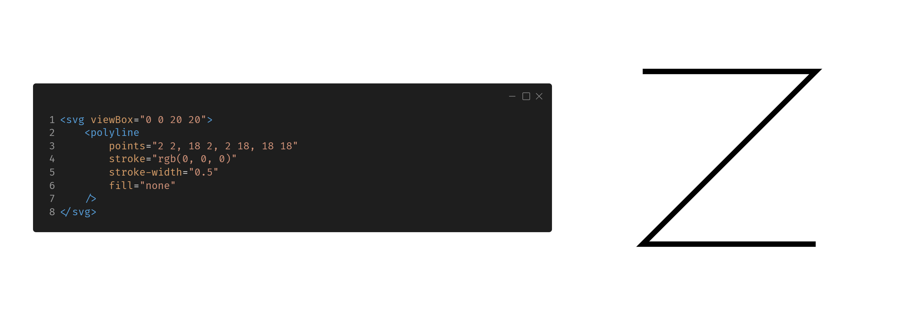
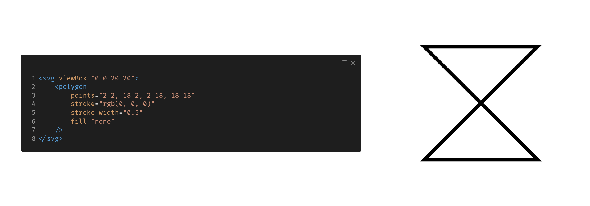
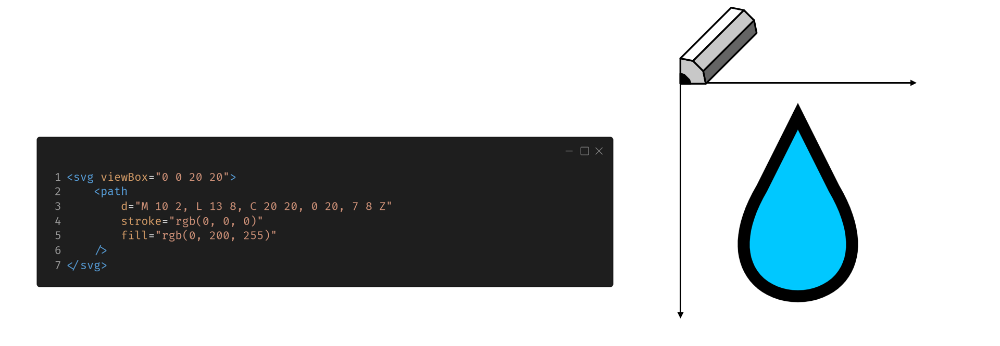

<!--
author:     Leon Endris

email:      leendris@uni-koblenz.de

version:    1.0.0

language:   de

narrator:   Deutsch Female

comment:    Dies ist die zweite Lektion des
            CV Online Kurses. Das Format "SVG"
            wird näher beschrieben und der 
            Nutzen und Einsatzbereich von 
            Vektorgrafiken wird vermittelt.

link:       ../CSS/main.css 

script:     ../JavaScript/liaScriptCustom.js

logo:       ../Images/Vectorgraphics/Vectorgraphics_Logo.png

-->

# Lektion 2: Vektorgrafiken
Willkommen zur zweiten Lektion des CV Online Kurses. In dieser Lektion lernst du mehr über den Aufbau von Vektorgrafiken. Außerdem sollst du am Ende dieser Lektion in der Lage sein erste eigene Vektorgrafiken selber zu erstellen.

# Wiederholungsquiz: "Pixel-/Rastergrafik"
In diesem kleinen Wiederholungsquiz kannst du deinen eigenen Wissensstand zum Thema "Pixel-/Rastergrafiken" nochmals überprüfen. Auch falsche Antworten können dir helfen das gelernte zu festigen, indem du die Erklärung für die korrekte Antwort nochmal verinnerlichst. Hast du eine falsche Antwort angegeben und möchtest es nicht nochmals versuchen, kannst du dir über das Häkchen die Lösung anzeigen lassen.

---------------------------------------------------------------------------------------------------------------------------------------------------------------------------------
Quiz
=================================================================================================================================================================================

1. Wofür steht das Wort "Pixel"?
---------------------------------------------------------------------------------------------------------------------------------------------------------------------------------
[[picture element]]

*********************************************************************************************************************************************************************************
Das Wort "Pixel" steht für "picture element" (Bildelement) und beschreibt das keinste Element in einer Pixel-/Rastergrafik.
*********************************************************************************************************************************************************************************

2. Welcher Begriff beschreibt die Anzahl der Helligkeitswerten, die ein Pixel in einer Pixel-/Rastergrafik annehmen kann?
---------------------------------------------------------------------------------------------------------------------------------------------------------------------------------
<!-- data-randomize -->
- [( )] Transparenz
- [( )] Auflösung
- [(X)] Farbtiefe
- [( )] Helligkeit
*********************************************************************************************************************************************************************************
Die Farbtiefe gibt an, wie viele Abstufungen von Helligkeitswerten für jedes Pixel möglich sind. Bei Farbbildern bezieht sie sich auf jeden Farbkanal einzeln.
*********************************************************************************************************************************************************************************

3. Wie viele Grauwerte können wir darstellen, wenn wir die Helligkeitswerte jedes Pixels mit einem Byte (8 Bit) codieren?
---------------------------------------------------------------------------------------------------------------------------------------------------------------------------------
<!-- data-randomize -->
- [( )] 8
- [( )] 16
- [( )] 100 000 000
- [(X)] 256
*********************************************************************************************************************************************************************************
Ein Byte entspricht 8 Bit. Jedes Bit kann dabei 2 Werte annehmen: 0 und 1. Wird der Helligkeitswert eines Pixels also mit 1 Bit codiert, gäbe es nur zwei Möglichkeiten. Bei 2 Bit gäbe es bereits **2 \* 2**, also **4** Möglichkeiten. Codieren wir den Helligkeitswert also mit 8 Bit gibt es **2 \* 2 \* 2 \* 2 \* 2 \* 2 \* 2 \* 2 = 28 = 256** Möglichkeiten.
*********************************************************************************************************************************************************************************

# Was ist eine Vektorgrafik 
Vektorgrafiken bestehen aus simplen geometrischen Formen, wie unter anderem Linien, Kurven oder Rechtecken. Diese Elemente befinden sich dabei auf einer zweidimensionalen Ebene. In diesem Kurs gehen wir näher auf **Scalable Vector Graphics (SVGs)** ein. Ein Format, mit dem es möglich ist, Vektorgrafiken zu speichern. Würden wir beispielsweise einen Kreis speichern wollen, so müssten wir ein vorher definiertes Koordinatensystem, die Koordinate des Kreismittelpunkts und den Radius des Kreises speichern. Soll die Vektorgrafik angezeigt werden, so wird diese Rasterisiert. Ein Vorgang, in dem die Vektorgrafik in eine Rastergrafik umgewandelt wird. Der Vorteil dabei ist, dass die Grundinformation in geometrischen Formen gespeichert ist, und somit eine verlustfreie Skalierung ermöglicht. Nachteil ist es, dass die Rasterisierung und Darstellung immer mit einem Rechenaufwand verbunden ist, der von Computer zu Computer unterschiedlich viel Zeit in Anspruch nehmen kann. So nehemen SVGs zwar meist weniger Speicherplatz als Pixel-/Rastergrafiken ein, tauschen diesen Vorteil aber durch eine unbekannte Rechendauer ein.

---------------------------------------------------------------------------------------------------------------------------------------------------------------------------------
Rasterisierung
=================================================================================================================================================================================
> Der Inhalt des folgenden Textes ist auch am Ende dieser Seite in einem Video zusammengefasst. Nutzte die Resource, die dir besser liegt oder lese den Text und schaue zusätzlich das Video um das Gelernte zu festigen.

Bei der Rasterisierung eines SVGs wandelt der Computer die in einer Vektorgrafik gespeicherten geometrischen Informationen in eine Rastergrafik um. Ein einfaches Beispiel hierfür ist die Darstellung eines Dreiecks. Ein Koordinatensystem und die zugehörigen Koordinaten der Dreieckseckpunkte, sowie die Farbe des Dreiecks wurden in einem SVG gespeichert. Nun soll dieses Dreieck in einem Raster der Größe 10 x 10 Pixeln dargestellt werden. 

Die Vorgehensweise dabei ist wie folgt: Die Pixel, in denen die Eckpunkten des Dreiecks liegen, werden in der Farbe des Dreiecks eingefärbt. Ebenso können diejenigen Pixel eingefärbt werden, die entlang einer Linie zwischen den Eckpunkten verlaufen. Zusätzlich erhalten die Pixel, die von den bereits eingefärbten Pixeln umgeben sind, die Farbe des Dreiecks. Dieser Prozess kann für beliebige Rastergrößen wiederholt werden und ermöglicht dadurch eine verlustfreie Skalierung von SVGs.

Auffallend sind die stufenartigen Muster, die durch die harten übergänge zwischen eingefärben und Hintergrundpixeln entstehen können. Dieser Effekt wird auch **Treppen(stufen)effekt** genannt. Um dagegen zu wirken nutzen wir das sogenannte **Anti-Aliasing**. Ziel des **Anti-Aliasing** ist es, die harten Kanten zu glätten und die wahrnehmbaren stufenartigen Muster zu reduzieren. Die Grundidee hinter Anti-Aliasing ist dabei eigentlich immer dieselbe: Anstatt ein Pixel nur entweder vollständig einzufärben oder gar nicht, erhält ein Pixel nun eine Mischfarbe basierend auf den darin enthaltenen Objekten. Das bedeutet, dass das Pixel proportional in der Farbe eingefärbt wird, die von den darin liegendem Objekten eingenommen wird. Dieses Verfahren hilft dabei, die Übergänge zwischen verschiedenen Farben sanfter zu gestalten.

---------------------------------------------------------------------------------------------------------------------------------------------------------------------------------

> Dieses Video fasst den Inhalt des vorangegangenen Textes zusammen:
> 
> !?[rasterizationVideo](https://youtu.be/AgdSERFE8cY)

## Wie ist ein SVG aufgebaut
**Scalable Vector Graphics** (SVGs) sind ein Bildformat, mit dem wir 2D Vektorgrafiken codieren können. Bildinformationen werden nicht in einem Raster gespeichert, sondern in simplen geometrischen Formen. Mit Tools wie "Inkscape" oder auch "Adobe Illustrator" können SVGs in einem Editor erstellt werden. Es gibt aber auch die Möglichkeit SVGs direkt mit Code zu erstellen. 

---------------------------------------------------------------------------------------------------------------------------------------------------------------------------------
SVGs
=================================================================================================================================================================================
> Der Inhalt des folgenden Textes ist auch am Ende dieser Seite in einem Video zusammengefasst. Nutzte die Resource, die dir besser liegt oder lese den Text und schaue zusätzlich das Video um das gelernte zu festigen.

Um ein SVG zu erstellen müssen wir zunächst einen **SVG-tag** öffnen: **\<svg>...</svg>**. In diesem Tag definieren wir zusätzlich die Dimensionen unseres Koordinatensystems. Die ersten beiden Zahlen sind dabei die Koordinaten für die obere linke Ecke des Koordinatensystems und die letzten beiden Zahlen für die untere rechte Ecke. Möchten wir also ein Koordinatensystem erstellen, dessen obere linke Ecke bei (0, 0) liegt und dessen untere rechte Ecke bei (20, 20) liegt schreiben wir: **\<svg viewBox="0 0 20 20">...</svg>**

---------------------------------------------------------------------------------------------------------------------------------------------------------------------------------
Rechtecke - \<rect ...></rect>
---------------------------------------------------------------------------------------------------------------------------------------------------------------------------------
Wir können Rechtecke in unser SVG einfügen, indem wir innerhalb des **SVG-tags** einen **rect-tag** einfügen. Rechtecken müssen wir folgende Attribute mitgeben:

- **x & y:** diese beiden Attribute definieren die Koordinate der oberen linken Ecke des Rechtecks.
- **width:** definiert die Breite des Rechtecks.
- **height:** definiert die Höhe des Rechtecks.
- **rx & ry:** (optional) **rx** beschreibt den Kantenradius in x und **ry** den Kantenradius in y Richtung. 

---------------------------------------------------------------------------------------------------------------------------------------------------------------------------------
Kreise - \<circle ...></circle>
---------------------------------------------------------------------------------------------------------------------------------------------------------------------------------
Mithilfe des **circle-tags** können wir Kreise erstellen. Einem Kreis geben wir folgende Attribute mit:

- **cx & cy:** diese beiden Attribute definieren die Koordinate des Kreismittelpunkts (c steht hierbei für center).
- **r:** definiert den Radius des Kreises.

---------------------------------------------------------------------------------------------------------------------------------------------------------------------------------
Ellipsen - \<ellipse ...></ellipse>
---------------------------------------------------------------------------------------------------------------------------------------------------------------------------------
Ellipsen werden ähnlich wie Kreise erstellt. Wir nutzen den **ellipse-tag** und übergeben folgende Attribute:

- **cx & cy:** diese beiden Attribute definieren die Koordinate des Ellipsenmittelpunkts (c steht hierbei für center).
- **rx & ry:** definieren jeweils den Ellipsen-Radius in x und in y Richtung.

---------------------------------------------------------------------------------------------------------------------------------------------------------------------------------
Linien - \<line ...></line>
---------------------------------------------------------------------------------------------------------------------------------------------------------------------------------
Mit dem **line-tag** können wir einfache Linien erstellen. Dafür müssen wir folgende Attribute definieren:

- **x1 & y1:** diese beiden Attribute definieren die Koordinate des Startpunktes der Linie.
- **x1 & y1:** diese beiden Attribute definieren die Koordinate des Endpunktes der Linie.
- **stroke:** dieses Attribut definiert die Farbe der Linie. Viele Farben können durch ihre englischen Namen ("black", "red", "green", ...) ausgewählt werden. Es ist aber auch möglich einen **RGB-Wert** zu übergeben. Beispielsweise wäre weiß "rgb(255, 255, 255)".
- **stroke-width:** (optional) mit diesem Attribut definieren wir die dicke unserer Linie. Der Standardwert beträgt 1.

Die beiden Attribute **stroke** und **stroke-width** können auch bei den anderen Geometrien angewandt werden, um deren Umrisse anzupassen.

---------------------------------------------------------------------------------------------------------------------------------------------------------------------------------
Polylinien - \<polyline ...></polyline>
---------------------------------------------------------------------------------------------------------------------------------------------------------------------------------
Polylinien sind mehrere einzelne Linien, die direkt miteinander verbunden sind. Weil die Anzahl der Koordinaten hierbei sehr lang werden kann, werden die Koordinaten auch anders übergeben. Wir übergeben dem **polyline-tag** folgende Attribute:

- **points:** dieses Attribut ersetzt die einzelnen **x1**, **y1**, ... Attribute, die wir bei Linien benutzt haben. Aufeinanderfolgende Zahlen sind nun immer ein Pärchen von x und y Werten.
- **stroke:** dieses Attribute definiert auch hier die Farbe der Linie. Eine genauere Beschreibung gibt es unter der Beschreibung von Linien.
- **stroke-width:** (optional) dieses Attribute definiert auch hier die Breite der Linie. Eine genauere Beschreibung gibt es unter der Beschreibung von Linien.
- **fill:** mit diesem Attribut können wir die Farbe des von der Polylinie umschlossenen Bereiches definieren. Wie auch bei Stroke können wir die Farbe durch die englischen Begriffe festlegen, oder den **RGB-Wert** direkt übergeben.

Das **fill** Attribut kann auch bei den anderen Geometrien verwendet werden, um deren Flächen zu färben. Wenn wir keine Färbung wollen, können wir auch folgendes eintragen: **fill="none"**.

---------------------------------------------------------------------------------------------------------------------------------------------------------------------------------
Polygone - \<polygon ...></polygon>
---------------------------------------------------------------------------------------------------------------------------------------------------------------------------------
Polygone sind Polylines sehr ähnlich. Der Hauptunterschied ist, dass automatisch die erste und letzte Koordinate miteinander verbunden werden. Ansonsten werden dieselben Attribute übergeben wie auch bei Polylinien.

---------------------------------------------------------------------------------------------------------------------------------------------------------------------------------
Pfade - \<path ...></path>
---------------------------------------------------------------------------------------------------------------------------------------------------------------------------------
Der umfangreichste Tag ist der **path-tag**. Hiermit können wir alle bisherigen Formen darstellen, allerdings ist der Tag dadurch auch etwas komplexer und weniger Intuitiv. Folgende Attribute werden mitgegeben:

- **stroke:** auch hier wird die Farbe der Linie definiert. Eine genauere Beschreibung gibt es unter der Beschreibung von Linien.
- **stroke-width:** (optional) dieses Attribute definiert auch hier die Breite der Linie. Eine genauere Beschreibung gibt es unter der Beschreibung von Linien.
- **fill:** mit diesem Attribut legen wir die Farbe der von dem Pfad umschlossenen Fläche fest. Eine genauere Beschreibung gibt es unter der Beschreibung von Polylinien.
- **d:** dieses Attribut legt die Form des Pfades fest und steht für "draw". Auf einige verschiedene Kommandos gehen wir separat ein.

Einige Kommandos für das Attribute **d** sind wie folgt aufgebaut:

- **M/m:** dieses Kommando können wir uns wie folgt vorstellen: Bevor wir anfangen zu zeichnen, bewegen wir unseren Stift an eine bestimmte Stelle auf dem Papier. Genau das macht auch das **M/m** Kommando. **M** steht dabei für **move to**. Benutzen wir ein großes **M** bezieht sich der Punkt auf das Koordinatensystem. Benutzen wir ein kleines **m** dann bewegen wir uns relativ vom letzen Punkt aus. Diesen Unterschied zwischen Groß- und Kleinbuchstaben können wir uns merken. Großbuchstaben beziehen sich immer auf das Koordinatensystem und Kleinbuchstaben beziehen sich immer relativ zur letzten Koordinate. 
- **L/l:** das **L/l** Kommando zeichnet eine Linie vom letzen Punkt zum aktuellen Punkt.
- **C/c:** mit dem **C/c** Kommando können wir sogenannte kubische Bezier Kurven zeichnen. Einfach gesagt, zeichnen wir simple Kurven. Anstatt einer Koordinate, die wie bisher auf das Kommando folgt anzugeben müssen wir hier 3 Koordinaten angeben. Die Koordinate vor dem Kommando ist der Startpunkt der Kurve, die dritte und letzte Koordinate, die wir nach dem Kommando angeben ist der Endpunkt der Kurve. Und die beiden anderen Koordinaten sind sogenannte Hilfspunkte, an denen sich die Kurven orientieren.
- **Z:** dieses Kommando verbindet den letzten und den ersten Punkt in unserem Pfad miteinander.

> Hier werden die einzelnen Schritte zum erstellen des Wassertropfen-SVGs einmal genauer betrachtet. Klicke auf die einzelnen Bilder um sie zu vergrößern.
>
>     

---------------------------------------------------------------------------------------------------------------------------------------------------------------------------------

> Dieses Video fasst den Inhalt des vorangegangenen Textes zusammen:
> 
> !?[svgVideo](https://youtu.be/U2clZVUNzuc)

# Erstelle ein eigenes SVG
Erstelle nun ein eigenes SVG mit dem Tool "MyPicCoder". Die Dokumentation und Anleitung für das Tool befindet sich auf der nächsten Seite, falls etwas unklar ist. Nutze den Editor um ein SVG zu erstellen. Sei kreativ und spiel ein wenig mit dem Tool rum. Mögliche Motive wären:

* Ein einfaches Emoji
* Ein Briefumschlag Icon
* Ein eigenes Logo

Du kannst auch über  ein Beispiel SVG auswählen und dieses bearbeiten und anpassen.

??[MyPicCoder](https://shortytwo42.github.io/InteractiveCodingTools/InteractiveCodingTools/HTML/MyPicCoder.html)

## MyPicCoder Anleitung

    

        Das Tool **"MyPicCoder"** ist in zwei Abschnitte aufgeteilt. Links der Editor und rechts die Vorschau
        
    

    

        Im Header befinden sich alle wichtigen Funktionen
        
    

    

        Links im Header kann zunächst der Dateiname frei gewählt werden. 
        

        Die Icons bedeuten folgendes von links nach rechts:
        <ul>
            <li> Die Diskette, speichert das aktuelle Bild mit dem aktuell ausgewählten Dateinamen.</li>
            <li> Der Ordner kann verwendet werden, um eigene Bilder hochzuladen und diese zu bearbeiten. Hierbei werden nur Dateien der Art **"PBM"**, **"PGM"**, **"PPM"** und "svg" angenommen.</li>
            <li> Die Datei mit Pfeil, öffnet das Beispielbilder Menü (zu diesem kommen wir später).</li>
            <li> Der Pfeil, der nach rechts zeigt, versteckt die Vorschau und gibt dem Editor, den gesamten Platz.</li>
            <li> Der Pfeil, der in beide Richtungen zeigt, sorgt dafür, dass Editor und Vorschau, zu gleichen Anteilen gezeigt werden</li>
            <li> Der Pfeil, der nach links zeigt, versteckt den Editor und gibt der Vorschau, den gesamten Platz.</li>
        </ul>
    

    

        Rechts im Header sehen wir folgende Icons.
        

        Die Icons bedeuten folgendes von links nach rechts:
        <ul>
            <li> Der Slider ist zu Beginn angeschaltet. Das bedeutet, dass die Live-Vorschau aktiviert ist. Änderungen im Editor werden also in Echtzeit auch in der Vorschau gezeigt. Die Live-Vorschau kann jederzeit an und ausgeschaltet werden.</li>
            <li> Ist die Live-Vorschau ausgeschaltet, kann das Code Symbol geklickt werden, um die Vorschau manuell zu aktualisieren.</li>
        </ul>
    

    

        Nun zum Beispielbilder Menü. In diesem kann zunächst ausgewählt werden, von welchem Bildtyp das Beispiel sein soll. Dabei wird zwischen **"PBM"**, **"PGM"**, **"PPM"** und "svg" unterschieden. Für jeden Bildtyp gibt es drei Beispiele, die ausgewählt werden können. Durch Klicken auf das "Datei mit Pfeil"-Icon in der unteren rechten Ecke des Menüs, wird das ausgewählte Beispiel hochgeladen und kann bearbeitet werden.
        
    

