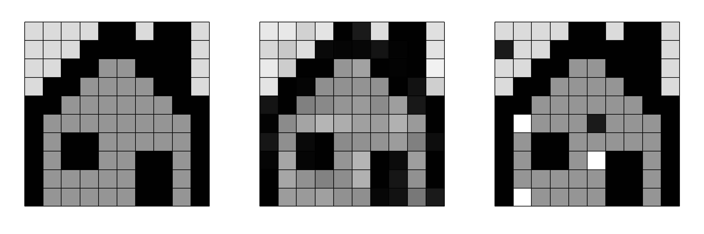
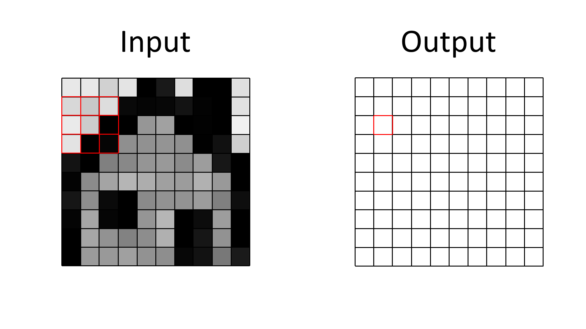
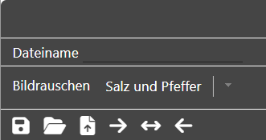
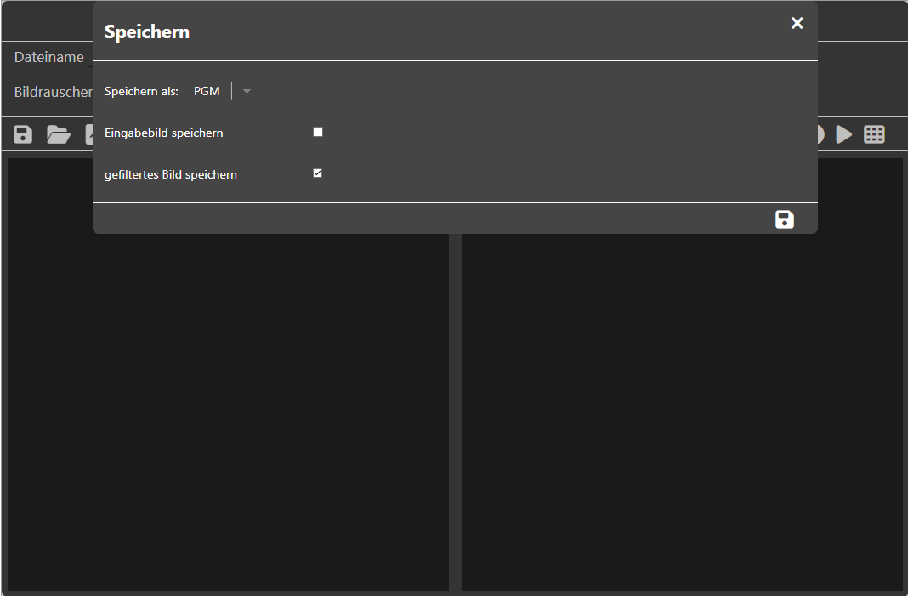
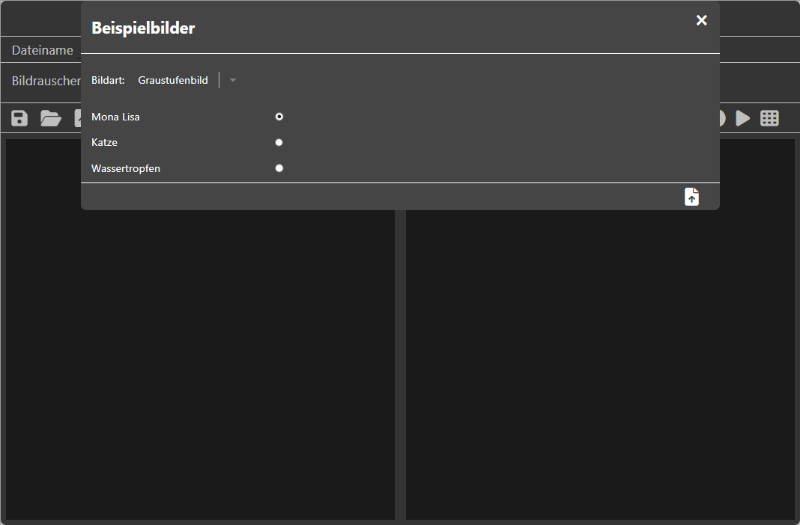

<!--
author:     Leon Endris

email:      leendris@uni-koblenz.de

version:    1.0.0

language:   de

narrator:   Deutsch Female

comment:    Dies ist die dritte Lektion des
            CV-Online-Kurses. Funktionsweise
            und Nutzen von Filtern wird hier 
            näher erläutert.

link:       ../CSS/main.css 

script:     ../JavaScript/Filter.js

logo:       ../Images/Filter/Filter_Logo.png

-->

# Lektion 3: Filter
Willkommen zur dritte Lektion des CV-Online-Kurses. In dieser Lektion wird dir die Funktionsweise verschiedener Filter vorgestellt. Am Ende dieser Lektion sollst du verstehen, wie ein Median-, Mittelwert- und Gauß-Filter funktionieren und was deren Einsatzbereiche sind.

# Wiederholungsquiz: "Vektorgrafik"
In diesem kleinen Wiederholungsquiz kannst du deinen eigenen Wissensstand zum Thema "Vektorgrafiken" nochmals überprüfen. Auch falsche Antworten können dir helfen das gelernte zu festigen, indem du die Erklärung für die korrekte Antwort nochmal verinnerlichst. Hast du eine falsche Antwort angegeben und möchtest es nicht nochmals versuchen, kannst du dir über das Häkchen die Lösung anzeigen lassen.

---------------------------------------------------------------------------------------------------------------------------------------------------------------------------------
Quiz
=================================================================================================================================================================================

1. Welche Informationen braucht es, um einen Kreis in einem SVG zu speichern?
---------------------------------------------------------------------------------------------------------------------------------------------------------------------------------
<!-- data-randomize -->
- [[X]] Koordinaten des Mittelpunktes
- [[ ]] Umfang des Kreises
- [[ ]] Durchmesser des Kreises
- [[X]] Radius des Kreises
*********************************************************************************************************************************************************************************
Um einen Kreis in einem SVG zu speichern müssen wir dessen Radius und die Koordinaten des Mittelpunktes kennen. Das Koordinatensystem wird für das SVG selbst definiert und wird nicht extra für den Kreis neu definiert. Auch können weitere Informationen über den Kreis gespeichert werden, wie Farbe oder die Breite des Umrisses. Diese Informationen sind aber nicht zwingend notwendig.
*********************************************************************************************************************************************************************************

2. Welche Aussagen über SVGs treffen zu?
---------------------------------------------------------------------------------------------------------------------------------------------------------------------------------
<!-- data-randomize -->
- [[ ]] In einem SVG kann immer nur eine einzelne geometrische Form gespeichert werden
- [[X]] Mit SVGs ist eine verlustfreie Skalierung möglich
- [[ ]] Das SVG-Format sind besonders gut für Fotos geeignet
- [[X]] Vor der Darstellung auf einem Bildschirm muss ein SVG in eine Rastergrafik umgewandelt werden
*********************************************************************************************************************************************************************************
SVGs können eine vielzahl an verschiedenen geometrischen Formen speichern und diese können beliebig miteinander zu neuen Bildern kombiniert werden. Zudem ist es, durch das Speichern geometrischer Informationen möglich, ein SVG ohne Qulaitätsverlust in beliebigen Größen darzustellen. Dafür muss ein SVG jedoch vor jeder Darstellung rasterisiert werden. Also aus der Vektorgrafik wird eine Rastergrafik in der gewünschten Größe erstellt. Für Fotos eignen sich SVGs nicht. Der Einsatzbereich von SVGs liegt eher bei Logos oder auch Schriftarten für den Computer.
*********************************************************************************************************************************************************************************

3. Wie nennt man das Verfahren, mit dem der Treppen(stufen)effekt, der bei der Rasterisierung von Vektorgrafiken entstehen kann, eingedämmt werden soll?
---------------------------------------------------------------------------------------------------------------------------------------------------------------------------------
[[anti-aliasing]]

*********************************************************************************************************************************************************************************
Um gegen den Treppen(stufen)effekt vorzugehen nutzen wir das sogenannte **Anti-Aliasing**. Anstatt ein Pixel entweder vollständig oder gar nicht in der Farbe eines Objektes zu färben, erhält ein Pixel eine Mischfarbe basierend auf den darin enthaltenen Objekten. Je mehr Fläche des Pixels ein Objekt dabei einnimmt desto größer ist der Farbanteil, den es zu dem Pixel beisteuert.
*********************************************************************************************************************************************************************************

# Was sind Filter
Häufig werden Filter genutzt, um ungewollten Effekten bei aufgenommenen Bildern entgegenzuwirken oder bestimmte Informationen aus Bildern besonders hervorzuheben (beispielsweise Kanten). Einer dieser ungewollten Effekte ist Bildrauschen. Auf dieses Phänomen gehen wir im folgenden Abschnitt genauer ein.

## Bildrauschen
Sensoren sind nie perfekt. So auch die Sensoren in den Kameras, mit denen wir Bilder aufnehmen. Dadurch kann es zu Ungenauigkeiten kommen, wenn das einfallende Licht in einen Pixelwert umgewandelt werden soll. Diese Ungenauigkeiten führen zu einem sogenannten **verrauschten Bild** und können von Kamera zu Kamera unterschiedlich stark ausfallen. Diese Art des Rauschens nennen wir auch **Gauß-Rauschen**. Eine andere Art von Rauschen ist das sogenannte **Salz-und-Pfeffer-Rauschen**. Dabei sind vereinzelte Pixel entweder annähernd schwarz oder weiß. Dieser Effekt kann auftreten, wenn die einzelnen Sensoren nicht mehr richtig funktionieren und entweder den Wert des Pixels immer als komplett beleuchtet (weiß) oder als unbeleuchtet (schwarz) auswerten.

> Hier ein Vergleich zwischen einem unverrauschten Bild, einem **Gauß-** und einem **Salz-und-Pfeffer-**verrauschten Bild:
>
> 

---------------------------------------------------------------------------------------------------------------------------------------------------------------------------------

> Dieses Video fasst den Inhalt des vorangegangenen Textes zusammen:
> 
> !?[imageNoiseVideo](https://youtu.be/NG3Ly77WHs8)

## Filter
Kompliziert ausgedrückt transformiert ein Filter den Wert jedes Pixels in einem Eingabebild in einen neuen Pixelwert für ein Ausgabebild, nachdem eine mathematische Funktion, Formel oder Algorithmus darauf angewandt wurde. In einfacheren Worten gehen wir also wie folgt vor: Wir gehen über jeden einzelnen Pixel in unserem Eingabebild und wenden darauf eine vorher definierte Operation an. Das kann beispielsweise sein, dass wir den aktuellen Wert lediglich um 10 erhöhen, damit das Bild insgesamt aufgehellt wird. Sehr häufig betrachten wir aber nicht nur den aktuellen Pixel, sondern betrachten auch gleich seine Nachbarschaft. Das können wir uns vorstellen, wie eine Maske oder ein Fenster, dass wir über unser Bild legen. In der Mitte des Fensters befindet sich unser Eingabepixel. Die Koordinaten dieses Pixels sind meist auch die Koordinaten des Ausgabepixels. Die Pixel, die sich sonst noch in dem Fenster befinden, sind diejenigen Nachbarpixel, die für unser Eingabepixel von Interesse sind und die wir bei der Ermittlung des Wertes für unser Ausgabepixel mit einbeziehen. 

> Hier zu sehen sind unser Input- und unser Output-Bild nebeneinander. Das Fenster müsste so platziert sein, damit wir den Wert des im Output-Bild rot markierten Pixels ermitteln könnten.
>
> 

Bei vielen Filtern können wir die Größe des Fensters selbst auswählen, indem wir einen Radius angeben. Dabei müssen wir immer beachten, dass auch der Rechenaufwand steigt, je größer wir das Fenster wählen. Die drei Filter, die in dieser Lektion vorgestellt werden, nutzen ein solches Fenster:

Median-Filter
---------------------------------------------------------------------------------------------------------------------------------------------------------------------------------
Bei diesem Filter sortieren wir zunächst alle betrachteten Pixelwerte der Größe nach. Anschließend wählen wir den Median dieser Werte aus, also den Wert, der genau in der Mitte liegt. Auf diese Weise können wir stark ausreißende Werte oder extreme Werte aus unserem Eingabebild entfernen.

> Wir stellen uns die Pixelwerte in unserem Filter in einer Reihe vor. Diese Reihe sortieren wir aufsteigend und wählen dann den Wert aus, der genau in der Mitte der Reihe liegt.
>
> 

Mittelwert-Filter
---------------------------------------------------------------------------------------------------------------------------------------------------------------------------------
Bei diesem Filter werden alle benachbarten Pixelwerte und der aktuelle Wert aufsummiert und durch die Anzahl an Pixeln geteilt, die in Betracht gezogen wurden. Ein Vorteil dabei ist, dass benachbarte Pixel dadurch auch ähnliche Werte annehmen und Sensorungenauigkeiten dadurch ausgeglichen werden können. Ein Nachteil ist, dass Bilder danach "verschwommen" aussehen können. Und vor allem Kanten werden dadurch "verschmiert".

> Alle Werte innerhalb des Fensters werden summiert und anschließend durch die Anzahl an Pixeln innerhalb des Fensters geteilt.
>
> 

Gauß-Filter
---------------------------------------------------------------------------------------------------------------------------------------------------------------------------------
Dieser Filter ist sowas, wie die logische Erweiterung des Mittelwert-Filters. Dabei gehen wir von der Annahme aus, dass die Pixel, die näher an unserem aktuellen Pixel liegen auch mehr Einfluss auf dessen neuen Wert nehmen sollten. Aus diesem Grund werden die Einzelnen Pixelwerte zusätzlich mit einem Gewichtungsfaktor multipliziert, um den Einfluss auf den neuen Pixelwert zu steuern. Auch nach Anwendung des Gauß-Filters sieht ein Bild meist "verschwommen" aus. Im vergleich zum Mittelwertfilter ist dieser Effekt aber schwächer.

> Alle Werte innerhalb des Fensters werden gewichtet summiert. Das bedeutet, die Pixel, die näher am Mittleren Pixel liegen nehmen größeren Einfluss auf den neuen Wert. Anschließend teilen wir durch die Summe der Gewichtswerte.
>
> 

---------------------------------------------------------------------------------------------------------------------------------------------------------------------------------

> Dieses Video fasst den Inhalt des vorangegangenen Textes zusammen:
> 
> !?[filterVideo](https://youtu.be/EQr8u8pf4UA)

## Randbehandlung
Die Berechnung neuer Pixelwerte im Ausgabebild ist in den meisten Fällen recht Intuitiv, indem wir einfach die definierte Operation ausführen. Die einzige Frage, die wir uns noch stellen müssen ist, wie wir die Ränder unseres Bildes behandeln. Liegt das Fenster auf dem oberen linken Pixel, dann ragt es über das darunterliegende Bild hinaus. Das bedeutet, dass einige Nachbarn nicht existieren und wir dadurch undefinierte Werte hätten. An dieser Stelle werden dir drei mögliche Randbehandlungen vorgestellt:

* **Keine Randbehandlung:** In den meisten Fällen sind die Ränder von Bildern vernachlässigbar. Das von Interesse liegt meist im eher im Zentrum des Bildes. Wenn wir keine Randbehandlung anwenden, verwerfen wir die äußeren Pixel und wenden den Filter nur dann an, wenn das Fenster komplett über unserem Bild liegt. Die Ränder werden dabei dann meist schwarz gelassen.

> Ragt die Filtermaske über das Bild hinaus, wird ein schwarzer Pixel erstellt. In diesem Fall steht die "-1" dafür, dass kein Wert vorliegt.
>
> 

* **Äußeres Pixel wiederholen:** Die leichteste Lösung, um ungewollte schwarze Ränder zu verhindern ist es, den Wert des äußersten Pixels zu wiederholen und damit die fehlenden Pixelwerte aufzufüllen. Doch auch das kann zu ungewollten gleichmäßigen Mustern an den Rändern führen.

> Ragt die Filtermaske über das Bild hinaus, wird einfach das äußerste Pixel wiederholt und füllt somit die leeren Werte aus.
>
> 

* **Pixel spiegeln:** Um die Ränder recht natürlich wirken zu lassen ist es auch möglich, dass die fehlenden Pixelwerte einfach durch ihre am Rand gespiegelten Pixel aufgefüllt werden. Dadurch wird die überrepräsentation des Äußersten Pixels vermieden und die Ränder wirken realistischer.

> Ragt die Filtermaske über das Bild hinaus, spiegeln wir mit den äußeren Pixeln als Spiegelachsen, damit die leeren Werte gefüllt werden.
>
> 

---------------------------------------------------------------------------------------------------------------------------------------------------------------------------------

> Dieses Video fasst den Inhalt des vorangegangenen Textes zusammen:
> 
> !?[borderTreatmentVideo](https://youtu.be/4rqo1XZots0)

# Pixelwert selbst berechnen
In diesem Abschnitt, sollst du nun selbst versuchen den neuen Pixelwert eines Eingabepixels zu berechnen, damit du besser verstehst, wie die einzelnen Filter funktionieren.

??[CalcFilter](https://shortytwo42.github.io/InteractiveCodingTools/InteractiveCodingTools/HTML/CalcFilter.html)

# Probiere selbst die vorgestellten Filter aus
Nutze nun selbst das Filter Tool "MyPicFilter", um die vorgestellten Filter in Aktion zu sehen. Versuche anschließend die Quizfragen aus dem Abschlussquiz zu beantworten. Auch hier sind falsche Antworten nicht schlimm. Nutze die Erklärungen für die korrekten Antworten, um auch aus deinen Fehlern lernen zu können. Du kannst eigene Bilder hochladen und diese Filtern. Achte dabei jedoch darauf, keine zu hohen Auflösungen zu nutzen, weil die Berechnung dadurch länger dauert. Du kannst aber auch über  ein Beispielbild auswählen. Probiere beispielsweise folgende Dinge aus:

* Lade ein Bild hoch. Nutze nun die verschiedenen Filter und schau dir die Ergebnisse an.
* Nutze ein und den selben Filter aber veränder die Filtergröße/den Radius.
* Lade ein Bild hoch und wende Salz-und-Pfeffer-Rauschen darauf an. Nutze nun die verschiedenen Filter.
* Lade ein Bild hoch und wende Gauß-Rauschen darauf an. Nutze nun die verschiedenen Filter.

??[MyPicCoder](https://shortytwo42.github.io/InteractiveCodingTools/InteractiveCodingTools/HTML/MyPicFilter.html)

## MyPicFilter Anleitung

    

        Das Tool **"MyPicFilter"** ist in zwei Abschnitte aufgeteilt. Links wird das Eingabebild angezeigt und rechts das Ausgabeild, nachdem der vorher definierte Filter angewandt wurde.
        
    

    

        Der Header zeigt zunächst den Namen, die Breite und die Höhe des aktuellen Bildes. Darunter ist es zudem möglich verschiedene Arten des Rauschens auf das Eingabebild drauf zu rechnen (Salz und Pfeffer Rauschen oder Gauß-Rauschen). Zudem kann der Rauschanteil (Salz und Pfeffer Rauschen) beziehungsweise die Rauschstärke (Gauß-Rauschen) eingestellt werden. 
        
        <ul>
            <li> Durch Klicken auf das Häkchen Icon wird das Rauschen auf das Eingabebild angewandt.</li>
       </ul>
    

    

        Links im Header sehen wir folgende Icons.
        

        Die Icons bedeuten folgendes von links nach rechts:
        <ul>
            <li> Durch Klicken auf das Speicher Icon, wird zunächst das Speichermenü aufgerufen (zu diesem kommen wir später).</li>
            <li> Der Ordner kann verwendet werden, um eigene Dateien hochzuladen. Angenommen werden Dateien vom Typen **"PGM"**, **"PPM"**, **"JPG"** und **"PNG"**.</li>
            <li> Die Datei mit Pfeil, öffnet das Beispielbilder Menü (zu diesem kommen wir später).</li>
            <li> Der Pfeil, der nach rechts zeigt, versteckt das Ausgabebild und gibt dem Eingabebild, den gesamten Platz.</li>
            <li> Der Pfeil, der in beide Richtungen zeigt, sorgt dafür, dass sowohl Eingabebild als auch Ausgabebild, zu gleichen Anteilen gezeigt werden.</li>
            <li> Der Pfeil, der nach links zeigt, versteckt das Ausgabebild und gibt dem Eingabebild, den gesamten Platz.</li>
        </ul> 
    

    

        Rechts im Header sehen wir folgende Icons.
        

        Die Icons bedeuten folgendes von links nach rechts:
        <ul>
            <li> Durch Klicken auf das Play Icon wird der aktuell ausgewählte Filter auf das Eingabebild angewandt und dadurch das Ausgabebild erzeugt.</li>
            <li> Durch Klicken auf das Filter Icon wird das Filtermenü geöffnet (zu diesem kommen wir später).</li>
        </ul>
    

    

        Im Speichermenü kann entschieden werden, ob das Eingabebild und/oder das Ausgabebild gespeichert werden sollen und auch in welchem Format diese gespeichert werden sollen. Mögliche Formate sind **"PGM"**, **"PPM"**, **"JPG"** und **"PNG"**.
        
    

    

        Nun zum Beispielbilder Menü. In diesem kann zunächst ausgewählt werden, ob ein Grauwertbild oder ein Farbbild hochgeladen werden soll. Anschließend kann eines von drei Motiven ausgewählt werden.
        
    

    

        Im Filtermenü kann zwischen drei verschiedenen Filtern ausgewählt werden: "Medianfilter", "Mittelwertfilter" und "Gauß-Filter". Zudem ist es möglich keinen Filter auszuwählen. Die Funktionsweise jedes Filters wird im Punkt **"Filter-Info"** kurz beschrieben. Auch ist es unter den **"Filter-Optionen"** möglich den Einflussbereich des Filters anzupassen. Dabei sollten zwei Dinge bedacht werden. Die Berechnung des neuen Bilds dauert länger, je größer der Einflussbereich gewählt ist. Auch dauert die Bearbeitung von Farbbildern länger, da in diesen drei Kanäle anstelle von nur einem Kanal neu berechnet werden müssen. Die Durchführung kann möglicherweise einige Sekunden dauern und ist auch von der Hardware abhängig. Auch ist es möglich die Randbehandlung des Filters anzupassen. An den Rändern der Bilder kommt es dazu, dass der Filter über die Grenzen hinweg ragt. Es ist möglich, die Ränder nicht zu behandeln und somit schwarz zu lassen, das äußerste Pixel zu wiederholen, oder auch die Randpixel zu spiegeln.
        
        
        
        
    

# Abschlussquiz

1. Welche Filter eignen sich um Salz-und-Pfeffer-Rauschen zu verringern?
---------------------------------------------------------------------------------------------------------------------------------------------------------------------------------
<!-- data-randomize -->
- [[X]] Median-Filter
- [[ ]] Mittelwert-Filter
- [[ ]] Gauß-Filter
*********************************************************************************************************************************************************************************
Der Median Filter eignet sich für diesen Fall am besten. Die Pixel werden zunächst der Größe nach sortiert und dadurch wandern annähernd schwarze und annähernd weiße Pixel an die äußeren Ränder. Extreme Werte, können dadurch also eliminiert werden. Beim Mittelwert-Filter und Gauß-Filter werden diese extremen Pixelwerte mit in die Berechnung einfließen.
*********************************************************************************************************************************************************************************

2. Welche Filter eignen sich um Gauß-Rauschen zu verringern?
---------------------------------------------------------------------------------------------------------------------------------------------------------------------------------
<!-- data-randomize -->
- [[ ]] Median-Filter
- [[X]] Mittelwert-Filter
- [[X]] Gauß-Filter
*********************************************************************************************************************************************************************************
Sowohl der Mittelwert-Filter als auch der Gauß-Filter eignen sich um Gauß-Rauschen im Bild zu verringern. In beiden Fällen wird das Bild "geglättet", indem die Werte der benachbarten Pixel mit einbezogen werden. Dadurch sollen starke unterschiede zwischen Nachbarpixeln behoben werden. 
*********************************************************************************************************************************************************************************

3. Welche Aussagen treffen zu?
---------------------------------------------------------------------------------------------------------------------------------------------------------------------------------
<!-- data-randomize -->
- [[X]] Je Größer der Radius, desto länger dauert die Berechnung des Ausgabebilds.
- [[ ]] Filter laufen schneller über Farbbilder als über Grauwertbilder.
- [[X]] An den Rändern der Bilder gehen Informationen verloren.
- [[ ]] Der Gauß-Filter "verschmiert" Bilder stärker als der "Mittelwert-Filter".
- [[X]] Kanten bleiben bei der Anwendung des Medianfilters weitestgehend erhalten.
*********************************************************************************************************************************************************************************
Je Größer der Radius eines Filters, desto mehr Pixel werden für jeden Berechnungsschritt mit in betracht gezogen. Dadurch ist der Rechenaufwand höher und die Berechnung dauert meist länger. 

Bei Farbbildern müssen drei Kanäle gefiltert werden, was dazu führt, dass auch hier die Berechnung länger dauert, als bei einfachen Grauwertbildern, bei denen nur ein Kanal gefiltert werden muss.

An den Rändern von Bildern gehen bei den meisten Filtern Informationen verloren, weil der Filterbereich dort, über die Ränder hinaus ragt und dadurch Informationen für die neuen Randpixelwerte fehlen. Durch Tricks wie der Wiederhohlung des Randpixels oder der Spiegelung am Rand wird versucht, diesen Informationsverlust zu verstecken.

Mittelwert-Filter "verschmieren" Bilder stärker als Gauß-Filter, weil diese alle Pixel gleich stark gewichten, egal wie weit diese von dem aktuellen Pixel entfernt sind.

Kanten bleiben bei der Anwendung des Medianilters weitestgehend erhalten und können lediglich verschoben werden. Da die Werte aber nicht gemittelt werden, werden die Kanten an sich aber nicht geglättet.
*********************************************************************************************************************************************************************************