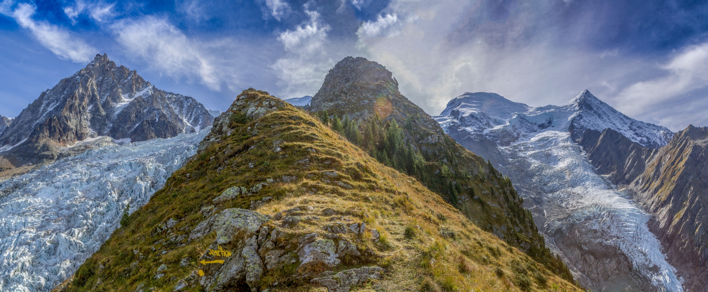
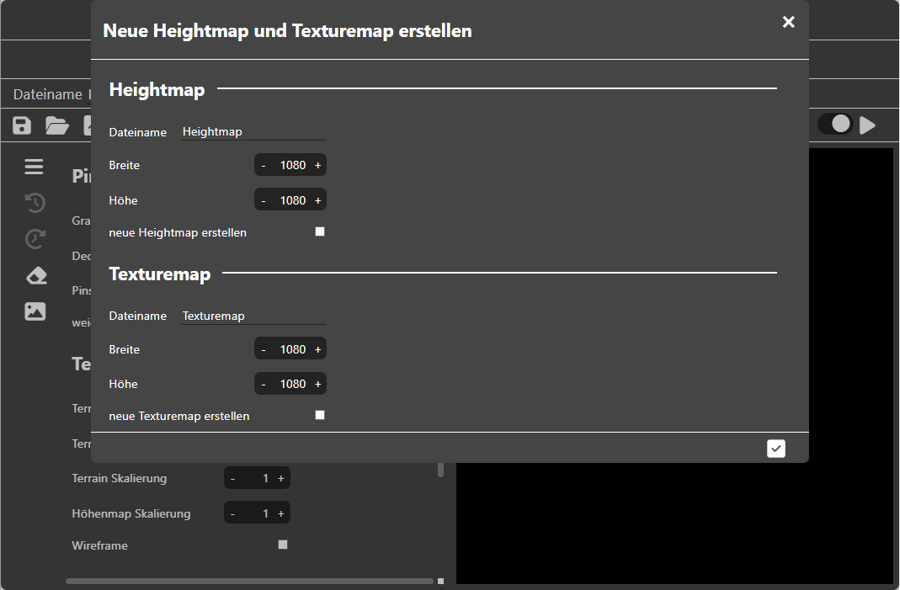

<!--
author:     Leon Endris

email:      leendris@uni-koblenz.de

version:    1.0.0

language:   de

narrator:   Deutsch Female

comment:    Dies ist die vierte Lektion des
            CV Online Kurses. Hier werden 
            simple 3D Meshes in Form von Terrains
            näher erklärt.

link:       ../CSS/main.css 

script:     ../JavaScript/LiaScriptCustom.js

logo:       ../Images/Terrain/Terrain_Logo.png

-->

# Lektion 4: Terrain
Willkommen zur vierten Lektion des CV Online Kurses. In dieser soll dir ein Grundverständnis für virtuelle Terrains vermittelt werden. Besonders der Einsatz von Heightmaps und die Texturierung von Terrains sollen dir näher gebracht werden.

# Wiederholungsquiz: "Filter"
In diesem kleinen Wiederholungsquiz kannst du deinen eigenen Wissensstand zum Thema "Filter" nochmals überprüfen. Auch falsche Antworten können dir helfen das gelernte zu festigen, indem du die Erklärung für die korrekte Antwort nochmal verinnerlichst. Hast du eine falsche Antwort angegeben und möchtest es nicht nochmals versuchen, kannst du dir über das Häkchen die Lösung anzeigen lassen.

---------------------------------------------------------------------------------------------------------------------------------------------------------------------------------
Quiz
=================================================================================================================================================================================

1. Der Gauß-Filter ist besonders gut für das Verringern von Salz-und-Pfeffer-Rauschen geeignet
---------------------------------------------------------------------------------------------------------------------------------------------------------------------------------
<!-- data-randomize -->
- [( )] Ja
- [(X)] Nein
*********************************************************************************************************************************************************************************
Nein. Der Median Filter eignet sich für diesen Fall am besten. Die Pixel werden zunächst der Größe nach sortiert und dadurch wandern annähernd schwarze und annähernd weiße Pixel an die äußeren Ränder. Extreme Werte, können dadurch also eliminiert werden. Beim Mittelwert-Filter und Gauß-Filter werden diese extremen Pixelwerte mit in die Berechnung einfließen.
*********************************************************************************************************************************************************************************

2. Wieviele Pixel breit ist der schwarze Rand, wenn wir ein Bild mit einer 5x5 Maske filtern (natürlich ohne Randbehandlung)?
---------------------------------------------------------------------------------------------------------------------------------------------------------------------------------
<!-- data-randomize -->
- [( )] 5 Pixel
- [( )] 3 Pixel
- [(X)] 2 Pixel
*********************************************************************************************************************************************************************************
Bei einer 5x5 Maske haben wir einen Radius von 2 Pixeln angegeben. Wir betrachten also jeweils die 2 nächsten Nachbarpixel um unser aktuelles Pixel herum. Das aktuelle Pixel liegt genau in der Mitte der Filtermaske und ist immer innerhalb des Bildes, wenn wir Filtern. Dadurch bekommen wir auch erst einen gefilterten Pixelwert, wenn unsere Maske komplett im Bild liegt. Und dass ist immer der Fall, wenn diese mindestens 2 Pixel vom Rand entfernt ist. Dadurch entsteht also ein 2 Pixel breiter schwarzer Rand.
*********************************************************************************************************************************************************************************

3. Wie wirkt sich die Größe der Filtermaske bei einem Mittelwert-Filter auf das Ausgabebild aus?
---------------------------------------------------------------------------------------------------------------------------------------------------------------------------------
<!-- data-randomize -->
- [( )] Eine große Filtermaske verstärkt die Kanten im Ausgabebild
- [( )] Die Größe der Filtermaske hat keinen Einfluss auf das Ausgabebild
- [(X)] Je größer die Filtermaske, desto "verschmierter" das Ausgabebild
*********************************************************************************************************************************************************************************
Eine größere Filtermaske beim Mittelwert-Filter führt zu einem "verschmierteren" oder auch unschärferen Bild. Außerdem gehen dadurch auch die Kanten eher verloren
*********************************************************************************************************************************************************************************

# Terrains
Das Wort "Terrain" stammt aus dem Französischen und bedeutet so viel wie "Gebiet" oder "Gelände". Ein Terrain ist ein Abschnitt der natürlichen Erdoberfläche mit all ihren Besonderheiten und Eigenschaften. Hierzu gehören Anhöhen und Vertiefungen sowie die generelle Form des Bodens. Abhängig von seiner Lage auf der Welt können Terrains sehr unterschiedlich sein. Es gibt flache und gleichmäßige Gelände, aber auch solche, die durch Berge und starke Höhenunterschiede geprägt sind.

> Foto des "Glacier des Bossons" in Frankreich
>
> 

---------------------------------------------------------------------------------------------------------------------------------------------------------------------------------
Virtuelle Terrains
=================================================================================================================================================================================  
Auch in der Computergrafik benötigen wir häufig virtuelle Terrains. Die Anforderungen an diese Terrains können sich je nach Anwendung unterscheiden. In Videospielen beispielsweise ist es wichtig, dass der Spielercharakter mindestens einer bestimmten Route folgen kann. In Filmen hingegen können computergenerierte Terrains als Hintergrundkulissen dienen, wenn es zu riskant, teuer oder gar unmöglich ist, an realen Drehorten zu filmen. Beispiele dafür wären der Mount Everest oder andere Planeten in Sci-Fiction Welten.

Stellen wir uns virtuelle Terrains zunächst wie gleichmäßig verteilte Punkte in einem Koordinatensystem vor. Diese Punkte, auch Vektoren genannt, werden miteinander durch Linien verbunden, um Dreiecke zu bilden. Diese Struktur aus Dreiecken wird in der Computergrafik auch als "Mesh" bezeichnet. Die Dichte oder auch Auflösung dieses Netzes aus Dreiecken kann erhöht oder verringert werden, indem wir Punkte hinzufügen oder entfernen. Bisher haben wir nur in zwei Dimensionen gearbeitet, was noch kein vollständiges Terrain ergibt. Um ein realistisches Terrain zu erstellen, fügen wir nun zusätzlich zu Länge und Breite auch die Höhenwerte hinzu. Jeder einzelne Vektor erhält eine Höhenangabe, wodurch ein virtuelles Terrain entsteht. 

> Links sehen wir die einzelnen Vektoren, in der Mitte das daraus resultierende Mesh und rechts das Mesh mit einer höheren Anzahl an Vektoren
>
> 

---------------------------------------------------------------------------------------------------------------------------------------------------------------------------------
Height- und Texturemaps
=================================================================================================================================================================================  
Wie gleichmäßige Gitter erstellt werden, wissen wir ja jetzt. Diese sind für viele Terraintypen geeignet und sehen bis auf deren Auflösung eigentlich immer gleich aus. Was sich ändert sind lediglich die Höhenwerte. Eine einfache Methode Höhenwerte zu speichern ist in Form von Bildern. Diese nennen wir auch Texturen. Wir können uns die Höhenwerte als Grauwertbild vorstellen. Je geringer der Pixelwert, desto kleiner ist auch der Höhenwert. Solche Grauwerttexturen, die Höhenwerte speichern, nennen wir auch Heightmaps (zu Deutsch: Höhenkarten). Um den Vectoren ihre entsprechenden Höhenwerte zuzuweisen können wir uns vorstellen, dass die Heightmap unter unser Mesh gelegt wird. Die Vektoren lesen nun den Pixelwert aus, der sich unter ihnen befindet und nehmen dadurch ihre entsprechende Höhe an. 

Doch nicht nur Höhenwerte können in Texturen gespeichert werden. In sogenannten Texturemaps werden auch die Farbwerte für unser Terrain gespeichert. Wir können uns auch hier vorstellen, dass die Texturemap unter unser Terrain gelegt wird und das Mesh daraus seine Farbinformationen bezieht. 

> Links sehen wir das Mesh, in der Mitte das Mesh über einer Heightmap und rechts das Mesh über einer Texturemap liegend.
>
> 

---------------------------------------------------------------------------------------------------------------------------------------------------------------------------------

> Dieses Video fasst den Inhalt des vorangegangenen Textes zusammen:
> 
> !?[TerrainVideo](https://youtu.be/d5l9ln9e1Mg)

# Optimierungsmöglichkeiten
---------------------------------------------------------------------------------------------------------------------------------------------------------------------------------
Überflüssige Vektoren entfernen
=================================================================================================================================================================================  

Bisher haben wir nur gleichmäßige Meshes gesehen, die natürlich ihre Vorteile mit sich bringen. Beispielsweise sind diese immer gleich aufgebaut und unterscheiden sich höchstens in ihrer Auflösung voneinander. Dadurch können sie für beliebige Heightmaps angewandt werden und liefern meist gute Ergebnisse. Speichertechnisch ist das aber nicht die optimale Lösung. In weniger detailreichen und flacheren Regionen können wir Vektoren einsparen. Eine mögliche Idee dafür wäre es, die Höhenwerte der benachbarten Vektoren miteinander zu vergleichen. Sind die Nachbarhöhenwerte gleich oder unterscheiden sich nur geringfügig, dann können wir auf den aktuellen Vektor verzichten und ihn einsparen. Diese Art der Optimierung von Meshes eignet sich besonders, wenn das Mesh starr ist und nicht dynamisch angepasst werden muss.

> Links sehen wir das Eingabe-Mesh. In der Mitte wurden die Vektoren markiert, deren Nachbarn sich nicht in der Höhe unterscheiden. Rechts wurden die markierten Vektoren entfernt und das Mesh neu verbunden.
>
> 

> Links sehen wir das Eingabe-Mesh. Rechts wurden die überflüssige Vektoren entfernt und das Mesh neu verbunden.
>
> 

---------------------------------------------------------------------------------------------------------------------------------------------------------------------------------
Level of Detail (LoD)
=================================================================================================================================================================================  

Eine andere Art der Optimierung, bezieht sich besonders auf weitläufiges Terrain. Das sogenannte Level of Detail oder kurz LoD. Dabei stellen wir uns vor, dass mehrere Terrain Abschnitte aneinandergereiht sind und somit die ganze virtuelle Welt darstellen. Dabei muss aber nicht jeder Abschnit gleich detailreich sein. Meshes, die weit entfernt von der Kamera sind können eine niedrigere Auflösung besitzen, da dies auf die Entfernung nicht so stark auffällt. Dabei sollte aber auch darauf geachtet werden, dass Benachbarte Terrain Abschnitte sich immer nur um höchstens 1 Level unterscheiden, damit die Übergänge nicht so drastisch sind. Die Auflösung der Terrains wird dann dynamisch an die Position der Kamera angepasst. Aus diesem Grund sind in diesem Fall auch die regelmäßigen Meshes von Vorteil, weil diese leichter zu handhaben sind. Je näher die Kamera einem Terrain Abschnitt ist, desto höher soll auch seine Auflösung sein.

> Links sehen wir vier Terrain Abschnitte mit der Kamera in diesen Positioniert. In der Mitte sehen wir all diese Abschnitte mit gleicher Auflösung. Rechts sehen wir, dass die Abschnitte, die näher an der Kamera sind nun auch eine höhere Auflösung besitzen.
>
> 

> Links sehen wir die vier Terrain Abschnitte mit gleicher Auflösung. In der Mitte wurden die Auflösungen angepasst. Hier soll sich die Kamera in dem gelben Bereich befinden. Rechts sehen wir das Terrain aus der Kameraperspektive.
>
> 

---------------------------------------------------------------------------------------------------------------------------------------------------------------------------------

> Dieses Video fasst den Inhalt des vorangegangenen Textes zusammen:
> 
> !?[TerrainOptimizationVideo](https://youtu.be/F9XKUwhV-O4)

# Erstelle ein eigenes Terrain
Nutze nun das Terrain Tool "MyTerrainCreator", um ein eigenes Terrain durch das zeichnen und bearbeiten einer Height- sowie dessen Texturemap zu erstellen. Beobachte dabei, wie sich deine Änderungen an den beiden Texturen auf das virtuelle Terrain auswirken. Versuche anschließend die Quizfragen aus dem Abschlussquiz zu beantworten. Auch hier sind falsche Antworten nicht schlimm. Nutze die Erklärungen für die korrekten Antworten, um auch aus deinen Fehlern lernen zu können. Du kannst über  eine Beispiele auswählen. Wechsel durch klicken auf  zwischen dem Heightmap Modus und dem Texturemap Modus, um auch deren spezifische Beispiele hochzuladen. Probiere beispielsweise folgende Dinge aus:

* Zeichne zunächst mit den Standardwerten eine Height- und eine Texturemap. Erkunde das Tool ein wenig und mach dich mit den Funktionen vertraut
* Lass das Terrain weiterhin in derselben Auflösung, also Quadratisch. Änder nun aber die Dimensionen deiner Texturen so, dass Höhe und Breite unterschiedlich sind. Was fällt dir auf, wenn du nun auf den Texturen zeichnest?

??[MyPicFilter](https://shortytwo42.github.io/InteractiveCodingTools/InteractiveCodingTools/HTML/MyTerrainCreator.html)

## MyTerrainCreator Anleitung

    

        Das Tool **"MyTerrainCreator"** ist in zwei Abschnitte aufgeteilt. Links kann sowohl die **"Heightmap"** als auch die **"Texturemap"** des Terrains bearbeitet werden, indem auf diese gemalt wird. Rechts ist das Terrain zu sehen, das durch die Bearbeitung der beiden Texturen Form und Farbe annimmt. Im Zeichenbereich ist es möglich mittels des Scrollrads der Maus zu zoomen. Durch Rechtsklick und bewegen der Maus kann über das Bild geschwenkt werden. Durch Linksklick und bewegen der Maus kann gemalt werden. Auch in der Vorschau kann man mit dem Mausrad zoomen und mit Linksklick und bewegen der Maus kann die Kameraposition verändert werden.
        
    

     

        Der Header zeigt zunächst an, in welchem Modus wir uns Befinden. Die beiden Modi, die es gibt, sind der **"Heightmap Modus"** und der **"Texturemap Modus"**. Darunter steht, der Dateiname der aktuellen Textur und die Dimensionen von dieser. 
        
    

    

        Links im Header sehen wir folgende Icons.
        

        Die Icons bedeuten folgendes von links nach rechts:
        <ul>
            <li> Durch Klicken auf das Speicher Icon wird zunächst das Speichermenü geöffnet (zu diesem kommen wir später).</li>
            <li> Durch Klicken auf das Ordner Icon können eigene **"Height-"** oder **"Texturemaps"** hochgeladen werden. Erlaubt sind für **"Heightmaps"** Dateien der Art **"PGM"**, **"JPG"** und **"PNG"** und für **"Texturemaps"** **"PPM"**, **"JPG"** oder **"PNG"**.</li>
            <li> Das "Datei mit Pfeil"-Icon erlaubt es Beispiele hochzuladen und öffnet zunächst das Beispielbilder Menü (zu diesem kommen wir später).</li>
            <li> Das "Datei mit Plus"-Icon erlaubt es, neue **"Heightmaps"** und **"Texturemaps"** zu erstellen. Hierfür wird das "neue Heightmap/Texturemap"-Menü geöffnet (zu diesem kommen wir später).</li>
            <li> Der Pfeil, der nach rechts zeigt, versteckt die Vorschau und gibt dem Zeichenbereich, den gesamten Platz.</li>
            <li> Der Pfeil, der in beide Richtungen zeigt, sorgt dafür, dass sowohl Zeichenbereich als auch Vorschau, zu gleichen Anteilen gezeigt werden</li>
            <li> Der Pfeil, der nach links zeigt, versteckt den Zeichenbereich und gibt der Vorschau, den gesamten Platz.</li>
        </ul> 
    

    

        Rechts im Header sehen wir folgende Icons.
        

        Die Icons bedeuten folgendes von links nach rechts:
        <ul>
            <li> Der Slider ist zu Beginn angeschaltet. Das bedeutet, dass die Live-Vorschau aktiviert ist. Das heißt, dass alle Änderungen an den Texturen direkt in der Terrain-Vorschau angezeigt werden.</li>
            <li> Ist die Live-Vorschau ausgeschaltet, kann man die Änderungen durch Klicken auf das Play Icon manuell aktualisieren.</li>
        </ul>
    

    

        Im Speichermenü kann entschieden werden, ob die **"Heightmap"**, die **"Texturemap"** und/oder die **"Geometrie"** gespeichert werden sollen und auch in welchem Format diese jeweils gespeichert werden sollen. Mögliche Formate für **"Height-"** und **"Texturemap"** sind **"PGM"**, **"PPM"**, **"JPG"** und **"PNG"**. Die Geometrie wird als "stl" Datei gespeichert.
        
    

    

        Im Beispielbilder Menü können Beispiele ausgewählt und hochgeladen werden. Je nachdem welcher Modus momentan ausgewählt ist, werden auch **"Heightmap"** oder **"Texturemap"** Beispiele vorgeschlagen. 
        
    

    

        Im "neue Heightmap/Texturemap"-Menü können neue **"Heightmaps"** und **"Texturemaps"** erstellen werden. Dabei können die Dimensionen und der Dateiname frei gewählt werden. Wird „neue Heightmap erstellen“ bzw. „neue Texturemap erstellen“ angehakt, so werden die ausgewählten Optionen durch Klicken auf das Häkchen unten rechts erstellt.
        
    

    

        Links im Zeichenbereich gibt es eine Sidebar, durch die verschiedene Aktionen durchgeführt werden können. 
        

        <ul>
            <li> Das Menü Icon öffnet das Hauptmenü mit verschiedenen Optionen (zu diesem kommen wir später).</li>
            <li> Der Pfeil nach links mit dem Uhrzeiger ist der Undo Button. Mit diesem können die letzten Pinselstriche gelöscht werden.</li>
            <li> Der Pfeil nach rechts mit dem Uhrzeiger ist der Redo Button. Mit diesem können versehentlich, mit dem Undo Button, gelöschte Pinselstriche wiederhergestellt werden.</li>
            <li> Das Radiergummi Icon wechselt zwischen Zeichnen und Radieren. Ist der Radiergummi aktiv, ist das Symbol blau.</li>
            <li> Das Bild Icon wird genutzt, um zwischen **"Heightmap Modus"** und **"Texturemap Modus"** zu wechseln. Es ist blau, wenn wir uns im **"Texturemap Modus"** befinden.</li>
        </ul>
    

    

        Durch Klicken auf den Menü Button wird das Hauptmenü geöffnet. Dort können wir verschiedene Anpassungen unternehmen. Es gibt die Pinseloptionen. Im **"Heightmap Modus"** kann dort der Grauwert des Pinsels angepasst werden, im **"Texturemap Modus"** die Farbe des Pinsels. Zudem kann die Deckkraft, Pinselgröße und ob es ein weicher Pinsel sein soll (Intensität nimmt zu den Rändern ab) angepasst werden. Die Terrain Optionen lassen die Auflösung des Terrains manuell anpassen. Sowie die Skalierung des gesamten Terrains (Default ist es eine Einheitsebene von -1 bis 1). Auch die Höhenmap Skalierung kann angepasst werden. Also wie stark der Höhenwert der **"Heightmap"** gewichtet werden soll. Auch ist es möglich in den Wireframe Modus zu wechseln. Zuletzt gibt es die Lichtoptionen. Dabei kann die Lichtfarbe angepasst werden, ob das Licht um das Terrain rotieren soll und wenn ja, wie schnell es um das Terrain rotieren soll.
        
    

# Abschlussquiz

1. Mit Heightmaps können wir Höhlen und Brücken darstellen
---------------------------------------------------------------------------------------------------------------------------------------------------------------------------------
<!-- data-randomize -->
- [( )] Ja
- [(X)] Nein
*********************************************************************************************************************************************************************************
Nein. Wir müssen uns Heightmaps wie eine Vogelperspektive auf die Welt vorstellen. Wenn wir über eine Brücke fliegen, sehen wir nur deren Oberfläche und nicht was darunter liegt. Es kann immer nur ein Höhenwert pro Punkt in der Welt gespeichert werden. Es ist also leider nicht möglich, mit einer Heightmap auch Brücken oder Höhlen darzustellen.
*********************************************************************************************************************************************************************************

2. Height- und Texturemaps müssen genau die selben Seitenverhältnisse wie deren Meshes vorweisen.
---------------------------------------------------------------------------------------------------------------------------------------------------------------------------------
<!-- data-randomize -->
- [( )] Ja
- [(X)] Nein
*********************************************************************************************************************************************************************************
Nein. Haben diese dieselben Seitenverhältnisse wie das zugrundeliegende Terrain ist es zwar leichter vorzustellen, wie deren Werte das Terrain beeinflussen, aber es ist nicht nötig das selbe Seitenverhältnis zu wählen. Die Texturen werden entsprechend gestreckt oder gestaucht, damit sie zu dem Mesh passen.
*********************************************************************************************************************************************************************************

3. Wofür steht die Abkürzung LoD?
---------------------------------------------------------------------------------------------------------------------------------------------------------------------------------
[[level-of-detail]]

*********************************************************************************************************************************************************************************
LoD steht für Level of Detail. Allgemein werden damit die Detailabstufungen von Meshes in virtuellen Welten beschrieben. Je weiter ein Objekt entfernt ist, desto weniger Details muss es aufweisen, weil diese auf die Entfernung fast nicht bis gar nicht ins Gewicht fallen.
*********************************************************************************************************************************************************************************

4. Welche Aussagen sind wahr?
---------------------------------------------------------------------------------------------------------------------------------------------------------------------------------
<!-- data-randomize -->
- [[X]] Regelmäßige Meshes nutzen meist mehr Speicherplatz als ihre unregelmäßigen Versionen.
- [[ ]] Die Heightmap eines unregelmäßigen Meshes kann beliebig ausgetauscht werden und liefern immer ein gutes Ergebnis.
- [[ ]] Helle Pixel in der Heightmap geben besonders tiefe Stellen im Terrain an.
- [[X]] Der LoD Unterschied zweier benachbarter Terrain-Abschnitte sollte nie größer als 1 sein.
*********************************************************************************************************************************************************************************
Regelmäßige Meshes nutzen so gut wie immer mehr Speicherplatz als ihre unregelmäßigen Versionen. Bei unregelmäßigen Meshes werden überflüssige Vektoren an detailarmen stellen eingespart und möglicherweise bei deteilreichen stellen hinzugefügt.

Ein unregelmäßiges Terrainmesh ist meist genau auf seine Heightmap abgestimmt. Tauschen wir die Heightmap aus, kann es sein, dass an den falschen Stellen Vektoren eingespart wurden. Wir nutzen unregelmäßige Meshes meist für statische/starre Szenen.

Je heller ein Pixel, desto höher auch der Höhenwert an dieser Stelle im Terrain.

Benachbarte Terrain-Abschnitte sollten entweder dasselbe oder höchstens einen Unterschied von einem LoD aufweisen, damit die Übergänge nicht zu hart wirken.
*********************************************************************************************************************************************************************************
