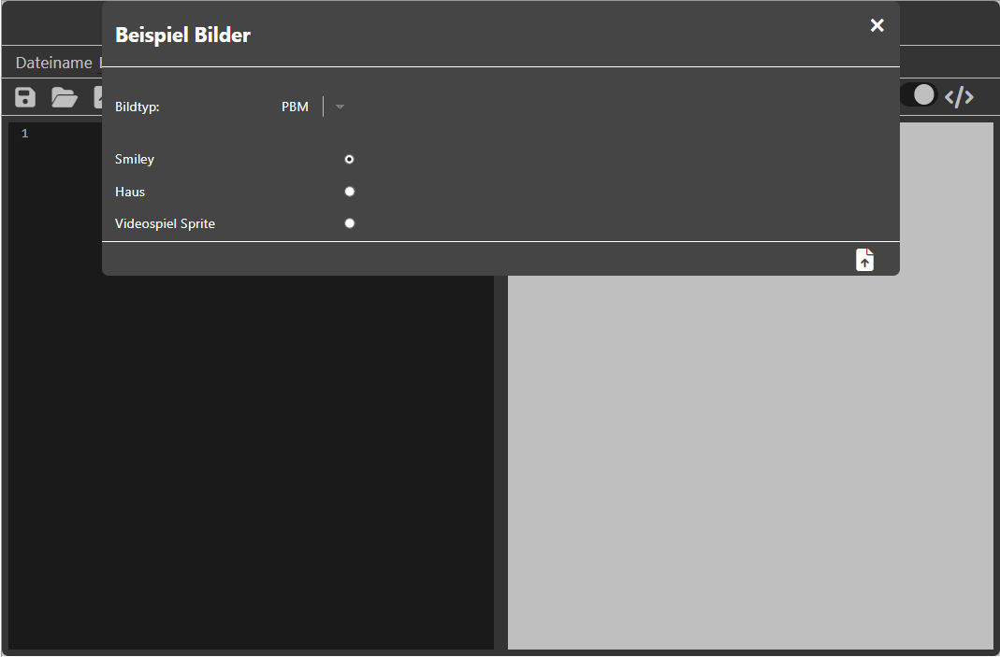
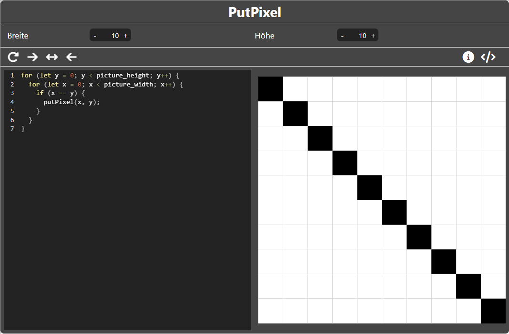
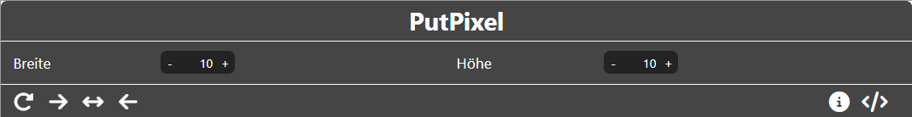
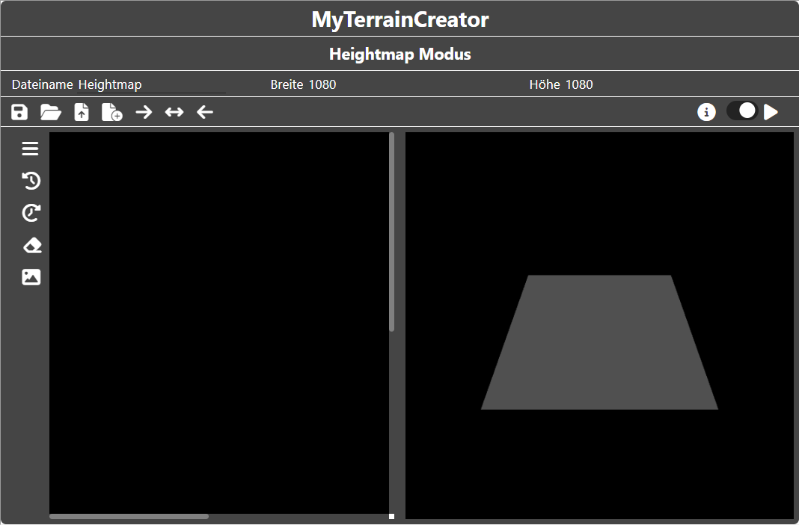
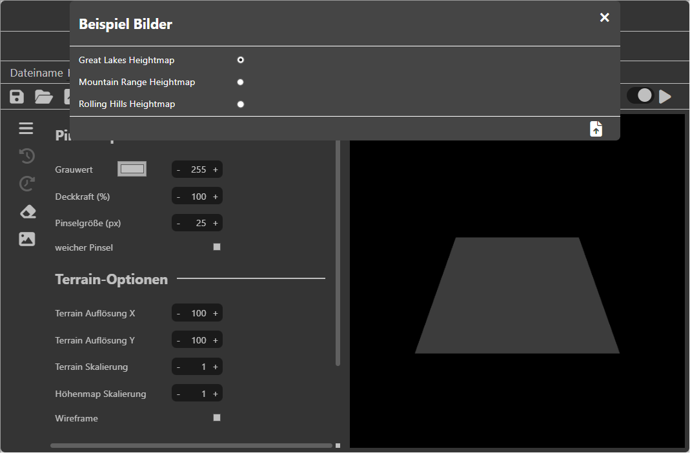

<!--
author:     Leon Endris

email:      leendris@uni-koblenz.de

version:    1.0.0

language:   de

narrator:   Deutsch Female

comment:    Dies ist die fünfte und letzte Lektion 
            des CV Online Kurses. Hier soll ein
            eigenes kleines Projekt realisiert werden.

link:       ../CSS/main.css 

script:     ../JavaScript/LiaScriptCustom.js

logo:       ../Images/Project/Project_Logo.png

-->

# Lektion 5: Eigenes Projekt
Willkommen zur letzten Lektion des CV Online Kurses. Du hast in den vorherigen Lektionen bereits einiges lernen können. In dieser Lektion sollst du nun selbst kreativ werden und das Gelernte anwenden. Dafür kannst du dich auch mit anderen Personen aus deiner Klasse zusammenfinden. Die einzelnen Tools sind nochmals auf einzelnen Seiten zugänglich. Hier sind ein paar Vorschläge für ein Abschlussprojekt, dass du allein oder mit anderen durchführen kannst. Zu jeder dieser Projektideen gibt es zudem eine eigene Seite, in diesem Kurs, die Anregungen zu den einzelnen Projekten gibt.

1. Entwerft eine eigene Fantasywelt. Erstellt ein Logo oder Wappen mit einer Vektorgrafik, erstellt eine Height und Texturemap mit dem Terrain Tool. Optimiert eure Height und Texturemap möglicherweise mit dem Filtertool. [~3-4 Personen]
2. Fragt, ob ihr euer Handy für Fotos benutzen dürft. Nehmt verschiedene Bilder auf, am besten in schwarz-weiß. Was passiert, wenn ihr diese als Heightmap benutzt? Überlegt euch interessante Motive und lasst die Filter darüber laufen. Was passiert beispielsweise, wenn ihr Filter auf Bilder mit starken Helligkeitsunterschieden aufnehmt? [~2-3 Personen]
3. Überlegt euch selbst Aufgaben, die man mit den verschiedenen Tools bearbeiten und lösen könnte. Tauscht eure Aufgaben untereinander aus und versucht sie zu lösen und zu bearbeiten. [~1-2 Personen]
4. Hat euch ein Thema besonders gut gefallen? Erstellt eine kleine Präsentation in der ihr das Thema nochmals zusammenfasst oder auch einen neuen Bereich des Themas erkundet. [~1-3 Personen]

Tauscht euch in der Klasse aus und stellt euch eure Projekte am Ende gegenseitig vor.

# Projekt: Fantasywelt
Dieses Projekt eignet sich für ~3-4 Personen. Findet euch also am besten in einer Gruppe zusammen. Ihr wollt das gelernte aus dem Kurs gerne in einer praktischen Übung umsetzten? Dann ist dieses Projekt eine gute Wahl für euch. Folgendes ist zu tun:

* Brainstormt, was für eine Welt ihr erstellen wollt. Möchtet ihr bergige Landschaften oder lieber sanfte Hügel. Ist es verschneit oder doch vulkanisch? Überlegt euch welche Farben in euerer Welt besonders präsent sind.
* 1 bis 2 Personen sollten sich nun um ein Logo kümmern. Denkt daran, welche Farben eure Welt am besten repräsentieren. Zeichnet euer Logo am besten selbst zunächst in ein Koordinatensystem, bevor ihr es in den "MyPicCoder" eintragt. Ist euch eine Vektorgrafik zu kompliziert könnt ihr das Logo auch als Rastergrafik erstellen. Auch hier solltet ihr zunächst eine Skizze anfertigen.
* 1 bis 2 Personen sollten sich um die Height- und Texturemap kümmern. Nutzt dafür das "MyTerrainCreator" Tool. Denkt daran, auf was für eine Art Welt ihr euch geeinigt habt. Schaut euch entsprechende Bilder von solchen Terrains an und versucht euch an diesen zu orientieren. Ihr könnt Filter auf euere Texturen anwenden, indem ihr sie runterladet und in das "MyPicFilter" Tool hochladet. Vielleicht hilft dies für sanfte Übergänge.
* Stellt euch innerhalb eurer Gruppe eure Ergebnisse vor. Vielleicht gibt es Verbesserungsvorschläge. Solltet ihr die Skalierung eures Terrains anpassen? Sind die Farben richtig getroffen?

# Projekt: Fotografie
Dieses Projekt eignet sich für ~2-3 Personen. Findet euch also am besten in einer Gruppe zusammen. Besonders Rastergrafiken waren interessant für euch? Dann ist dieses Projekt möglicherweise das richtige für euch. Folgendes ist zu tun:

* Fragt zunächst, ob ihr euer Handy oder eine Kamera zum aufnehmen von Fotos benutzen dürft.
* Schaut nun nach interessanten Motiven, die man fotografieren kann. Mögliche Motive wären Portraits oder Objekte mit starken Helligkeitsunterschieden. Am besten fotografiert ihr in schwarz-weiß.
* Benutzt nun eure Fotos, um diese in das "MyPicFilter" Tool hochzuladen. Testet die verschiedenen Filter darauf aus und schaut was passiert. Was ist, wenn ihr gefilterte Bilder nochmals filtert? Dokumentiert euer vorgehen.
* Was ist, wenn ihr eure Bilder als Heightmaps verwendet? Experimentiert mit den Einstellungen des "MyTerrainCreator" Tool.

# Projekt: Eigene Aufgaben
Dieses Projekt eignet sich für ~1-2 Personen. Arbeitet am besten allein oder mit einer anderen Person aus eurer Klasse zusammen. Euch haben die Aufgaben besonders viel Spaß gemacht oder ihr denkt, dass es noch interessante aufgaben geben könnte? Dann ist dieses Projekt wahrscheinlich das richtige für euch. Folgendes ist zu tun:

* Überlegt euch selbst sinnvolle Aufgaben, die man mit den verschiedenen Tools bearbeiten könnte. Stellt euch dabei auch immer vor, was man aus einer solchen Aufgabe lernen kann, oder wie man dadurch Wissen vertiefen kann. 
* Geht dabei möglicherweise die alten Aufgaben für die einzelnen Tools durch. Könnte man einige davon variieren?
* Stellt selbst sicher, dass die Aufgaben lösbar sind, indem ihr sie erst selbst bearbeitet.
* Tauscht euch mit anderen Personen in der Klasse aus, die auch aufgaben erstellt haben. Versucht eure Aufgaben gegenseitig zu lösen.

# Projekt: Präsentation
Dieses Projekt eignet sich für ~1-3 Personen. Arbeitet allein oder mit bis zu zwei weiteren Personen aus eurer Klasse zusammen. Ein Thema hat euch besonders angesprochen und ihr möchtet gerne mehr darüber lernen? Dann spricht euch dieses Projekt wahrscheinlich am meisten an. Folgendes ist zu tun:

* Entscheided euch, welches Thema euch am meisten interessiert hat.
* Nun überlegt, ob ihr das Thema nochmals selbst zusammenfassen möchtet oder sogar neue Informationen zu einem Thema sammeln wollt.
* Mögliche neue Informationen zu den Themen sind:

  - **Rastergrafik:** Wie können Bilder komprimiert werden, damit sie weniger speicher verbrauchen? (Stichworte: Lauflängenkodierung, verlustfreie VS. verlustbehaftete Kompression)
  - **Vektorgrafik:** Was ist unter einer Bézierkurve zu verstehen? (Stichworte: Bézierkurve, De-Casteljau-Algorithmus)
  - **Filter:** Welche anderen Filter gibt es und was bewirken diese? (Stichworte: Sobel-Operator, Min-/Max-Filter)
  - **Terrain:** Kann man die Erstellung von Heightmaps automatisieren? (Stichworte: Diamond-Square-Algorithmus)

# MyPicCoder
Der **"MyPicCoder"** wurde als Alternative zum Tool **"CodeMyPic"** entwickelt. Es können folgende Grafikdateien erstellt werden:

* Portable Bitmap (*.pbm)
* Portable Graymap (*.pgm)
* Portable Pixmap (*.ppm)
* Scalable Vector Graphics (*.svg)

??[MyPicCoder](https://shortytwo42.github.io/InteractiveCodingTools/InteractiveCodingTools/HTML/MyPicCoder.html)

## MyPicCoder Anleitung

    

        Das Tool **"MyPicCoder"** ist in zwei Abschnitte aufgeteilt. Links der Editor und rechts die Vorschau
        
    

    

        Im Header befinden sich alle wichtigen Funktionen
        
    

    

        Links im Header kann zunächst der Dateiname frei gewählt werden. 
        

        Die Icons bedeuten folgendes von links nach rechts:
        <ul>
            <li> Die Diskette, speichert das aktuelle Bild mit dem aktuell ausgewählten Dateinamen.</li>
            <li> Der Ordner kann verwendet werden, um eigene Bilder hochzuladen und diese zu bearbeiten. Hierbei werden nur Dateien der Art **"PBM"**, **"PGM"**, **"PPM"** und "svg" angenommen.</li>
            <li> Die Datei mit Pfeil, öffnet das Beispielbilder Menü (zu diesem kommen wir später).</li>
            <li> Der Pfeil, der nach rechts zeigt, versteckt die Vorschau und gibt dem Editor, den gesamten Platz.</li>
            <li> Der Pfeil, der in beide Richtungen zeigt, sorgt dafür, dass Editor und Vorschau, zu gleichen Anteilen gezeigt werden</li>
            <li> Der Pfeil, der nach links zeigt, versteckt den Editor und gibt der Vorschau, den gesamten Platz.</li>
        </ul>
    

    

        Rechts im Header sehen wir folgende Icons.
        

        Die Icons bedeuten folgendes von links nach rechts:
        <ul>
            <li> Der Slider ist zu Beginn angeschaltet. Das bedeutet, dass die Live-Vorschau aktiviert ist. Änderungen im Editor werden also in Echtzeit auch in der Vorschau gezeigt. Die Live-Vorschau kann jederzeit an und ausgeschaltet werden.</li>
            <li> Ist die Live-Vorschau ausgeschaltet, kann das Code Symbol geklickt werden, um die Vorschau manuell zu aktualisieren.</li>
        </ul>
    

    

        Nun zum Beispielbilder Menü. In diesem kann zunächst ausgewählt werden, von welchem Bildtyp das Beispiel sein soll. Dabei wird zwischen **"PBM"**, **"PGM"**, **"PPM"** und "svg" unterschieden. Für jeden Bildtyp gibt es drei Beispiele, die ausgewählt werden können. Durch Klicken auf das "Datei mit Pfeil"-Icon in der unteren rechten Ecke des Menüs, wird das ausgewählte Beispiel hochgeladen und kann bearbeitet werden.
        
    

# PutPixel
Das **"PutPixel"** Tool wurde entwickelt, um den Teilnehmenden des Kurses die Möglichkeit zu geben mithilfe der Funktion **"putPixel()"** **"For-Schleifen"** sowie **"If-Abfragen"** besser zu verstehen:

??[PutPixel](https://shortytwo42.github.io/InteractiveCodingTools/InteractiveCodingTools/HTML/PutPixel.html)

## PutPixel Anleitung

    

        Das Tool **"PutPixel"** ist in zwei Abschnitte aufgeteilt. Links der Code Editor und rechts die Vorschau
        
    

    

        Im Header kann zunächst die Dimension, also Breite und Höhe, des Bildes ausgewählt werden
        
    

    

        Links im Header sehen wir folgende Icons.
        

        Die Icons bedeuten folgendes von links nach rechts:
        <ul>
            <li> Klickt man auf diesen "Reload" Button, wird ein simpler Beispielcode geladen, um einen Ansatzpunkt zur Verfügung zu stellen, der weiter verändert werden kann.</li>
            <li> Der Pfeil, der nach rechts zeigt, versteckt die Vorschau und gibt dem Editor, den gesamten Platz.</li>
            <li> Der Pfeil, der in beide Richtungen zeigt, sorgt dafür, dass Editor und Vorschau, zu gleichen Anteilen gezeigt werden</li>
            <li> Der Pfeil, der nach links zeigt, versteckt den Editor und gibt der Vorschau, den gesamten Platz.</li>
        </ul> 
    

    

        Rechts im Header sehen wir das Code Icon.
        <ul>
            <li> Wird dieses Angeklickt, wird das Programm aus dem Editor zunächst überprüft (ob dieses auch nur zugelassene Funktionen beinhaltet), und anschließend ausgeführt.</li>
       </ul> 
    

# MyPicFilter
**"MyPicFilter"** wurde als Tool entwickelt um die Auswirkungen verschiedener Filter auf Eingabebilder zu verdeutlichen:

??[MyPicFilter](https://shortytwo42.github.io/InteractiveCodingTools/InteractiveCodingTools/HTML/MyPicFilter.html)

## MyPicFilter Anleitung

    

        Das Tool **"MyPicFilter"** ist in zwei Abschnitte aufgeteilt. Links wird das Eingabebild angezeigt und rechts das Ausgabeild, nachdem der vorher definierte Filter angewandt wurde.
        
    

    

        Der Header zeigt zunächst den Namen, die Breite und die Höhe des aktuellen Bildes. Darunter ist es zudem möglich verschiedene Arten des Rauschens auf das Eingabebild drauf zu rechnen (Salz und Pfeffer Rauschen oder Gauß-Rauschen). Zudem kann der Rauschanteil (Salz und Pfeffer Rauschen) beziehungsweise die Rauschstärke (Gauß-Rauschen) eingestellt werden. 
        
        <ul>
            <li> Durch Klicken auf das Häkchen Icon wird das Rauschen auf das Eingabebild angewandt.</li>
       </ul>
    

    

        Links im Header sehen wir folgende Icons.
        

        Die Icons bedeuten folgendes von links nach rechts:
        <ul>
            <li> Durch Klicken auf das Speicher Icon, wird zunächst das Speichermenü aufgerufen (zu diesem kommen wir später).</li>
            <li> Der Ordner kann verwendet werden, um eigene Dateien hochzuladen. Angenommen werden Dateien vom Typen **"PGM"**, **"PPM"**, **"JPG"** und **"PNG"**.</li>
            <li> Die Datei mit Pfeil, öffnet das Beispielbilder Menü (zu diesem kommen wir später).</li>
            <li> Der Pfeil, der nach rechts zeigt, versteckt das Ausgabebild und gibt dem Eingabebild, den gesamten Platz.</li>
            <li> Der Pfeil, der in beide Richtungen zeigt, sorgt dafür, dass sowohl Eingabebild als auch Ausgabebild, zu gleichen Anteilen gezeigt werden.</li>
            <li> Der Pfeil, der nach links zeigt, versteckt das Ausgabebild und gibt dem Eingabebild, den gesamten Platz.</li>
        </ul> 
    

    

        Rechts im Header sehen wir folgende Icons.
        

        Die Icons bedeuten folgendes von links nach rechts:
        <ul>
            <li> Durch Klicken auf das Play Icon wird der aktuell ausgewählte Filter auf das Eingabebild angewandt und dadurch das Ausgabebild erzeugt.</li>
            <li> Durch Klicken auf das Filter Icon wird das Filtermenü geöffnet (zu diesem kommen wir später).</li>
        </ul>
    

    

        Im Speichermenü kann entschieden werden, ob das Eingabebild und/oder das Ausgabebild gespeichert werden sollen und auch in welchem Format diese gespeichert werden sollen. Mögliche Formate sind **"PGM"**, **"PPM"**, **"JPG"** und **"PNG"**.
        
    

    

        Nun zum Beispielbilder Menü. In diesem kann zunächst ausgewählt werden, ob ein Grauwertbild oder ein Farbbild hochgeladen werden soll. Anschließend kann eines von drei Motiven ausgewählt werden.
        
    

    

        Im Filtermenü kann zwischen drei verschiedenen Filtern ausgewählt werden: "Medianfilter", "Mittelwertfilter" und "Gauß-Filter". Zudem ist es möglich keinen Filter auszuwählen. Die Funktionsweise jedes Filters wird im Punkt **"Filter-Info"** kurz beschrieben. Auch ist es unter den **"Filter-Optionen"** möglich den Einflussbereich des Filters anzupassen. Dabei sollten zwei Dinge bedacht werden. Die Berechnung des neuen Bilds dauert länger, je größer der Einflussbereich gewählt ist. Auch dauert die Bearbeitung von Farbbildern länger, da in diesen drei Kanäle anstelle von nur einem Kanal neu berechnet werden müssen. Die Durchführung kann möglicherweise einige Sekunden dauern und ist auch von der Hardware abhängig. Auch ist es möglich die Randbehandlung des Filters anzupassen. An den Rändern der Bilder kommt es dazu, dass der Filter über die Grenzen hinweg ragt. Es ist möglich, die Ränder nicht zu behandeln und somit schwarz zu lassen, das äußerste Pixel zu wiederholen, oder auch die Randpixel zu spiegeln.
        
        
        
        
    

# MyTerrainCreator
**"MyTerrainCreator"** wurde als Tool entwickelt um interaktiv **"Heightmaps"** sowie **"Texturemaps"** zu erstellen und direkt die Auswirkung auf ein virtuelles Terrain zu erkennen.

??[MyPicFilter](https://shortytwo42.github.io/InteractiveCodingTools/InteractiveCodingTools/HTML/MyTerrainCreator.html)

## MyTerrainCreator Anleitung

    

        Das Tool **"MyTerrainCreator"** ist in zwei Abschnitte aufgeteilt. Links kann sowohl die **"Heightmap"** als auch die **"Texturemap"** des Terrains bearbeitet werden, indem auf diese gemalt wird. Rechts ist das Terrain zu sehen, das durch die Bearbeitung der beiden Texturen Form und Farbe annimmt. Im Zeichenbereich ist es möglich mittels des Scrollrads der Maus zu zoomen. Durch Rechtsklick und bewegen der Maus kann über das Bild geschwenkt werden. Durch Linksklick und bewegen der Maus kann gemalt werden. Auch in der Vorschau kann man mit dem Mausrad zoomen und mit Linksklick und bewegen der Maus kann die Kameraposition verändert werden.
        
    

     

        Der Header zeigt zunächst an, in welchem Modus wir uns Befinden. Die beiden Modi, die es gibt, sind der **"Heightmap Modus"** und der **"Texturemap Modus"**. Darunter steht, der Dateiname der aktuellen Textur und die Dimensionen von dieser. 
        
    

    

        Links im Header sehen wir folgende Icons.
        

        Die Icons bedeuten folgendes von links nach rechts:
        <ul>
            <li> Durch Klicken auf das Speicher Icon wird zunächst das Speichermenü geöffnet (zu diesem kommen wir später).</li>
            <li> Durch Klicken auf das Ordner Icon können eigene **"Height-"** oder **"Texturemaps"** hochgeladen werden. Erlaubt sind für **"Heightmaps"** Dateien der Art **"PGM"**, **"JPG"** und **"PNG"** und für **"Texturemaps"** **"PPM"**, **"JPG"** oder **"PNG"**.</li>
            <li> Das "Datei mit Pfeil"-Icon erlaubt es Beispiele hochzuladen und öffnet zunächst das Beispielbilder Menü (zu diesem kommen wir später).</li>
            <li> Das "Datei mit Plus"-Icon erlaubt es, neue **"Heightmaps"** und **"Texturemaps"** zu erstellen. Hierfür wird das "neue Heightmap/Texturemap"-Menü geöffnet (zu diesem kommen wir später).</li>
            <li> Der Pfeil, der nach rechts zeigt, versteckt die Vorschau und gibt dem Zeichenbereich, den gesamten Platz.</li>
            <li> Der Pfeil, der in beide Richtungen zeigt, sorgt dafür, dass sowohl Zeichenbereich als auch Vorschau, zu gleichen Anteilen gezeigt werden</li>
            <li> Der Pfeil, der nach links zeigt, versteckt den Zeichenbereich und gibt der Vorschau, den gesamten Platz.</li>
        </ul> 
    

    

        Rechts im Header sehen wir folgende Icons.
        

        Die Icons bedeuten folgendes von links nach rechts:
        <ul>
            <li> Der Slider ist zu Beginn angeschaltet. Das bedeutet, dass die Live-Vorschau aktiviert ist. Das heißt, dass alle Änderungen an den Texturen direkt in der Terrain-Vorschau angezeigt werden.</li>
            <li> Ist die Live-Vorschau ausgeschaltet, kann man die Änderungen durch Klicken auf das Play Icon manuell aktualisieren.</li>
        </ul>
    

    

        Im Speichermenü kann entschieden werden, ob die **"Heightmap"**, die **"Texturemap"** und/oder die **"Geometrie"** gespeichert werden sollen und auch in welchem Format diese jeweils gespeichert werden sollen. Mögliche Formate für **"Height-"** und **"Texturemap"** sind **"PGM"**, **"PPM"**, **"JPG"** und **"PNG"**. Die Geometrie wird als "stl" Datei gespeichert.
        
    

    

        Im Beispielbilder Menü können Beispiele ausgewählt und hochgeladen werden. Je nachdem welcher Modus momentan ausgewählt ist, werden auch **"Heightmap"** oder **"Texturemap"** Beispiele vorgeschlagen. 
        
    

    

        Im "neue Heightmap/Texturemap"-Menü können neue **"Heightmaps"** und **"Texturemaps"** erstellen werden. Dabei können die Dimensionen und der Dateiname frei gewählt werden. Wird „neue Heightmap erstellen“ bzw. „neue Texturemap erstellen“ angehakt, so werden die ausgewählten Optionen durch Klicken auf das Häkchen unten rechts erstellt.
        
    

    

        Links im Zeichenbereich gibt es eine Sidebar, durch die verschiedene Aktionen durchgeführt werden können. 
        

        <ul>
            <li> Das Menü Icon öffnet das Hauptmenü mit verschiedenen Optionen (zu diesem kommen wir später).</li>
            <li> Der Pfeil nach links mit dem Uhrzeiger ist der Undo Button. Mit diesem können die letzten Pinselstriche gelöscht werden.</li>
            <li> Der Pfeil nach rechts mit dem Uhrzeiger ist der Redo Button. Mit diesem können versehentlich, mit dem Undo Button, gelöschte Pinselstriche wiederhergestellt werden.</li>
            <li> Das Radiergummi Icon wechselt zwischen Zeichnen und Radieren. Ist der Radiergummi aktiv, ist das Symbol blau.</li>
            <li> Das Bild Icon wird genutzt, um zwischen **"Heightmap Modus"** und **"Texturemap Modus"** zu wechseln. Es ist blau, wenn wir uns im **"Texturemap Modus"** befinden.</li>
        </ul>
    

    

        Durch Klicken auf den Menü Button wird das Hauptmenü geöffnet. Dort können wir verschiedene Anpassungen unternehmen. Es gibt die Pinseloptionen. Im **"Heightmap Modus"** kann dort der Grauwert des Pinsels angepasst werden, im **"Texturemap Modus"** die Farbe des Pinsels. Zudem kann die Deckkraft, Pinselgröße und ob es ein weicher Pinsel sein soll (Intensität nimmt zu den Rändern ab) angepasst werden. Die Terrain Optionen lassen die Auflösung des Terrains manuell anpassen. Sowie die Skalierung des gesamten Terrains (Default ist es eine Einheitsebene von -1 bis 1). Auch die Höhenmap Skalierung kann angepasst werden. Also wie stark der Höhenwert der **"Heightmap"** gewichtet werden soll. Auch ist es möglich in den Wireframe Modus zu wechseln. Zuletzt gibt es die Lichtoptionen. Dabei kann die Lichtfarbe angepasst werden, ob das Licht um das Terrain rotieren soll und wenn ja, wie schnell es um das Terrain rotieren soll.
        
    

